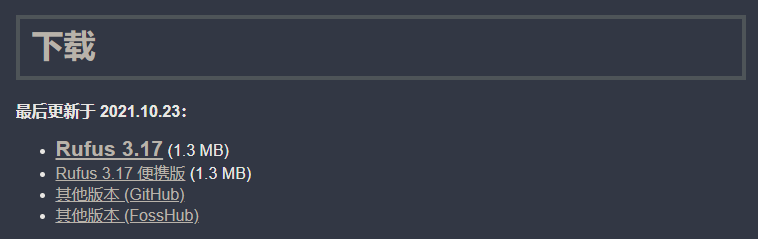
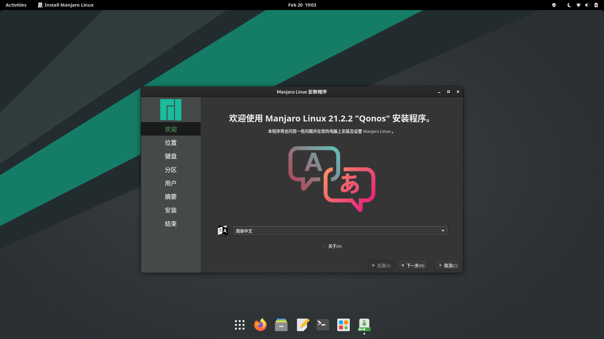
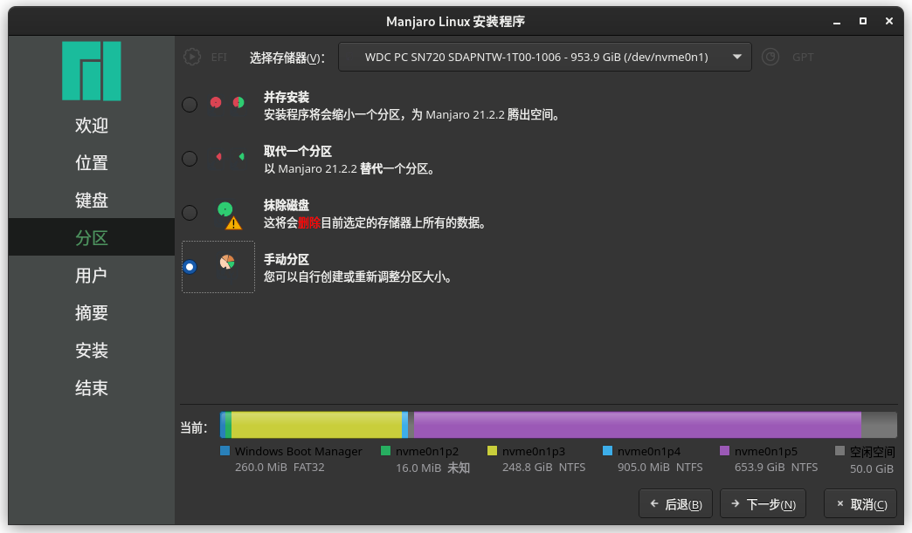
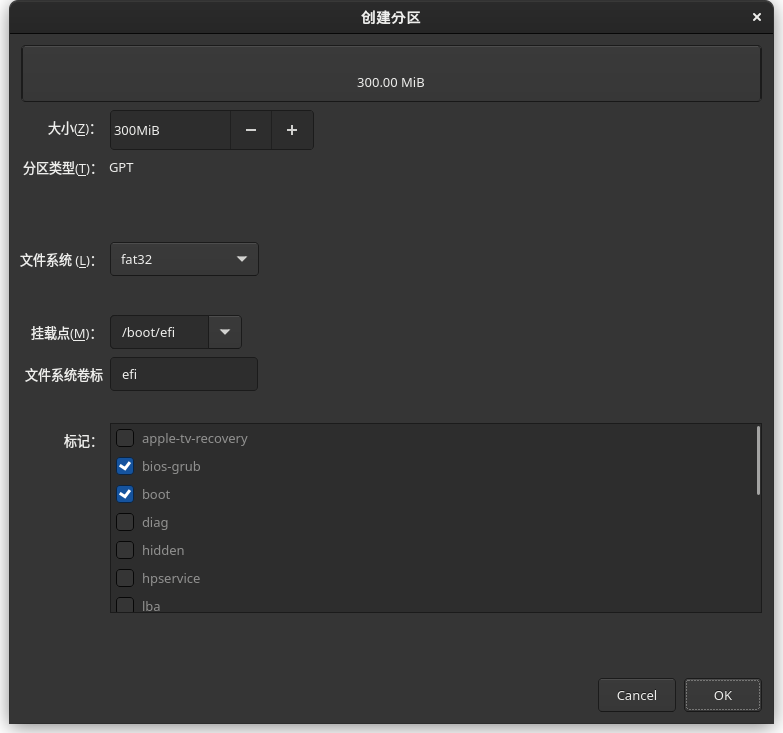
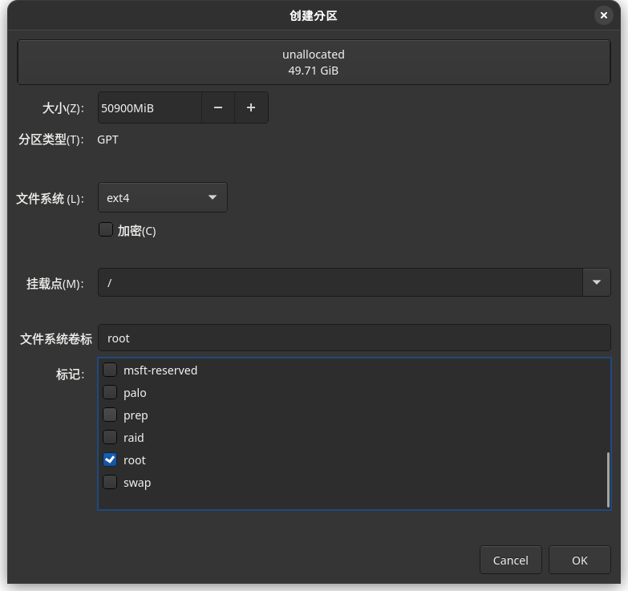
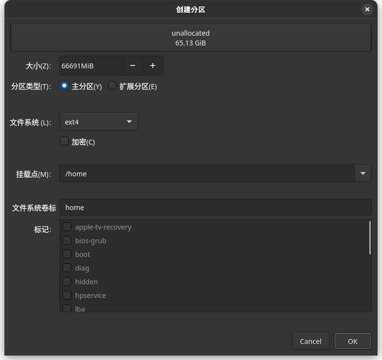
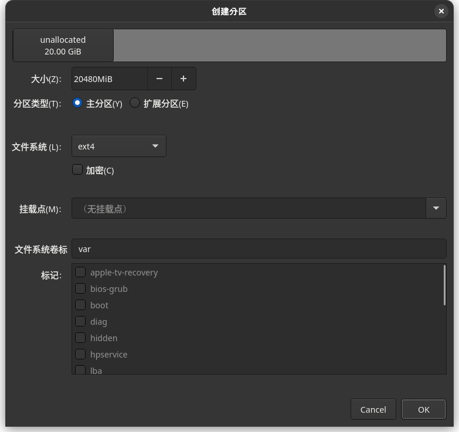
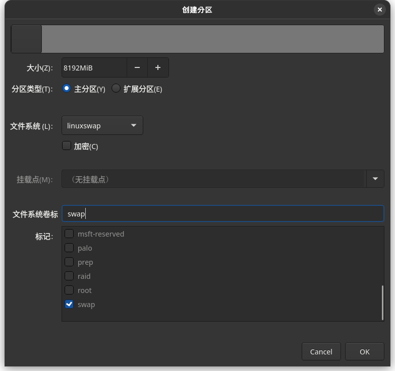
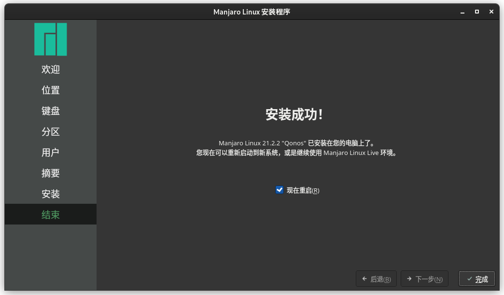

# Manjaro 安装

在硬盘的指定位置安装 [Manjaro](https://manjaro.org/), 适用于普通用户/多系统用户/SSD与HDD混合的用户.  

## 条件

- U盘: 将被格式化, 因此应先转移U盘内已有的数据.

## 梗概

1. 制作 Manjaro 的 USB 启动盘.
2. 利用 Manjaro 自带的安装程序安装 Manjaro 到硬盘.

## 下载系统镜像

从[官网](https://manjaro.org/download/)下载系统镜像.  

{ width=40% }  

默认是 `Full` 完整版, 也可以选择 `Minimal` 最小版, 仅提供了基本的桌面环境, 没有安装附加的软件.  
点击 `Image` 直接下载镜像文件, 点击 `Torrent` 下载种子文件.  

若使用种子下载需使用专门的下载器进行下载.  

{ width=70% }  

## 下载烧录软件

从[官网](http://rufus.ie/zh/)下载软件.  

{ width=70% }  

!!! warning
    自动更新可能失效, 新的系统镜像使用较早版本的 Rufus 可能导致失败, 因此建议从官网下载最新版本.  

## 烧录镜像到U盘中

1. 插入U盘.
2. 选项设置可参考下图.

   { width=50% }  

3. 点击 `开始` 按钮.

Rufus 快速格式化U盘并开始写入镜像, 耗时大约 3-5 min.  

## 从U盘中启动

开机时按下指定按键进入 BIOS 设置, 然后选择从U盘启动.  

| 制造商  | 按键             |
| ------- | ---------------- |
| Acer    | F12, F9, F2, Esc |
| Apple   | Option           |
| Asus    | Esc              |
| Clevo   | F7               |
| Dell    | F12              |
| Fujitsu | F12, Esc         |
| HP      | F9               |
| Huawei  | F12              |
| Intel   | F10              |
| Lenovo  | F12              |
| MSI     | F11              |
| Samsung | Esc, F12, F2     |
| Sony    | F11, Esc, F10    |
| Toshiba | F12              |
| others  | F12, Esc         |

!!! tip
    不同电脑进入 BIOS 设置的方式和从U盘启动的操作不同, 需根据自己的电脑型号查找具体操作方式.  

!!! warning
    修改前需拍照备份, 方便失败后复原.  

## [更新 pacman 镜像源](../Arch_包管理.md#更新镜像源)

后续安装将使用到 pacman 下载内容, 因此提前更新镜像源可以提高安装速度和成功率.  

## 安装 Manjaro

启动后单击任务栏最右侧的图标启动 Manjaro 安装程序.  

### 欢迎

{ width=80% }  

### 位置

选择时区和系统语言.  

{ width=80% }  

### 键盘

选择键盘布局.  

!!! warning
    `Chinese(汉语)` 键盘布局可能存在问题, 建议使用美式键盘布局.  

{ width=80% }  

### 分区

!!! danger
    该步骤存在较高风险, 需谨慎操作.  

选择手动分区.  

{ width=80% }  

根据硬盘类型和空间进行分区. 在进行分区时, 应该先对 [FHS] 具有基本了解.  

{ width=80% }  
{ width=80% }  
{ width=80% }  
{ width=80% }  
{ width=80% }  

### 用户

设置用户名/计算机名/密码.  

### 安装

点击 `安装` 开始在指定分区安装 Manjaro.  

{ width=80% }  

!!! info
    `misc postinstall configurations` 步骤需要调用 pacman 下载内容, 因此可能耗时较长.  

### 结束

系统成功安装后将显示此提示.  

{ width=80% }  

## 安装后配置

- [包管理](../Arch_包管理.md).
- 时间同步: 在设置中开启时间同步, 如果是双系统请参考[双系统时间不同步](../双系统时间不正确.md).
- 启用备份: 使用 Timeshift 对系统进行定期备份.

## 参见

- [Manjaro Wiki](https://wiki.manjaro.org/index.php/Main_Page)

[FHS]: https://refspecs.linuxfoundation.org/FHS_3.0/index.html
