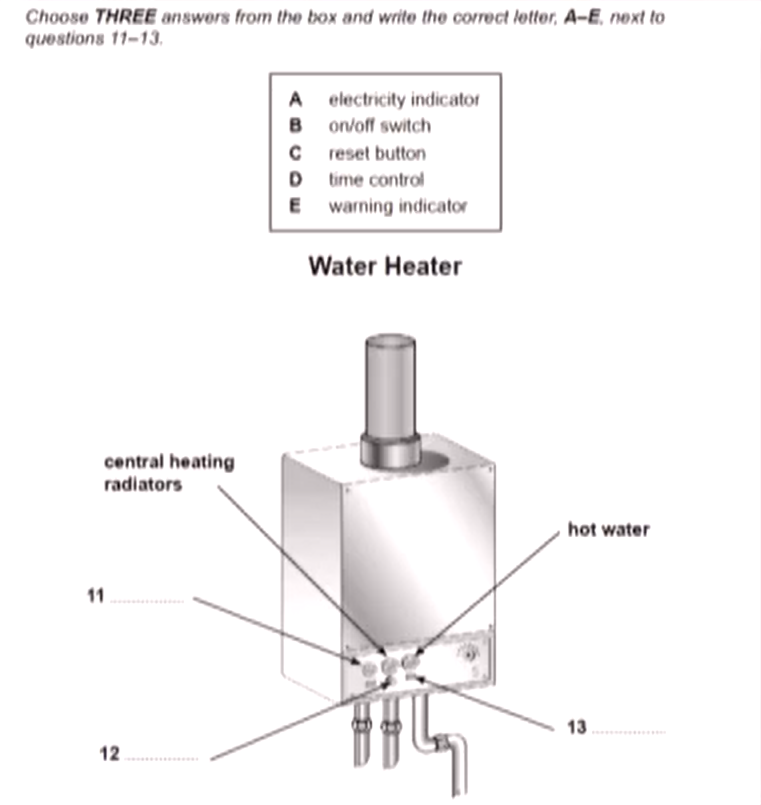

# 听力

## 评分标准

| 得分 | 正确题数 |
| ---- | -------- |
| 5    | 16-19    |
| 5.5  | 20-22    |
| 6    | 23-26    |
| 6.5  | 27-29    |
| 7    | 30-32    |
| 7.5  | 33-34    |
| 8    | 35-36    |
| 8.5  | 37-38    |
| 9    | 39-40    |

以 7 分为例, 错误题数至多 10 题, 每部分错题数量应保持在 1, 2, 3, 4 及以内.  

## 题型设置

- 表格(form/notes/table).

      
      
      

- 句子填空(sentence completion).
- 简答(short-answer questions).

      

    回答问题, 字数通常在 3 以内.  

- 图形(plan/map/diagram labelling/flow-chart)

      
      
      

- 选择(multiple choice).

      

    通常为 5 选 2 或 7 选 3.  

- 配对(matching).

      

## 题型分布

通常题型分布为:  

1. 填空题.
2. 单选, 多选, 配对, 图形. (生活场景)
3. 单选, 多选, 配对, 图形. (难题: 学术场景+题型复杂)
4. 填空题.

## 答题方法

- 顺寻: 一定的顺序的.
- 所听即所得 (仅填空): 不需要进行任何后期处理.
- 同义替换 (仅选择).
- 关键词: 名词 (如专有名词/数字, 占答案的 80%, 可能会重读)/限定词/信号词 (如 but/in fact/actually/so).
