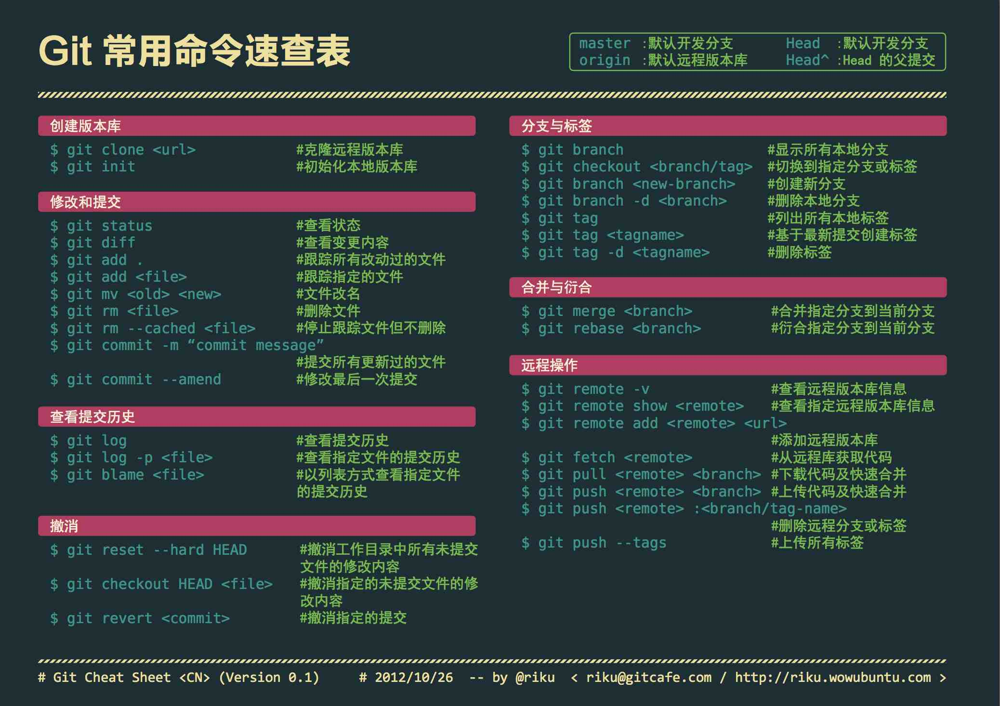

# Git

  

!!! info
    以下内容基于 2.X 版本.  

[Git](https://git-scm.com/) 是一款版本控制系统(Version control system, VCS). 名字的由来是项目创始人 Linus 的自嘲[^1], 该词在英语俚语代表 "令人讨厌的人".  

## 工作流程

{ align=right width=40% }  

### 分支

- main: 包含稳定的代码.
- develop: 包含不稳定的代码, 将合并到 main.
- feature/xxx: 包含新功能的代码, 将合并到 develop.
- hotfix/xxx: .
- release/xxx: .

### 提交

提交信息的编写方式可以参考 [Conventional Commits](https://www.conventionalcommits.org/en/v1.0.0/), 里面列举了一些[例子](https://www.conventionalcommits.org/en/v1.0.0/#examples)和[优点](https://www.conventionalcommits.org/en/v1.0.0/#why-use-conventional-commits).  
可以借助工具 [commitlint](https://github.com/conventional-changelog/commitlint) 来进行检查.  

| 类型     | 描述                                                                              |
| -------- | --------------------------------------------------------------------------------- |
| refactor | 代码重构，既不修复错误也不添加功能.                                               |
| feat     | 类型为 feat 的提交表示在代码库中新增了一个功能(这和语义化版本中的 MINOR 相对应).  |
| fix      | 类型为 fix 的 提交表示在代码库中修复了一个 bug (这和语义化版本中的 PATCH 相对应). |
| style    | 不影响代码含义的变化(空白/格式化/缺少分号等).                                     |
| perf     | 改进性能的代码更改.                                                               |
| test     | 添加确实测试或更正现有的测试.                                                     |
| build    | 影响构建系统或外部依赖关系的更改.                                                 |
| docs     | 只是更改文档.                                                                     |
| ci       | 更改持续集成文件和脚本.                                                           |
| chore    | 其他不修改 src 或 test 文件.                                                      |
| revert   | commit 回退.                                                                      |

## 代码托管平台

- [GitHub](https://github.com/).
- [GitLab](https://about.gitlab.com/).
- [Bitbucket](https://bitbucket.org/).

使用平台进行对仓库托管还可以利用平台提供的相关功能, 但不应该产生依赖. 应确保项目随时可以脱离该平台并正常运作.  

## 暂存

| Command                      | New Files | Modified Files | Deleted Files | Description                            |
| ---------------------------- | --------- | -------------- | ------------- | -------------------------------------- |
| `git add -A`                 | √         | √              | √             | Stage all files.                       |
| `git add .`                  | √         | √              | √             | Stage all files in current folder.     |
| `git add --ignore-removal .` | √         | √              | ×             | Stage new and modified files only.     |
| `git add -u`                 | ×         | √              | √             | Stage modified and deleted files only. |

## 忽略文件

不想使用 Git 进行跟踪和管理的文件可以在 `.gitignore` 文件中指定, 语法十分简洁易懂.  
对于常见开发环境通常忽略的文件, 可以利用 gitignore.io([Web](https://www.toptal.com/developers/gitignore)/[CLI](https://docs.gitignore.io/install/command-line))生成.  

## 清空仓库

```sh
git checkout --orphan empty        || exit 1
git branch -D main                 || exit 1
git add -A                         || exit 1
git commit -m 'feat: first commit' || exit 1
git push origin empty:main --force || exit 1
git checkout main                  || exit 1
git branch -D empty
git pull origin main --allow-unrelated-histories
```

!!! warning
    该操作将清空仓库指定分支的全部历史记录.  

## GUI 客户端

- [GitHub Desktop](https://desktop.github.com/): 跨平台, 简洁, 开源, 目标仅为 GitHub 服务.
- [GitKraken](https://www.gitkraken.com/): 跨平台, 部分功能收费.

!!! warning
    如果已为 Git 配置了代理服务器不建议使用 `GitKraken`, 可能会导致错误.

## TUI 客户端

- Gitui: 跨平台, 快速, 开源.

## GitHub CLI

GitHub CLI 是 GitHub 官方提供的跨平台的命令行工具. [安装教程](https://github.com/cli/cli#installation).  
Windows 用户可以直接从 [Releases](https://github.com/cli/cli/releases) 上下载安装包.  
安装后执行下面命令, 来登录账户并配置本地的 Git.  
在 GitHub 因为安全问题禁用 Git 通过账户和密码登录后, 经过 GitHub CLI 配置后的 Git 可以按原样使用.  

```sh
sudo pacman -S github-cli # Archlinux
gh auth login             # 登录 GitHub 账号
gh auth setup-git         # 配置 Git
```

## 配置 Git

### 设置用戶

```sh
git config --global user.name 'name'
git config --global user.email 'eamil'
```

### 设置编辑器

```sh
git config --global core.editor 'nvim'
```

### 设置代理

```sh
git config --global http.proxy 'socks5://127.0.0.1:7891'
git config --global https.proxy 'socks5://127.0.0.1:7891'
```

### 设置别名

可以通过给命令[设置别名](https://git-scm.com/book/en/v2/Git-Basics-Git-Aliases) 来简化 Git 的使用.  

```sh
git config --global alias.co checkout
git config --global alias.br branch
git config --global alias.ci commit
git config --global alias.st status
```

## 参见

- [Git 文档](https://git-scm.com/doc)
- [Git FAQ](https://git.wiki.kernel.org/index.php/GitFaq)
- [Bilibili 入门视频](https://www.bilibili.com/video/BV1KD4y1S7FL)
- [Bilibili 进阶视频](https://www.bilibili.com/video/BV1hA411v7qX)

[^1]: https://git.wiki.kernel.org/index.php/GitFaq#Why_the_.27Git.27_name.3F

