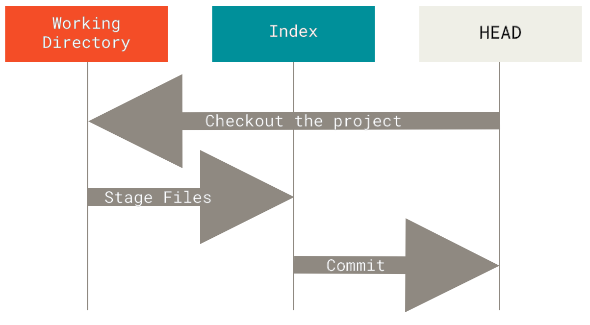

# Git

  

!!! info
    以下内容基于 2.X 版本.  

[Git](https://git-scm.com/) 是一款版本控制系统 (Version control system, VCS). 名字的由来是项目创始人 Linus 的自嘲[^1], 该词在英语俚语代表 "令人讨厌的人".

## 常用命令

```sh
# 贮藏除了索引区的内容, 便于测试这是否是一次完整的提交 (比如是否能通过编译)
git stash --keep-index
git stash -k

# 撤销上一个提交, 并还原到暂存区
# 适合利用 LLM 重写提交信息
git reset --soft HEAD~
```

## 配置 Git

```sh
# 设置用戶
git config --global user.name '<NAME>'
git config --global user.email '<EMAIL>'

# 设置默认主分支名称
git config --global init.defaultBranch main

# 设置 pull 模式
git config --global pull.rebase true

# 设置编辑器
git config --global core.editor 'nvim'

# 设置网络代理
git config --global http.proxy 'http://127.0.0.1:1234'
git config --global https.proxy 'http://127.0.0.1:1234'

git config --global column.ui auto
git config --global branch.sort -committerdate

# 设置命令别名
git config --global alias.co checkout
git config --global alias.br branch
git config --global alias.ci commit
git config --global alias.st status
```

## 配置 GPG 签名

```sh
gpg --list-secret-keys --keyid-format=long

git config --global user.signingkey <KEY_ID>
git config --global user.signingkey <SUB_KEY_ID>!

git config --global commit.gpgsign true
git config --global tag.gpgSign true

git config --global gpg.program <GPG_PATH>
```

详情请参考 [GitHub Docs](https://docs.github.com/en/authentication/managing-commit-signature-verification/telling-git-about-your-signing-key).

## 代码托管平台

以下平台提供了 Git 远程仓库托管服务:

- [GitHub](https://github.com/): 社区最大.
- [GitLab](https://about.gitlab.com/): 开源, 可自建.
- [Gitea](https://gitea.com/): 开源, 可自建.
- [Bitbucket](https://bitbucket.org/).

使用平台进行对仓库托管还可以利用平台提供的相关功能, 但不应该产生依赖. 应确保项目随时可以脱离该平台并正常运作.

## GitHub CLI

GitHub CLI 是 GitHub 官方提供的跨平台的命令行工具. [安装教程](https://github.com/cli/cli#installation).  
在 GitHub 因为安全问题禁用 Git 通过账户和密码登录后, 经过 GitHub CLI 配置后的 Git 可以按原样使用.

```sh
sudo pacman -S github-cli # Arch Linux
scoop install gh          # Windows

gh auth login             # 登录 GitHub 账号
gh auth setup-git         # 配置 Git

gh extension install github/gh-copilot # 安装 Copilot 拓展

gh copilot explain "sudo apt-get"         # 解释命令
gh copilot suggest "Undo the last commit" # 生成命令
```

## 暂存



| Command                      | New Files | Modified Files | Deleted Files | Description                            |
|------------------------------|-----------|----------------|---------------|----------------------------------------|
| `git add -A`                 | √         | √              | √             | Stage all files.                       |
| `git add .`                  | √         | √              | √             | Stage all files in current folder.     |
| `git add --ignore-removal .` | √         | √              | ×             | Stage new and modified files only.     |
| `git add -u`                 | ×         | √              | √             | Stage modified and deleted files only. |

## 重置

- `--soft`: 重置 `HEAD`.
- `--mixed` (默认): 重置 `HEAD` 和索引.
- `--hard`: 重置 `HEAD`, 索引和工作目录.

## 贮藏

如果需要一个干净的工作目录 (比如切换分支), 但是当前的工作还未完成无法提交, 可以使用贮藏 (stash).

```sh
git stash     # 贮藏当前工作
git stash pop # 恢复贮藏
```

其中 `git stash pop` 的作用类似 `git stash apply` 然后 `git stash drop`.

更多有关贮藏的信息请参考 [Pro Git 的对应章节](https://git-scm.com/book/zh/v2/Git-%E5%B7%A5%E5%85%B7-%E8%B4%AE%E8%97%8F%E4%B8%8E%E6%B8%85%E7%90%86).

## 提交信息

提交信息的编写方式可以参考 [Conventional Commits](https://www.conventionalcommits.org/en/v1.0.0/), 里面列举了一些[例子](https://www.conventionalcommits.org/en/v1.0.0/#examples)和[优点](https://www.conventionalcommits.org/en/v1.0.0/#why-use-conventional-commits).  
可以借助工具 [commitlint](https://github.com/conventional-changelog/commitlint) 来进行检查.

| 类型     | 描述                                                                             |
|----------|--------------------------------------------------------------------------------|
| refactor | 代码重构, 既不修复错误也不添加功能.                                              |
| feat     | 类型为 feat 的提交表示在代码库中新增了一个功能(这和语义化版本中的 MINOR 相对应). |
| fix      | 类型为 fix 的 提交表示在代码库中修复了一个 bug(这和语义化版本中的 PATCH 相对应). |
| style    | 不影响代码含义的变化(空白/格式化/缺少分号等).                                    |
| perf     | 改进性能的代码更改.                                                              |
| test     | 添加确实测试或更正现有的测试.                                                    |
| build    | 影响构建系统或外部依赖关系的更改.                                                |
| docs     | 只是更改文档.                                                                    |
| ci       | 更改持续集成文件和脚本.                                                          |
| chore    | 其他不修改 src 或 test 文件.                                                     |
| revert   | commit 回退.                                                                     |

下面是[最初由 Tim Pope 写的模板](https://tbaggery.com/2008/04/19/a-note-about-git-commit-messages.html):

```txt
首字母大写的摘要 (不多于 50 个字符)

如果必要的话, 加入更详细的解释文字. 在大概 72 个字符的时候换行.
在某些情形下, 第一行被当作一封电子邮件的标题, 剩下的文本作为正文.
分隔摘要与正文的空行是必须的（除非你完全省略正文）, 
如果你将两者混在一起, 那么在使用例如变基这样的工具时, 它们会生成难以阅读的输出, 让人困惑.

使用指令式的语气来编写提交信息: 使用 "Fix bug" 而非 "Fixed bug" 或 "Fixes bug".
此约定与 git merge 和 git revert 命令生成提交说明相同.

空行接着更进一步的段落.

- 标号也是可以的.
- 项目符号可以使用典型的连字符或星号, 后跟一个空格, 行之间用空行隔开, 但是可以依据不同的惯例有所不同.
- 使用悬挂式缩进.
```

## 忽略文件

不想使用 Git 进行跟踪和管理的文件可以在 `.gitignore` 文件中指定, 语法十分简洁易懂.  
对于常见开发环境通常忽略的文件, 可以利用 gitignore.io ([Web](https://www.toptal.com/developers/gitignore)/[CLI](https://docs.gitignore.io/install/command-line)) 生成.

## 清空仓库

下面代码用于清空 main 分支的所有提交历史.

```sh
git checkout --orphan empty        || exit 1
git branch -D main                 || exit 1
git add -A                         || exit 1
git commit -m 'feat: first commit' || exit 1
git push origin empty:main --force || exit 1
git checkout main                  || exit 1
git branch -D empty
git pull origin main --allow-unrelated-histories
```

在确认执行成功后, 可以执行 `git gc` 来清除无用的历史, 此举将导致之前的提交历史**完全丢失**.

## 常见错误

```sh
gpg: skipped "XXXXXXXXXXXXXXXX": No secret key
```

检查是否使用的正确的 `gpg.exe`. 通过下面命令指定使用的 `gpg.exe`:

```sh
git config --global gpg.program "path/to/gpg.exe"
```

## 参见

- [Git 文档](https://git-scm.com/doc)
- [Git Book](https://git-scm.com/book)
- [Git FAQ](https://git.wiki.kernel.org/index.php/GitFaq)
- [入门视频1 - 奇乐编程学院](https://www.bilibili.com/video/BV1KD4y1S7FL)
- [入门视频2 - 奇乐编程学院](https://www.bilibili.com/video/BV1hA411v7qX)
- <https://git-send-email.io/>
- <https://education.github.com/git-cheat-sheet-education.pdf>
- <https://learngitbranching.js.org/>

[^1]: <https://git.wiki.kernel.org/index.php/GitFaq#Why_the_.27Git.27_name.3F>
