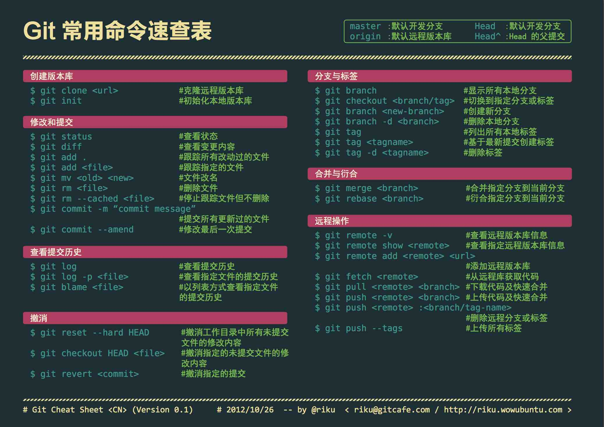
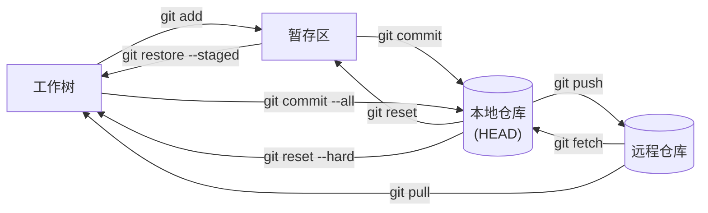
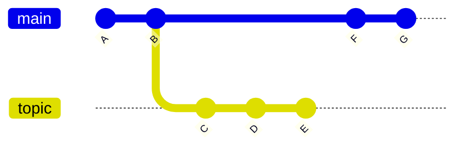
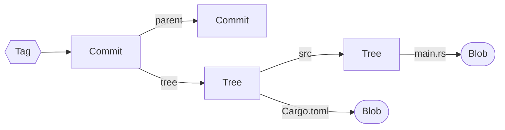
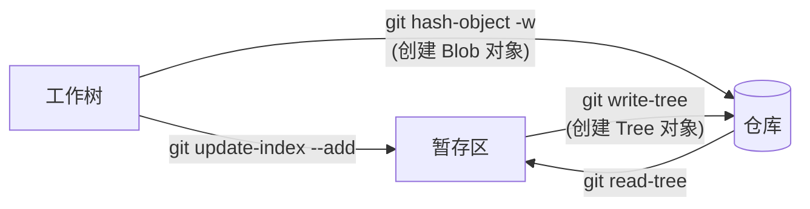

# Git

  

[Git](https://git-scm.com/) 是一款开源 (GPLv2) 的版本控制系统 (Version Control System, VCS). 名字的由来是项目创始人 Linus 的自嘲[^1], 该词在英语俚语代表 "令人讨厌的人".

[^1]: <https://git.wiki.kernel.org/index.php/GitFaq#Why_the_.27Git.27_name.3F>

## 教程

- [Pro Git (第 2 版)](https://git-scm.com/book/en/v2): Git 官方推荐的教程, 基于 CC BY-NC-SA 3.0 协议发布. 本书内容较多, **建议按需阅读**.
- [Learn Git Branching](https://learngitbranching.js.org/): 可视化的互动式教程, 可以帮助学习 Git 分支相关的操作. 许多 Git 命令的本质是操作有向无环图, 该互动式教程可视化了这个图, 形象的帮助用户学习相关操作. 教程内容**非常实用, 建议完全掌握**.

- [GIT CHEAT SHEET](https://education.github.com/git-cheat-sheet-education.pdf): GitHub 官方提供的 Git 命令速查表.
- `man 7 gitglossary`: Git 术语表.

Git 的提交历史本质上是以提交为节点的有向无环图 (DAG), 指向提交的指针被称为引用 (即分支). 其中 `HEAD` 是一个指向当前检出提交或分支的引用.

## 配置

```sh
# 设置用戶
# 设置用戶信息后才能创建提交
git config --global user.name '<NAME>'
git config --global user.email '<EMAIL>'

# 设置新仓库主分支默认名称
# 从技术角度看, `main` 更简短也更清晰的表明了主分支的含义
git config --global init.defaultBranch main

# 设置 pull 合并方式, 默认为 merge
git config --global pull.rebase true

# 设置编辑器
# 执行 `git commit` 时就会调用该编辑器
git config --global core.editor '<EDITOR>'

# 提升可读性
git config --global column.ui auto
# 列出分支时按最后提交时间排序
git config --global branch.sort -committerdate
```

### 网络代理

Git 尊重代理相关的环境变量, 也可以通过下面命令进行复写:

```sh
git config --global http.proxy 'http://<IP>:<PORT>'
git config --global https.proxy 'http://<IP>:<PORT>'
```

详情请参考[官方文档](https://git-scm.com/docs/git-config#Documentation/git-config.txt-httpproxy).

### GPG 签名

```sh
gpg --list-secret-keys --keyid-format=long
```

执行上面命令后可以得到下面格式的输出:

```txt
[keyboxd]
---------
sec   ed25519/<KEY_ID> 2023-12-28 [SC]
      XXXXXXXXXXXXXXXXXXXXXXXXXXXXXXXXXXXXXXXX
uid                 [ultimate] ShenMian <sms_school@outlook.com>
ssb   cv25519/<SUB_KEY_ID> 2023-12-28 [E]
```

可以看出, 只有主密钥具备签名功能, 因此可以使用下面命令指定使用主密钥进行签名:

```sh
git config --global user.signingKey <KEY_ID>
```

如果要使用具有签名功能的子密钥, 可以使用下面命令:

```sh
git config --global user.signingKey <SUB_KEY_ID>
```

最后, 启用签名功能:

```sh
git config --global commit.gpgSign true
git config --global tag.gpgSign true
```

在 Windows 环境下, 可能有多个 GPG 程序. 比如 Git 自带的 gpg, 和 gpg4win.  
请确定密钥所在的 GPG, 并通过下面命令指定该 `gpg.exe` 的路径:

```sh
git config --global gpg.program <GPG_PATH>
```

详情请参考 [GitHub Docs](https://docs.github.com/en/authentication/managing-commit-signature-verification/telling-git-about-your-signing-key).

下面命令可以用于验证签名的有效性:

```sh
git verify-commit <COMMIT_ID>
git verify-tag <TAG_NAME>
```

## 常用命令



| 命令                     | 描述                           | 备注                                                                                     |
|--------------------------|------------------------------|------------------------------------------------------------------------------------------|
| `git stash --keep-index` | 贮藏除了索引区的内容           | 可以用于测试暂存区中准备提交的内容是否完整有效, 比如是否能通过编译                       |
| `git reset --soft HEAD~` | 撤销上一个提交, 并还原到暂存区 | 相比 `git commit --amend`, 该命令可以获得一个完整的暂存区, 便于利用 LLM 重新生成提交信息 |
| `git reset --hard HEAD`  | 丢弃所有修改 (不可撤销)        |                                                                                          |
| `git switch -`           | 切换到上一个分支               | 等价于 `git switch @{-1}`                                                                |

## 相关工具

### Lazygit

[Lazygit](https://github.com/jesseduffield/lazygit) 是一个基于 TUI 的 Git 客户端, 可以简化 Git 相关的操作.

```sh
# 安装
sudo pacman -S lazygit # Arch Linux
scoop install lazygit  # Windows
```

### GitHub CLI

[GitHub CLI](https://github.com/cli/cli) 是 GitHub 官方提供的开源 (MIT) 命令行工具.

```sh
# 安装
sudo pacman -S github-cli # Arch Linux
scoop install gh          # Windows

gh auth login     # 登录 GitHub 账号
gh auth setup-git # 配置 Git

# Copilot 拓展
gh extension install github/gh-copilot    # 安装
gh copilot explain "sudo apt-get"         # 解释命令
gh copilot suggest "Undo the last commit" # 生成命令
```

### GitHub Desktop

[GitHub Desktop](https://github.com/desktop/desktop) 是 GitHub 官方提供的开源 (MIT) Git GUI 客户端.

## 仓库托管

以下平台提供了 Git 远程仓库托管服务:

- [GitHub](https://github.com/): 社区最大.
- [GitLab](https://about.gitlab.com/): 社区版 (GitLab CE) 开源 (MIT), 可自建.
- [Gitea](https://gitea.com/): 开源 (MIT), 可自建.
- [Bitbucket](https://bitbucket.org/).

以上平台均提供了各自的 CI/CD 功能并支持 [Git LFS](#git-lfs), 但不应该过度依赖, 确保项目随时可以脱离该平台并正常运作.

## gitignore

仓库中总有不想让 Git 跟踪的文件或文件夹, 比如:

- 包含构建产物的 `target` 文件夹, 体积较大且可以自动生成.
- 包含 API 密钥的 `.env` 文件, 可能泄露到远程仓库中.

可以将它们写入 `.gitignore` 文件中, 避免增加仓库体积并防止泄露敏感数据.

可以通过该[网站](https://www.toptal.com/developers/gitignore)根据所使用的技术栈自动生成 `.gitignore` 文件.

## 提交信息

如果要提交的仓库为:

- **个人项目**: 可以参考 [Conventional Commits](https://www.conventionalcommits.org/en/v1.0.0/). 这种严谨的格式便于利用工具自动化生成 Changelog. 其他优点请参考[官方文档](https://www.conventionalcommits.org/en/v1.0.0/#why-use-conventional-commits).
- **其他项目**: 建议参考历史提交信息的格式. 许多开源项目对此并没有严格的规定.

具体的提交内容建议使用 LLM 自动生成, 然后再做调整.  

下面是一份最初由 Tim Pope 写的提交信息模板:

```txt
首字母大写的摘要 (不多于 50 个字符)

如果必要的话, 加入更详细的解释文字. 在大概 72 个字符的时候换行.
在某些情形下, 第一行被当作一封电子邮件的标题, 剩下的文本作为正文.
分隔摘要与正文的空行是必须的（除非你完全省略正文）, 
如果你将两者混在一起, 那么在使用例如变基这样的工具时, 它们会生成难以阅读的输出, 让人困惑.

使用指令式的语气来编写提交信息: 使用 "Fix bug" 而非 "Fixed bug" 或 "Fixes bug".
此约定与 git merge 和 git revert 命令生成提交说明相同.

空行接着更进一步的段落.

- 标号也是可以的.
- 项目符号可以使用典型的连字符或星号, 后跟一个空格, 行之间用空行隔开, 但是可以依据不同的惯例有所不同.
- 使用悬挂式缩进.
```

## 贮藏

可以通过将当前工作区和暂存区的内容存入贮藏区来获得一个干净的工作区.

部分 Git 命令需要用户没有未

部分 Git 命令需要当前工作区和暂存区保持干净 (即没有未提交的修改), 直接提交未完成的修改显然不是一个好方法, 另一个方法则是将修改临时保存到贮藏区中.

```sh
git stash list         # 列出贮藏区内容
git stash              # 贮藏工作区和暂存区的修改
git stash --keep-index # 仅贮藏工作区的修改
git stash pop          # 恢复上一个贮藏的修改
git stash drop         # 丢弃上一个贮藏的修改
```

其中 `git stash pop` 的作用类似 `git stash apply` 然后 `git stash drop`.

详情请参考 [Pro Git](https://git-scm.com/book/zh/v2/Git-%E5%B7%A5%E5%85%B7-%E8%B4%AE%E8%97%8F%E4%B8%8E%E6%B8%85%E7%90%86).

## 合并与变基



Git 的两种最常见的合并方式分别是:

- `git merge topic`: 三方合并. 在当前分支上创建一个新提交, 包含 topic 分支的修改. 即将 topic 分支合并到当前分支.

    ```mermaid
    gitGraph
        commit id: "A"
        commit id: "B"
        branch topic
        commit id: "C"
        commit id: "D"
        commit id: "E"
        checkout main
        commit id: "F"
        commit id: "G"
        merge topic
    ```

- `git rebase main topic`: 变基, 也称为线性合并. 删除当前分支, 将其提交应用到 main 分支. 即将当前分支嫁接到 main 分支.

    ```mermaid
    gitGraph
        commit id: "A"
        commit id: "B"
        commit id: "F"
        commit id: "G"
        commit id: "C'"
        commit id: "D'"
        commit id: "E'"
    ```

关于何时使用何种合并方法仁者见仁, 智者见智. 下面仅提供一种方法作为参考:

- **merge**: 用于合并普通分支, 比如特性或修复分支.
    - 可以从历史中看出有分支合并行为, 提高可读性.
    - 不会修改远程仓库中已有的提交, 不影响多人合作.
- **rebase**: 用于合并当前分支对应的远程分支, 且本地提交还没有推送.
    - 确保历史简洁, 不会出现莫名其妙的合并提交.
    - 将本地未推送的提交变基到更新后的本地分支上, 不会修改远程分支中已有的提交, 不影响多人合作.

值得一提的是 `git pull` 的作用类似 `git fetch` 然后 `git merge` 或 `git rebase`.

更多讨论请参考 [Pro Git](https://git-scm.com/book/en/v2/Git-Branching-Rebasing#_rebase_vs_merge).

## Git LFS

Git LFS (Large File Storage) 是一个 Git 拓展, 用于改进 Git 对二进制大体积文件的管理.

该功能对于游戏项目来说非常重要, 因为游戏资源文件通常为体积较大的二进制文件, 对这些文件进行修改会导致 Git 仓库体积急速增长.

Linux 下需要专门安装该插件, 而 Windows 下, LFS 是安装 Git 时默认勾选的组件.  
安装拓展后, 可以通过下面命令为当前用户启用 LFS:

```sh
git lfs install
```

Git LFS 主要提供两个功能:

- **大文件按需下载**: 被 LFS 跟踪的文件将被存储在 LFS 服务器上, Git 仓库中指保留一个轻量的指针. 这使得 Git 仓库的体积与大文件无关, 可以仅在执行检出操作时下载必要的大文件.
- **文件上锁**: 由于二进制文件的编辑总是会导致冲突, LFS 还提供了文件上锁的功能. 防止多个用户同时编辑单个二进制文件, 最终导致合并冲突. 加锁信息由 LFS 服务器管理.

以上功能均依赖 LFS 服务器, 因此需要仓库托管平台支持 Git LFS, 且在使用相关功能时保持联网. 按需下载功能可以通过提前下载全部内容来离线使用, 文件上锁功能则必须联网使用.

```sh
# 指定需要 LFS 跟踪的文件类型
git lfs track "*.glb"
# 可锁定 (lockable) 文件是默认只读的, 锁定后才变为可写的
git lfs track "*.scn" --lockable

git lfs track # 查看当前 LFS 跟踪的文件类型

git lfs fetch --all # 下载全部 LFS 对象
```

由于二进制文件的编辑总是会导致冲突, LFS 还提供了文件上锁的功能. 防止多个用户同时编辑单个二进制文件:

```sh
git lfs locks # 查看当前锁定的文件和持有该锁的用户

git lfs lock <PATH>   # 锁定文件
git lfs unlock <PATH> # 解锁文件

# 强制解锁文件
# 可以解锁由其他用户上锁的文件
git lfs unlock --force <PATH>
```

文件上锁情况由 LFS 服务器管理, 因此该功能必须联网使用.

如果 Git 仓库已经跟踪并提交了大文件, 则需要通过重写历史才能让 LFS 管理这些文件. 详情请参考[官方文档](https://github.com/git-lfs/git-lfs/wiki/Tutorial#migrating-existing-repository-data-to-lfs).

## 清空历史

!!! warning
    该章节的代码片段可能导致数据丢失, 请谨慎操作.

下面代码可以清空仓库中指定分支的所有提交历史:

```sh
git checkout --orphan empty          || exit 1
git branch -D main                   || exit 1
git add -A                           || exit 1
git commit -m 'feat: initial commit' || exit 1
git push origin empty:main --force   || exit 1
git checkout main                    || exit 1
git branch -D empty
git pull origin main --allow-unrelated-histories
```

其中, 前面命令失败后立即终止十分重要, 否则可能导致数据丢失.

在确认执行成功后, 可以执行下面命令来清除无用的历史, 此举将导致之前的提交历史**不可找回**.

```sh
git reflog expire --expire-unreachable=now --all
git gc --prune=now
```

## 故障排除

- `gpg: skipped "XXXXXXXXXXXXXXXX": No secret key`

    检查是否使用了正确的 `gpg.exe`, 然后通过下面命令指定要使用的 `gpg.exe`:

    ```sh
    git config --global gpg.program "path/to/gpg.exe"
    ```

    详情请参考[GPG 签名](#gpg-签名).

---

## 底层原理

通过底层 (plumbing) 命令, 可以更加痛苦和折磨的使用 Git. 这些命令没必要在实际项目中使用, 但了解它们有助于深入理解 Git 的内部机制.

### 仓库结构

```txt
.git/
|-- config (本地仓库配置)
|-- description
|-- index (暂存区)
|-- HEAD (引用)
├── hooks/ (钩子脚本)
├── info/
├── logs/ (reflog 历史)
├── objects/ (对象数据库)
│   ├── 0a/ (以对象哈希值前两位命名的目录)
│   ├── ...
│   ├── info/
│   └── pack/
└── refs/ (引用指针)
    ├── heads/ (本地引用)
    ├── remotes/ (远程引用)
    └── tags/ (标签)
```

- `config`: 当前仓库的专属配置, 包含远程仓库信息等内容.
- `description`: 仅供 GitWeb 程序使用, 可忽略.
- `HEAD`: 指向当前检出分支或提交的引用.
- `objects/`: 存储各种类型的 Git 对象, 本质是一个简单的键值对数据库, 文件名为键, 文件内容为值.
- `refs/`: 包含指向 Git 对象的引用指针. 每个文件内只有一个指向 `objects/` 中对象的哈希值 (即 commit id).
    - `heads/`/`remotes/`: 指向 commit 类型对象的引用. 其中 `refs/remotes/<NAME>/HEAD` 指向克隆后默认检出的分支或提交.
    - `tags/`: 指向 tag 类型对象的引用.

### 对象

Git 对象存储在被称为对象数据库的 `objects/` 文件夹下, 用于保存实际的数据. 这是一个键值对数据库, 以文件名为键 (即对象的哈希值), 文件内容为值 (即对象的内容).

#### 类型

| 类型   | 描述                                           |
|--------|----------------------------------------------|
| blob   | 存储使用 zlib 压缩的二进制数据, 通常是文件内容 |
| commit | 存储提交信息                                   |
| tree   | 存储目录结构, 包含文件名等数据                 |
| tag    | 存储标签信息                                   |

它们之间的引用关系如下图所示:



### 相关命令



| 命令                                                 | 描述                                    | 备注                                                                                           |
|------------------------------------------------------|---------------------------------------|------------------------------------------------------------------------------------------------|
| `git hash-object -w <FILE>`                          | 从文件内容创建 Blob 对象, 并写入数据库. | 具体过程见 [Git Pro](https://git-scm.com/book/en/v2/Git-Internals-Git-Objects#_object_storage) |
| `git cat-file -p <OID>`                              | 查看对象内容                            |                                                                                                |
| `git cat-file -t <OID>`                              | 查看对象类型                            |                                                                                                |
| `git update-index --add <FILE>`                      | 将文件添加到暂存区                      |                                                                                                |
| `git write-tree`                                     | 从暂存区内容创建树对象, 并写入数据库    |                                                                                                |
| `git read-tree <TREE_ID>`                            | 将指定树对象恢复到暂存区                |                                                                                                |
| `git commit-tree <TREE_ID> -m <MESSAGE> -p <PARENT>` | 从树对象创建提交对象, 并写入数据库      |                                                                                                |

其中命令 `git update-index` 是将工作树的修改添加到暂存区的, 但是默认忽略新文件 (仅暂存区不存在) 和丢失的文件 (仅工作树不存在).  
所以往暂存区添加新文件或删除已有的文件需要先在工作树做对应的操作, 然后配合 `--add` 和 `--remove` 参数来更新暂存区.

### 引用

与 Git 对象相似, Git 引用本身也是键值对, 存储在 `refs/` 目录下和 `HEAD` 文件中. 文件名是引用名称, 文件内容是符号引用或提交对象的哈希值.

引用可以分为三类:

### 分支引用

这部分引用就是所谓的 "分支", 存储在 `refs/heads/` 和 `refs/remotes/` 目录下的文件中. 其中:

- `refs/heads/`: 存储本地分支.
- `refs/remotes/`: 存储远程分支, 包含一个远程仓库的 `HEAD` 文件.

    使用 `git switch` 或 `git checkout` 不能直接让 `HEAD` 指向该分支, 而只能进入头分离模式, 指向远程分支所指向的提交对象.  
    后续将介绍能实现这一点的底层命令 `git symbolic-ref`.

### HEAD 引用

这是一个比较特殊的引用, 指向当前检出的分支或引用. 在检出分支时, 该文件里存储指向检出分支的符号引用 (symbolic reference), 在头分离 (detached HEAD) 状态下存储检出提交的哈希值.

### 标签引用

这部分引用就是所谓的 "标签", 存储在 `refs/tags/` 目录下的文件中. 文件名是标签名称, 文件内容是指向标签对象的哈希值.

### 相关命令

| 命令                         | 描述                    | 备注                                                                  |
|------------------------------|-----------------------|---------------------------------------------------------------------|
| `git update-ref <REF> <OID>` | 添加/删除和修改引用     | 本质上就是往指定文件写入所指向对象的哈希值                            |
| `git symbolic-ref ...`       | 读取/删除和修改符号引用 | 只能引用 `refs/` 中的引用, 需注意当前目录, 允许将 `HEAD` 引用远程分支 |

创建分支的命令 `git branch` 底层实现就依赖于 `git update-ref` 命令.

## 重置

`git reset` 子命令提供了以下三种重置方式:

- `--soft`: 重置 `HEAD`.
- `--mixed` (默认): 重置 `HEAD` 和索引.
- `--hard`: 重置 `HEAD`, 索引和工作树.
