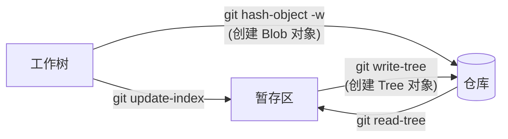

# Git

  

[Git](https://git-scm.com/) 是一款开源 (GPLv2) 的版本控制系统 (Version Control System, VCS). 名字的由来是项目创始人 Linus 的自嘲[^1], 该词在英语俚语中代表 "令人讨厌的人".

[^1]: <https://git.wiki.kernel.org/index.php/GitFaq#Why_the_.27Git.27_name.3F>

## 教程

- [Pro Git (第 2 版)](https://git-scm.com/book/en/v2): Git 官方推荐的教程, 基于 CC BY-NC-SA 3.0 协议发布. 本书内容较多, **建议按需阅读**.
- [Learn Git Branching](https://learngitbranching.js.org/): 可视化的互动式教程, 可以帮助学习 Git 分支相关的操作. 许多 Git 命令的本质是操作有向无环图, 该互动式教程可视化了这个图, 形象地帮助用户学习相关操作. 教程内容**非常实用, 建议完全掌握**.
- Git 官方文档下的 [Guides 主题](https://git-scm.com/docs/git#_guides)
    - [gittutorial](https://git-scm.com/docs/gittutorial).
    - [gitfaq](https://git-scm.com/docs/gitfaq).
- [GIT CHEAT SHEET](https://education.github.com/git-cheat-sheet-education.pdf): GitHub 官方提供的 Git 命令速查表.

许多 Git 命令的本质是在三棵树之间转移数据, 以及修改以提交为节点的有向无环图 (DAG), 指向提交的指针被称为引用. 其中 `HEAD` 是一个指向当前检出提交或分支的引用.

## 配置

```sh
# 设置用户
# 如果不进行设置, Git 将尝试从环境变量中读取, 可能导致使用意料之外的名称和邮箱
git config --global user.name '<NAME>'
git config --global user.email '<EMAIL>'

# 设置新仓库主分支默认名称
# 从技术角度看, `main` 更简短也更清晰地表明了主分支的含义
git config --global init.defaultBranch main

# 设置 pull 合并方式为 rebase, 默认为 merge
git config --global pull.rebase true
# 启用 rerere 功能
git config --global rerere.enabled true

# 设置编辑器
# 执行 `git commit` 时就会调用该编辑器
git config --global core.editor '<EDITOR>'

# 提升可读性
git config --global column.ui auto
# 列出分支时按最后提交时间排序
git config --global branch.sort -committerdate
```

### 网络代理

Git 尊重代理相关的环境变量, 也可以通过下面命令进行重写:

```sh
git config --global http.proxy 'http://<IP>:<PORT>'
git config --global https.proxy 'http://<IP>:<PORT>'
```

详情请参考[官方文档](https://git-scm.com/docs/git-config#Documentation/git-config.txt-httpproxy).

### GPG 签名

```sh
gpg --list-secret-keys --keyid-format=long
```

执行上面命令后可以得到下面格式的输出:

```txt
[keyboxd]
---------
sec   ed25519/<KEY_ID> 2023-12-28 [SC]
      XXXXXXXXXXXXXXXXXXXXXXXXXXXXXXXXXXXXXXXX
uid                 [ultimate] ShenMian <sms_school@outlook.com>
ssb   cv25519/<SUB_KEY_ID> 2023-12-28 [E]
```

可以看出, 只有主密钥具备签名功能, 因此可以使用下面命令指定使用主密钥进行签名:

```sh
git config --global user.signingKey <KEY_ID>
```

如果要使用具有签名功能的子密钥, 可以使用下面命令:

```sh
git config --global user.signingKey <SUB_KEY_ID>
```

最后, 启用签名功能:

```sh
git config --global commit.gpgSign true
git config --global tag.gpgSign true
```

在 Windows 环境下, 可能有多个 GPG 程序. 比如 Git 自带的 gpg, 和 gpg4win.  
请确定密钥所在的 GPG, 并通过下面命令指定该 `gpg.exe` 的路径:

```sh
git config --global gpg.program <GPG_PATH>
```

详情请参考 [GitHub Docs](https://docs.github.com/en/authentication/managing-commit-signature-verification/telling-git-about-your-signing-key).

下面命令可以用于验证签名的有效性:

```sh
git verify-commit <COMMIT_ID>
git verify-tag <TAG_NAME>
```

## 常用命令


| 命令                           | 描述                           | 备注                                                                                     |
|--------------------------------|------------------------------|------------------------------------------------------------------------------------------|
| `git stash --keep-index`       | 贮藏除暂存区外的内容           | 可以用于测试暂存区中准备提交的内容是否完整有效, 比如是否能通过编译                       |
| `git reset --soft HEAD~`       | 撤销上一个提交, 并还原到暂存区 | 相比 `git commit --amend`, 该命令可以获得一个完整的暂存区, 便于利用 LLM 重新生成提交信息 |
| `git reset --hard HEAD`        | 丢弃所有修改                   | 会导致工作树中的修改**永久丢失**                                                         |
| `git switch -`                 | 切换到上一个分支               | 等价于 `git switch @{-1}`                                                                |
| `git rev-parse <REF>`          | 查看引用所指向的哈希值         |                                                                                          |
| `git clean -f -d`              | 移除未跟踪的内容 (包括文件夹)  | 可以用来移除一些恼人的空文件夹, 可以先使用 `git clean -d -n` 预览效果                    |
| `git commit --amend --no-edit` | 将修改合并到上一个提交         |                                                                                          |

## 提交信息

如果要提交的仓库为:

- **个人项目**: 可以参考 [Conventional Commits](https://www.conventionalcommits.org/en/v1.0.0/). 这种严谨的格式便于利用工具自动化生成 Changelog. 其他优点请参考[官方文档](https://www.conventionalcommits.org/en/v1.0.0/#why-use-conventional-commits).
- **其他项目**: 建议参考历史提交信息的格式. 许多开源项目对此并没有严格的规定.

具体的提交内容建议使用 LLM 自动生成, 然后再做调整.  

下面是一份最初由 Tim Pope 编写的提交信息模板:

```txt
首字母大写的摘要 (不多于 50 个字符)

如果必要的话, 加入更详细的解释文字. 在大概 72 个字符的时候换行.
在某些情形下, 第一行被当作一封电子邮件的标题, 剩下的文本作为正文.
分隔摘要与正文的空行是必须的（除非你完全省略正文）, 
如果你将两者混在一起, 那么在使用例如变基这样的工具时, 它们会生成难以阅读的输出, 让人困惑.

使用指令式的语气来编写提交信息: 使用 "Fix bug" 而非 "Fixed bug" 或 "Fixes bug".
此约定与 git merge 和 git revert 命令生成提交说明相同.

空行接着更进一步的段落.

- 标号也是可以的.
- 项目符号可以使用典型的连字符或星号, 后跟一个空格, 行之间用空行隔开, 但是可以依据不同的惯例有所不同.
- 使用悬挂式缩进.
```

## 贮藏

可以通过将当前工作区和暂存区的内容存入贮藏栈来获得一个干净的工作区.

部分 Git 命令需要当前工作区和暂存区是干净的 (即没有未提交的修改), 直接提交未完成的修改显然不是一个好方法, 另一个方法则是将修改临时保存到贮藏栈中.

```sh
git stash list         # 列出贮藏栈内容
git stash              # 贮藏工作区和暂存区的修改
git stash --keep-index # 仅贮藏工作区的修改
git stash pop          # 应用并删除上一个贮藏栈条目
git stash drop         # 删除上一个贮藏栈条目
```

其中 `git stash pop` 的作用类似 `git stash apply` 然后 `git stash drop`.  
如果不确定某个 stash 条目是否为所需的内容, 可以先尝试 apply, 确认无误后再 drop.

详情请参考 [Pro Git](https://git-scm.com/book/zh/v2/Git-%E5%B7%A5%E5%85%B7-%E8%B4%AE%E8%97%8F%E4%B8%8E%E6%B8%85%E7%90%86).

## 合并与变基


Git 的两种最常见的合并方式分别是:

- `git merge topic`: 合并, 也称为三方合并. 在当前分支上创建一个新提交, 包含 topic 分支的修改. 即将 topic 分支合并到当前分支.

    ```mermaid
    gitGraph
        commit id: "A"
        commit id: "B"
        branch topic
        commit id: "C"
        commit id: "D"
        commit id: "E"
        checkout main
        commit id: "F"
        commit id: "G"
        merge topic
    ```

- `git rebase main topic`: 变基, 也称为线性合并. 删除当前分支, 将其提交应用到 main 分支. 即将当前分支嫁接到 main 分支.

    ```mermaid
    gitGraph
        commit id: "A"
        commit id: "B"
        commit id: "F"
        commit id: "G"
        commit id: "C'"
        commit id: "D'"
        commit id: "E'"
    ```

关于何时使用何种合并方法仁者见仁, 智者见智. 下面仅提供一种方法作为参考:

- **merge**: 用于合并普通分支, 比如特性或修复分支.
    - 可以从历史中看出有分支合并行为, 提高可读性.
    - 不会修改远程仓库中已有的提交, 不影响多人合作.
- **rebase**: 用于合并当前分支对应的远程分支, 且本地提交还没有推送.
    - 确保历史简洁, 不会出现莫名其妙的合并提交.
    - 将本地未推送的提交变基到更新后的本地分支上, 不会修改远程分支中已有的提交, 不影响多人合作.

值得一提的是 `git pull` 的作用类似 `git fetch` 然后 `git merge` 或 `git rebase`.

更多讨论请参考 [Pro Git](https://git-scm.com/book/en/v2/Git-Branching-Rebasing#_rebase_vs_merge).

## 引用日志

引用日志 (reflog) 包含 `HEAD` 和分支引用的变更记录, 这些记录默认保存 90 天.

假设用户意外执行了 `git reset --hard HEAD~3`:

1. **工作树被重置**: 这部分内容永久丢失.

    只有 `--hard` 参数会导致工作树被重置, 因此这是一个危险的参数, 应该谨慎使用.

2. **丢失最近 3 个提交的访问**: 可以通过引用日志轻松找回.

    执行 `git reflog` 查看引用日志, 查找需要还原到的 `HEAD` 状态.  
    由于误操作刚刚被执行, 因此应该还原到 `HEAD` 的上一个值, 即 `HEAD@{1}`.

    ```sh
    git reset --hard "HEAD@{1}"
    ```

3. **暂存区被重置**

    由于还未提交, Tree 对象没有保存, 因此文件名/目录结构等数据均永久丢失.  
    但暂存区内的文件内容已经作为 Blob 对象被保存到了对象数据库, 因此可以找回, 但难度可能比较高.

    这部分 Blob 对象将变为悬垂对象, 可以通过下面命令找出它们:

    ```sh
    git fsck --full | grep "dangling blob"
    ```

    然后可以通过下面命令查看其内容:

    ```sh
    git show <HASH>
    ```

    找出需要还原的 Blob 对象后, 使用下面命令将它们重新添加到暂存区中:

    ```sh
    git update-index --cacheinfo 100644,<HASH>,path/to/file
    ```

## 相关工具

Git 官方提供了两个基于 GUI 的工具:

- gitk: 用于查看仓库历史.
- git-gui: 用于仓库管理.

这两个工具均基于 Tcl/Tk, 如需使用还需要安装以下依赖项:

```sh
sudo pacman -S tk
```

下面将推荐一些合并了这两款工具功能的上位替代.

### Lazygit

[Lazygit](https://github.com/jesseduffield/lazygit) 是一个基于 TUI 的 Git 客户端, 可以简化 Git 相关的操作.  
该工具功能丰富, 在终端环境下使用特别方便, 可作为各种 Git 交互式功能的上位替代, 支持补丁暂存.

```sh
# 安装
sudo pacman -S lazygit # Arch Linux
scoop install lazygit  # Windows
```

### GitHub Desktop

[GitHub Desktop](https://github.com/desktop/desktop) 是 GitHub 官方提供的, 基于 GUI 的开源 (MIT) Git 客户端.  
该工具界面简约, 使用方便, 支持补丁暂存.

### GitHub CLI

[GitHub CLI](https://github.com/cli/cli) 是 GitHub 官方提供的开源 (MIT) 命令行工具.  
该工具与 Git 相关的主要功能有:

- **作为 Git 的凭证助手 (credential helper)**: 快速帮助通过 GitHub 身份验证. 不需要再手动配置 SSH 身份验证.
- **快速克隆 GitHub 仓库**: 比如执行 `gh repo clone abc` 即可克隆当前用户的 `abc` 仓库, 会比输入完整的远程 URL 稍快一点.

```sh
# 安装
sudo pacman -S github-cli # Arch Linux
scoop install gh          # Windows

gh auth login     # 登录 GitHub 账号
gh auth setup-git # 将自己设为 Git 的凭证助手

# Copilot 扩展
gh extension install github/gh-copilot    # 安装
gh copilot explain "sudo apt-get"         # 解释命令
gh copilot suggest "Undo the last commit" # 生成命令
```

## 仓库托管

以下平台提供了 Git 远程仓库托管服务:

- [GitHub](https://github.com/): 社区最大.
- [GitLab](https://about.gitlab.com/): 社区版 (GitLab CE) 开源 (MIT), 可自建.
- [Gitea](https://gitea.com/): 开源 (MIT), 可自建.
- [Bitbucket](https://bitbucket.org/).

以上平台均提供了各自的 CI/CD 功能并支持 [Git LFS](#git-lfs), 但不应该过度依赖, 确保项目随时可以脱离该平台并正常运作.

## gitignore

仓库中总有不想让 Git 跟踪的文件或文件夹, 比如:

- 包含构建产物的 `target` 文件夹, 体积较大且可以自动生成.
- 包含 API 密钥的 `.env` 文件, 可能泄露到远程仓库中.

可以将它们写入 `.gitignore` 文件中, 避免增加仓库体积并防止泄露敏感数据.

可以通过该[网站](https://www.toptal.com/developers/gitignore)根据所使用的技术栈自动生成 `.gitignore` 文件.

## Git LFS

Git LFS (Large File Storage) 是一个 Git 扩展, 用于改进 Git 对二进制大体积文件的管理.

该功能对于游戏项目来说非常重要, 因为游戏资源文件通常为体积较大的二进制文件, 对这些文件进行修改会导致 Git 仓库体积急速增长.

Linux 下需要专门安装该扩展, 而 Windows 下, LFS 是安装 Git 时默认勾选的组件.  
安装扩展后, 可以通过下面命令为当前用户启用 LFS:

```sh
git lfs install
```

Git LFS 主要提供两个功能:

- **大文件按需下载**: 被 LFS 跟踪的文件将被存储在 LFS 服务器上, Git 仓库中只保留一个轻量的指针. 这使得 Git 仓库的体积与大文件无关, 可以仅在执行检出操作时下载必要的大文件. 这方面有点类似 Subversion (SVN).

    ```sh
    # 指定需要 LFS 跟踪的文件类型
    git lfs track "*.glb"
    # 可锁定 (lockable) 文件是默认只读的, 锁定后才变为可写的
    git lfs track "*.scn" --lockable

    git lfs track # 查看当前 LFS 跟踪的文件类型

    git lfs fetch --all # 下载全部 LFS 对象
    ```

- **文件上锁**: 由于二进制文件的编辑总是会导致冲突, LFS 还提供了文件上锁的功能. 防止多个用户同时编辑单个二进制文件, 最终导致合并冲突. 加锁信息由 LFS 服务器管理.

    ```sh
    git lfs locks # 查看当前锁定的文件和持有该锁的用户

    git lfs lock <PATH>   # 锁定文件
    git lfs unlock <PATH> # 解锁文件

    # 强制解锁文件
    # 可以解锁由其他用户上锁的文件
    git lfs unlock --force <PATH>
    ```

    文件上锁情况由 LFS 服务器管理, 因此该功能必须联网使用.

以上功能均依赖 LFS 服务器, 因此需要仓库托管平台支持 Git LFS, 且在使用相关功能时保持联网. 按需下载功能可以通过提前下载全部内容来离线使用, 文件上锁功能则必须联网使用.

如果 Git 仓库已经跟踪并提交了大文件, 则需要通过重写历史才能让 LFS 管理这些文件. 详情请参考[官方文档](https://github.com/git-lfs/git-lfs/wiki/Tutorial#migrating-existing-repository-data-to-lfs).

## 钩子

Git 钩子就是执行特定命令的触发器, 这些自定义脚本存储在 `hooks/` 目录下.  
下面是一个自定义脚本 `hooks/pre-commit` 的简单示例:

```sh
#!/usr/bin/env bash
# .git/hooks/pre-commit

# 任何命令失败立即终止脚本执行, 并返回错误码
set -e

export CARGO_TERM_COLOR=always
export RUSTFLAGS="--deny warnings"
export RUSTDOCFLAGS="--deny warnings"

[[ -f Cargo.toml ]] || exit 0

cargo clippy --locked --workspace --all-targets --all-features -- --deny warnings
cargo +nightly fmt --all -- --check
cargo doc --locked --workspace --all-features --document-private-items --no-deps
```

该脚本会在 `git commit` 命令执行时被调用, 自动检查代码和文档能否通过编译以及代码格式是否能通过检查.  
从而避免用户创建无效的提交.

## 底层原理

本节将讲解部分 Git 底层工作原理, 以及相关的低级 (low-level) 命令. 这些命令不需要在实际项目中使用, 但了解它们有助于深入理解 Git 的内部机制.

### 仓库结构

下面是 Git 仓库结构的树形图:

```txt
.git/
|-- config        (本地仓库配置, 包含远程仓库信息等内容)
|-- description   (仅供 GitWeb 程序使用, 可忽略)
|-- index         (暂存区)
|-- packed-refs   (refs 目录的打包)
|-- HEAD          (指向当前检出分支或提交的引用)
├── hooks/        (钩子脚本)
├── info/
│   ├── exclude   (类似本地 .gitignore)
│   └── refs      (哑协议使用)
├── logs/         (reflog, 即引用日志)
├── objects/      (对象数据库)
│   ├── 0a/       (以对象哈希值前两位命名的目录)
│   ├── ...       (其他松散对象)
│   ├── info/
│   |   └── packs (哑协议使用)
│   └── pack/     (包文件)
└── refs/         (引用)
    ├── heads/    (本地引用)
    ├── remotes/  (远程引用)
    └── tags/     (标签)
```

实际的仓库可能包含更多甚至更少的文件和目录, 该树形图仅列出较为主要的部分供参考.

### 对象

Git 对象存储在被称为对象数据库的 `objects/` 文件夹下, 用于保存实际的数据. 这是一个键值对数据库, 以文件名为键 (即对象的哈希值), 文件内容为值 (即对象的内容).

#### 类型

Git 核心对象类型一共有四种:

| 类型   | 描述                                           |
|--------|----------------------------------------------|
| commit | 存储提交信息, 包含提交时间, 作者, 提交者等信息 |
| tree   | 存储目录结构, 包含文件名等信息                 |
| blob   | 存储使用 zlib 压缩的二进制数据, 通常是文件内容 |
| tag    | 存储标签信息, 包含备注等信息                   |

其他类型由[包文件](#包文件)内部增量压缩使用, 全部对象类型请参考 [Git 源码](https://github.com/git/git/blob/2c2ba49d55ff26c1082b8137b1ec5eeccb4337d1/object.h#L97-L109).

它们之间的引用关系如下图所示:


#### 对象相关命令



| 子命令           | 描述                         | 备注                                         |
|------------------|----------------------------|----------------------------------------------|
| `hash-object -w` | 从文件内容创建 Blob 对象     | 具体过程见 [Git Pro][git-pro-object-storage] |
| `cat-file -p`    | 查看对象内容                 |                                              |
| `cat-file -t`    | 查看对象类型                 |                                              |
| `cat-file -s`    | 查看对象大小                 |                                              |
| `update-index`   | 将工作树的修改添加到暂存区   |                                              |
| `write-tree`     | 从暂存区内容创建 Tree 对象   |                                              |
| `read-tree`      | 将指定 Tree 对象恢复到暂存区 |                                              |
| `commit-tree`    | 从 Tree 对象创建提交对象     |                                              |

其中命令 `git update-index` 默认忽略新文件 (仅暂存区不存在) 和删除的文件 (仅工作树不存在).  
所以往暂存区添加新文件或删除已有的文件需要先在工作树做对应的操作, 然后再使用该命令配合 `--add` 和 `--remove` 参数来更新暂存区.

[git-pro-object-storage]: https://git-scm.com/book/en/v2/Git-Internals-Git-Objects#_object_storage

### 引用

与 Git 对象相似, Git 引用本身也是键值对, 存储在 `refs/` 目录下和 `HEAD` 文件中. 文件名是引用名称, 文件内容是符号引用或提交对象的哈希值 (即 OID).

#### 分支引用

分支引用即所谓的 "分支", 存储在 `refs/heads/` 和 `refs/remotes/` 目录下的文件中. 其中:

- `refs/heads/`: 存储本地分支.
- `refs/remotes/`: 存储远程分支, 包含一个远程仓库的 `HEAD` 文件.

    使用 `git switch` 或 `git checkout` 无法让 HEAD 直接指向远程分支, 而是进入头分离 (detached HEAD) 状态, 仅指向该远程分支当前对应的提交.  
    而低级命令 `git symbolic-ref` 能实现这种操作, 后文将详述.

    其中 `refs/remotes/origin/HEAD` 指向本地仓库克隆完成后默认检出的分支或提交.

#### HEAD 引用

这是一个比较特殊的引用, 指向当前检出的分支或引用. 在检出分支时, 该文件里存储指向检出分支的符号引用 (symbolic reference), 在头分离状态下存储检出提交的哈希值.

#### 标签引用

标签引用即所谓的 "标签", 存储在 `refs/tags/` 目录下的文件中. 文件名是标签名称, 文件内容是指向标签对象的哈希值.

#### 引用相关命令

| 子命令         | 描述                    | 备注                                                  |
|----------------|-----------------------|-----------------------------------------------------|
| `update-ref`   | 添加/删除和修改引用     | 本质上就是往指定文件写入所指向对象的哈希值.           |
| `symbolic-ref` | 读取/删除和修改符号引用 | 只能引用 `refs/` 中的引用, 允许将 `HEAD` 引用远程分支 |

### 包文件

Git 将松散 (loose) 对象格式文件存储在 `objects/` 中以两个数字或字母开头的目录下. 此处的对象文件均包含完整内容.  
在执行部分 Git 命令 (如 `git gc`) 时, 这些松散对象会通过增量压缩 (delta compression) 被打包为包文件 (packfile), 存储在 `objects/pack/` 目录下.

包文件主要有两种类型, 它们成对出现:

- `.idx`: 存储对象索引信息, 可以通过命令 `git verify-pack -v <IDX_FILE>` 查看.
- `.pack`: 存储对象数据.

在打包过程中, 相似的对象只会保留一份完整快照, 其他对象仅记录它们之间的差异, 从而节省空间. 引用关系存储在 `.idx` 文件中.

使用智能协议与远程仓库同步数据时就是传输包文件, 而非松散对象文件. 因此会先自动进行打包.

- **上传数据**: 使用 `git-send-pack` 和 `git-receive-pack` 命令.
- **下载数据**: 使用 `git-fetch-pack` 和 `git-upload-pack` 命令.

## 清空历史

!!! warning
    该章节的代码片段可能导致数据丢失, 请谨慎操作.

下面代码可以清空仓库中指定分支的所有提交历史:

```sh
git checkout --orphan empty          || exit 1
git branch -D main                   || exit 1
git add -A                           || exit 1
git commit -m 'feat: initial commit' || exit 1
git push origin empty:main --force   || exit 1
git checkout main                    || exit 1
git branch -D empty
git pull origin main --allow-unrelated-histories
```

其中, 前面命令失败后立即终止十分重要, 否则可能导致数据丢失.

在确认执行成功后, 可以执行下面命令来清除无用的历史, 此举将导致之前的提交历史**不可找回**.

```sh
git reflog expire --expire-unreachable=now --all
git gc --prune=now
```

## 故障排除

- `gpg: skipped "XXXXXXXXXXXXXXXX": No secret key`

    检查是否使用了正确的 `gpg.exe`, 然后通过下面命令指定要使用的 `gpg.exe`:

    ```sh
    git config --global gpg.program "path/to/gpg.exe"
    ```

    详情请参考 [GPG 签名](#gpg-签名).

---

## 重置

`git reset` 子命令提供了以下三种重置方式:

- `--soft`: 修改 `HEAD`.
- `--mixed` (默认): 修改 `HEAD` 并重置暂存区.
- `--hard`: 修改 `HEAD` 并重置暂存区和工作树.
