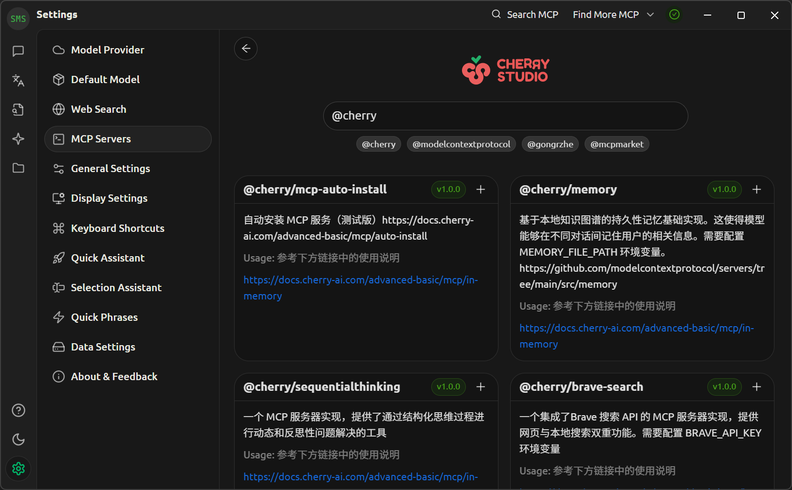

# LLM 使用指南

## 客户端

### 优点

- **界面统一**: 可以通过统一的界面使用各种 LLM. 通过 API 接入各种 LLM 提供商, 可以访问不同的 LLM.

    { width=70% style="display: block; margin: 0 auto" }  

- **支持 MCP**: 部分客户端支持 MCP.
- **参数可调**: 可以自定义模型参数/温度/最大上下文等设置.
- **离线可用**: 客户端通常支持运行本地 LLM, 确保离线可用且数据安全.
- **开源透明**: 部分 LLM 客户端采用开源许可.

### 缺点

- **需要 API**: 会增加使用难度, 并产生额外成本. LLM 提供商的网页版通常可以免费使用, 而 API 则需要付费使用. 不过 API 价格通常较便宜, 而且用途更加广泛 (比如可以让翻译插件接入 LLM).
- **需要配置**: 初次使用需要配置 LLM 提供商的 API 密钥, 增加了使用门槛.
- **硬件要求**: 运行本地 LLM 需要强大的硬件.

### 推荐

- **[Cherry Studio]**: 跨平台, 部分开源 (个人使用免费),  MCP, 在线搜索, 图片/文档解析, 知识库, Ollama/LM Studio. **不支持**对话克隆.
- **[LobeChat]**: 跨平台, 部分开源 (个人使用免费), 支持知识库, Ollama.
- **[LM Studio]**: 跨平台, 闭源免费, **仅支持离线模型**, 界面简洁易用. 支持图片/文档解析.
- **[Msty]**: 跨平台, 闭源免费 (提供付费高级版), 支持在线搜索 (效果较差), 图片/文档解析, 知识库, Ollama.

[Cherry Studio]: https://github.com/CherryHQ/cherry-studio
[LobeChat]: https://github.com/lobehub/lobe-chat
[LM Studio]:https://lmstudio.ai/
[Msty]: https://msty.app/

## MCP

LLM 可以与 MCP 服务器通信, 以拓展其功能.

MCP 既可以运行在远程服务器, 也可以运行在本地. 比如网页爬虫 MCP 就可以在本地或远程, 而文件系统 MCP (访问本地文件系统) 就只应该在本地运行.

MCP 服务器有以下部署方式:

- **远程部署**：适用于网页爬虫/API 调用等通用功能.
- **本地部署**：适用于文件系统访问/本地数据库操作等涉及敏感数据的功能, 确保离线可用且数据安全.

{ width=80% style="display: block; margin: 0 auto" }  

点击上图右上角的 `Search MCP` 按钮, 即可快速添加 Cherry Studio 提供的 MCP.

{ width=80% style="display: block; margin: 0 auto" }  

后续便可用通过下面方式在会话中启用 MCP:

{ width=60% style="display: block; margin: 0 auto" }  

## 实用链接

- [DeepSeek API](https://platform.deepseek.com/).
- [DeepSeek API 价格](https://api-docs.deepseek.com/zh-cn/quick_start/pricing/).
- [OpenAI API](https://platform.openai.com/).
- [OpenAI API 价格](https://openai.com/api/pricing/).
- [GitHub Models](https://github.com/marketplace?type=models).
