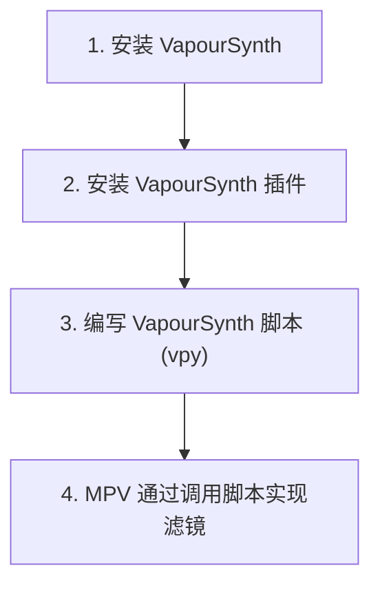

# MPV


## 超分辨率 (Super Resolution)

```conf title="~~/mpv.conf"
vf=d3d11vpp=w=0:h=0:scaling-mode=nvidia
```

## 补帧 (Frame Interpolation)

下面为配置过程的简化流程图:



1. [VapourSynth] 是一个开源 (LGPL-2.1) 的视频处理框架. 此处用于对 MPV 的帧数据进行后处理.
2. 在 Linux 下通常可以通过包管理器直接安装, 在 Windows 下需要将编译的 dll 文件移动到 VapourSynth 安装目录下的 `vs-plugins` 文件夹中.
3. 通过 Python 脚本构建管线, 因此该脚本只需运行一次. 用户可以在此处进行各种高级的自定义, 但主要任务是调用安装的 VapourSynth 插件进行后处理.
4. 在 MPV 的配置文件中引用该脚本, 以启用相应的功能.

[VapourSynth]: https://github.com/vapoursynth/vapoursynth

主要有两种补帧技术:

- **[MVTools]**: 基于传统算法. 速度快, 依赖 CPU.
- **[RIFE]**: 基于神经网络. 质量高, 依赖 GPU. 如果 GPU 性能不足, 无法做到实时补帧, 反而可能降低帧率.

[MVTools]: https://github.com/dubhater/vapoursynth-mvtools
[RIFE]: https://github.com/AmusementClub/vs-mlrt

### MVTools

```sh
paru -S vapoursynth vapoursynth-plugin-mvtools
```

```py title="~~/scripts/mvtools.vpy"
import vapoursynth as vs

clip = video_in

dst_fps = display_fps
# Interpolating to fps higher than 60 is too CPU-expensive, smoothmotion can handle the rest.
while (dst_fps > 60):
    dst_fps /= 2

# Skip interpolation for >1080p or 60 Hz content due to performance
if not (clip.width > 1920 or clip.height > 1080 or container_fps > 59):
    src_fps_num = int(container_fps * 1e8)
    src_fps_den = int(1e8)
    dst_fps_num = int(dst_fps * 1e4)
    dst_fps_den = int(1e4)
    # Needed because clip FPS is missing
    clip = vs.core.std.AssumeFPS(clip, fpsnum = src_fps_num, fpsden = src_fps_den)
    print("Reflowing from ",src_fps_num/src_fps_den," fps to ",dst_fps_num/dst_fps_den," fps.")

    sup  = vs.core.mv.Super(clip, pel=2, hpad=16, vpad=16)
    bvec = vs.core.mv.Analyse(sup, blksize=16, isb=True , chroma=True, search=3, searchparam=1)
    fvec = vs.core.mv.Analyse(sup, blksize=16, isb=False, chroma=True, search=3, searchparam=1)
    clip = vs.core.mv.BlockFPS(clip, sup, bvec, fvec, num=dst_fps_num, den=dst_fps_den, mode=3, thscd2=12)

clip.set_output()
```

### RIFE

模型:

```sh
python3 -c "import sys;sys.path.append('/usr/lib/vapoursynth');import vsmlrt;[print(f'{m.value:>4} = {m.name}') for m in vsmlrt.RIFEModel]"
```

后端:

```sh
python3 -c "import sys; sys.path.append('/usr/lib/vapoursynth'); import vsmlrt; print(*[b for b in dir(vsmlrt.Backend) if not b.startswith('_')], sep='\n')"
```

#### TensorRT

依赖于 TensorRT, 因此需要 20 或更新系列的 NVIDIA 显卡.

```sh
paru -S cuda
set -x PATH /opt/cuda/bin $PATH
set -x LD_LIBRARY_PATH /opt/cuda/lib64 $LD_LIBRARY_PATH
set -x CUDAToolkit_ROOT /opt/cuda
paru -S tensorrt

paru -S vapoursynth vapoursynth-plugin-mlrt-trt-runtime-git vapoursynth-plugin-mlrt-ext-models-rife
```

```py title="~~/scripts/rife.vpy"
import vapoursynth as vs
from vapoursynth import core
import vsmlrt

clip = video_in

# 分辨率向上取整至 64 的倍数
# 若需向下取整, 改为 (clip.width // 64) * 64
pad_w = ((clip.width + 63) // 64) * 64
pad_h = ((clip.height + 63) // 64) * 64

# 调整分辨率并转换为 RIFE 所需的 RGBS 格式
clip = core.resize.Bicubic(
    clip,
    width=pad_w,
    height=pad_h,
    format=vs.RGBS,
    matrix_in_s="709"
)

# 配置 TensorRT 后端
trt_backend = vsmlrt.Backend.TRT(
    device_id=0,         # 显卡序号 (GPU Index), 0 为第一张显卡
    workspace=None,      # 显存 (VRAM) 分配大小, None 为自动分配
    num_streams=2,       # CUDA 流并发数 (Number of Streams)
    max_aux_streams=2,   # 最大辅助流数 (Max Auxiliary Streams)
    fp16=True,           # 启用半精度浮点 (FP16) 加速 (提升性能但轻微降质)
    force_fp16=True,     # 强制使用 FP16 精度
    use_cuda_graph=True  # 启用 CUDA 图降低运行开销
    # use_cublas=True,                  # 优化矩阵运算
    # use_cudnn=True,                   # 优化卷积神经网络
    # use_edge_mask_convolutions=True,  # 减少模糊重影 (会降低性能)
    # use_jit_convolutions=True,        # 即时编译卷积 (增加编译时间, 提升运行性能)
    # static_shape=True,                # 静态形状 (增加编译时间, 提升运行性能)
    # heuristic=True,                   # TRT 自动选择最佳算法
    # short_path=True,                  # 短路径优化 (减少重复计算)
    # builder_optimization_level=5,     # 构建器优化等级 (0~5)
    # tiling_optimization_level=2       # 平铺优化等级 (0~2)
)

# 运行 RIFE 模型
clip = vsmlrt.RIFE(
    clip,
    model=46,            # 模型版本
    multi=2,             # 补帧倍速
    backend=trt_backend
)

# 恢复为常规的 YUV420P10 格式输出
clip = core.resize.Bicubic(
    clip,
    format=vs.YUV420P10,
    matrix_s="709"
)

clip.set_output()
```

#### NCNN Vulkan

!!! warning
    未测试该后端, 下面内容仅供参考.

基于由腾讯开发的 [ncnn](https://github.com/Tencent/ncnn), 依赖于 Vulkan, 因此兼容性较好.

```sh
paru -S vapoursynth vapoursynth-plugin-mlrt-ncnn-runtime vapoursynth-plugin-mlrt-ext-models-rife
```

```py title="~/.config/mpv/scripts/"
import vapoursynth as vs
from vapoursynth import core
import vsmlrt

clip = video_in

# 分辨率向上取整至 64 的倍数
# 若需向下取整, 改为 (clip.width // 64) * 64
pad_w = ((clip.width + 63) // 64) * 64
pad_h = ((clip.height + 63) // 64) * 64

# 调整分辨率并转换为 RIFE 所需的 RGBS 格式
clip = core.resize.Bicubic(
    clip, 
    width=pad_w, 
    height=pad_h, 
    format=vs.RGBS,
    matrix_in_s="709"
)

# 配置 NCNN Vulkan 后端
ncnn_backend = vsmlrt.Backend.NCNN_VK(
    device_id=0,      # 显卡序号 (GPU Index)，0 为第一张显卡
    num_streams=1,    # 并行流处理数量 (Number of Streams)，范围 1~8
    fp16=True,        # 启用半精度浮点 (FP16) 加速
    tiles=None,       # 分块处理的大小 (Tile Size)，None 为自动分配
    overlap=None      # 分块边缘重叠像素的大小 (Overlap Size)，None 为自动分配
)

# 运行 RIFE 模型
clip = vsmlrt.RIFE(
    clip,
    model=46,         # 模型版本
    multi=2,          # 补帧倍速
    backend=ncnn_backend
)

# 恢复为常规的 YUV420P10 视频流格式输出
clip = core.resize.Bicubic(
    clip, 
    format=vs.YUV420P10, 
    matrix_s="709"
)

clip.set_output()
```

## 参见

- [mpv_PlayKit](https://github.com/hooke007/mpv_PlayKit): Windows 下开箱即用的高级 mpv 配置.

## 参考

- [如何在Linux下使用RIFE - 技术交流与探讨 / 游戏与多媒体 - Arch Linux 中文论坛](https://forum.archlinuxcn.org/t/topic/15389)
