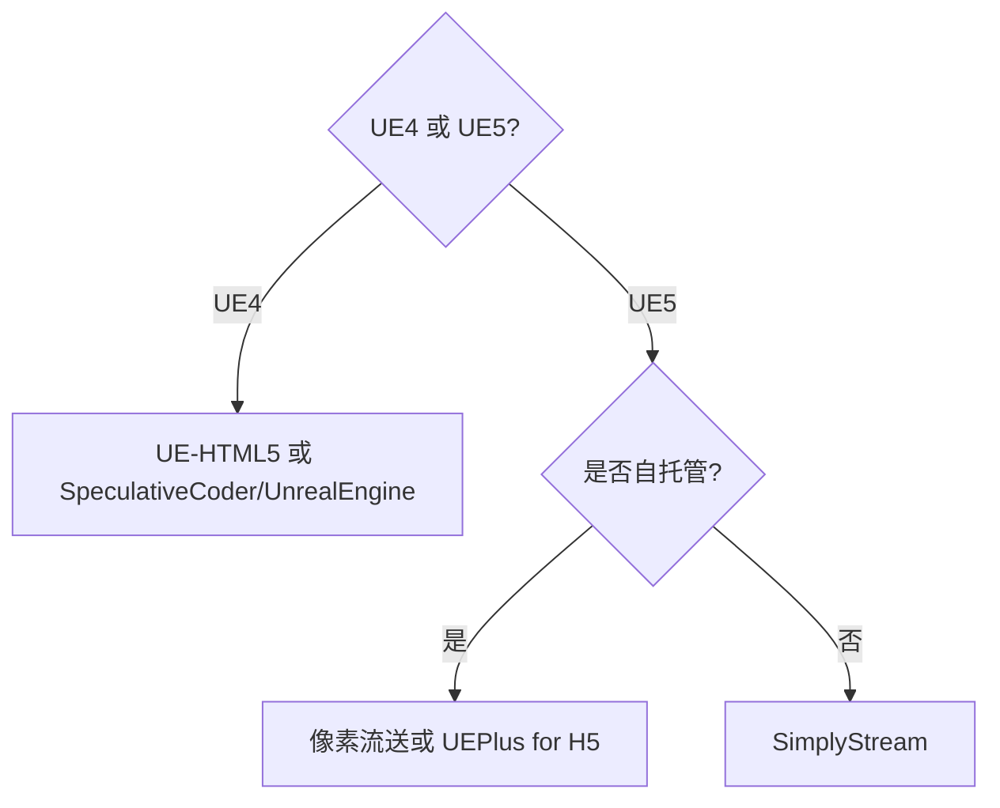

# UE5 使用 WebGPU 的可行性分析

## 摘要

UE 4.23 是官方最后支持 HTML5 导出的版本, 本文旨在分析为 UE5 添加 WebGPU 和 WASM 支持的可行性. 本文大致可以分为两部分, 第一部分介绍市面上已存在的相关方案, 第二部分将具体分析相关方案的可行性.

## 第三方方案

| **项目名称**                  | **支持 UE 版本** | **收费模式** | **图形 API** |
|-------------------------------|------------------|------------|--------------|
| UEPlus for H5                 | 5.5 及更早版本   | 付费         | WebGPU       |
| SimplyStream                  | 4.X, 5.X         | 付费         | WebGPU       |
| UE-HTML5                      | 4.24, 4.27       | 免费开源     | WebGL        |
| SpeculativeCoder/UnrealEngine | 4.27             | 免费开源     | WebGL        |

**备注**: 查看在线演示需确保浏览器已启用 WebGPU 支持, 目前 Chrome/Edge 默认启用, Firefox 默认禁用,  但可以手动启用.

### UEPlus for H5

- **官网**: <https://www.uipower.com/UEPlus.html>
- **在线演示**: **不可用**. 官网有提供链接, 但是打开后显示页面不存在 (HTTP 404).
- **收费标准**: 未知.

支持自托管 (导出为 HTML5/WASM).

### SimplyStream

- **官网**: <https://simplystream.com/>
- **在线演示**: <https://simplystream.com/demos> (无法成功加载)
- **收费标准**: <https://simplystream.com/calculator>
- <https://news.ycombinator.com/item?id=40099974#40100414>

astlouis44 声称他们 (Wonder Interactive) 的实现方法是为 UE 添加 WebGPU 和 WASM 支持.  
宣称其特点是支持流式资源传输, 但在线演示中的 WASM 文件体积就有 500MB.  
官网信息不足, 没有具体支持的 UE 版本范围, 仅能从 astlouis44 的发言推测支持 UE5, 且可能支持 UE4.

!!! warning
    不支持自托管, 只能租用他们提供的服务器.

### UE-HTML5

- **文档**: <https://github.com/ufna/UE-HTML5>
- **代码仓库**: <https://github.com/ufna/UnrealEngine/tree/4.24-html5>
- **代码量**: +42426

该社区分支提供 UE **4.24** 的 HTML5 导出功能.

### SpeculativeCoder/UnrealEngine

- **代码仓库**: <https://github.com/SpeculativeCoder/UnrealEngine/tree/4.27-html5-es3>
- **代码量**: +117273 -66210

该社区分支提供 UE **4.27** 的 HTML5 导出功能.

该项目还提供一个 UE **5.5** 分支, 但是从 commit 看仅引入了 4.27 支持 HTML5 的修改, 应该还没有开始正式为 UE5 添加 HTML5 导出功能, 且相关工作已经停止了 3 个月 (截至 2024 年 8 月).

### Nanite WebGPU

- **代码仓库**: <https://github.com/Scthe/nanite-webgpu>
- **在线演示**: <https://github.com/Scthe/nanite-webgpu#demo-scenes>

该项目是尝试通过 WebGPU 复现 Nanite 功能 (虚拟几何体), 最终**只成功复现部分功能**, 其余功能由于 WebGPU 限制, 无法实现.

说明将 UE5 的功能 (渲染管线等) **完整地移植到 WebGPU 不太可行**.

内部使用了 meshoptimizer 和 METIS 库, 与 Bevy 一致.

## 自行添加 WebGPU 支持

为 UE 4.24 和 4.27 版本重新添加 HTML5 导出支持的社区分支, 代码行数平均增加 4 万行以上. 可以看出, 即使是为 UE4 继续支持该功能也需要大量工作. UE5 相较于 UE4 在渲染管线方面又有较大的改动, 使得为 UE5 添加相关支持难上加难.

大致需要以下步骤:

1. 为 UE5 添加 WASM 支持.
2. 为 UE5 添加 WebGPU RHI 后端.
3. 重制渲染管线以兼容 WebGPU. 详情请参考 "渲染管线移植可行性" 小节.

综上所述, 该方案**可行性极低**.

## 像素流送

UE 5.5 引入**像素流送 2**, 其 C++ API 存在重大变更, 蓝图节点也需要更新. 如果计划使用该技术, 建议使用 UE 5.5 及以后版本.

该方案**可行性较高**, 缺点是服务端需要能承担渲染任务的高性能硬件, 可能导致较大的开销.

## 渲染管线移植可行性

根据 Bevy 虚拟几何体 (即 UE 的 Nanite) 相关文档, 在渲染管线方面, 需要借助 Mesh 着色器才能充分发挥 GPU 硬件的性能, 而目前 WebGPU 和 wgpu (最初由 Mozilla 主导的 WebGPU 实现) 均不支持该类型的着色器. 所以需要退而求其次, 选择其他替代方案 (可能为 Compute 着色器). 这表明即使原生应用程序使用 wgpu 也无法完美地实现 Nanite 的渲染管线, 由浏览器提供的 WebGPU 会存在更多限制. 根据 Nanite WebGPU 的文档, WebGPU 不支持能实现高效软光栅化器的 `atomic<u64>` 类型. 根据最新的 WGSL 标准, 原子类型仅支持 u32 和 i32. 近期 wgpu/naga 已添加对 `atomic<u64>` 类型的支持, 并在 Bevy 中得到应用. 但如果将 WebGPU 作为后端, 而非直接使用 wgpu, 因此该问题依然存在.

由于 WebGPU 的各种限制, 导致其难以实现 UE5 的新渲染管线. 因此可以推断为 UE5 添加 WebGPU 支持的难度较高. 除了需要为 UE5 添加 WebGPU RHI 后端, 还需要对部分渲染管线进行重制, 以绕过 WebGPU 的限制.

Bevy 和 Nanite WebGPU 的实现中均借助第三方库 meshoptimizer (用于简化网格) 和 METIS (用于 meshlets 分组) 对网格进行预处理, 这两个库支持 WASM, 但是 UE5 是使用自己实现的简化代码. 有可能 UE5 为引擎引入了一些不支持 WASM 的代码, 鉴于官方早在 UE 4.23 就放弃了 HTML5 导出功能.

此外 Nanite WebGPU 提供的 "Bunnies" 场景 (1.2B 三角形) 在线演示在 NVIDIA GeForce RTX 4060 Laptop 下运行约 10 FPS, 远不满足实时渲染的标准 (30 FPS). 并且作者还表示, 由于兔子体积太小, 大部分已经在视锥剔除阶段被剔除了.

还有一种简单粗暴的方法就是直接禁用 Nanite, 因为一般的简单场景 (尤其是手工 3D 建模) 并没有非常大量的三角形面数, 所以对 Nanite 没有硬性要求. 虽然根据 UE 的文档, 应该尽可能地为静态网格体启用 Nanite, 以提高渲染速度, 同时减少内存和外存占用.

## 结论

目前市面上存在少量付费方案, 但由于无法查看其提供的在线演示, 其实际效果难以评估.

自行为 UE5 添加 WebGPU 和 WASM 支持的可行性极低. 由于存在限制, 即使成功为 UE5 添加了 WebGPU 支持, 也无法发挥其图形渲染管线的全部功能, 需要对部分功能进行限制, 如 Nanite 或 Lumen 等高级特性. 付费方案均未公开实现细节.

以下是较为可行的方案:

1. 尝试第三方提供的付费方案.
2. 未来首选有官方 WASM 支持的游戏引擎, 如 Unity 和 Godot.
3. 像素流送, 可以作为第三方付费方案的替代品, 可能更具性价比.

