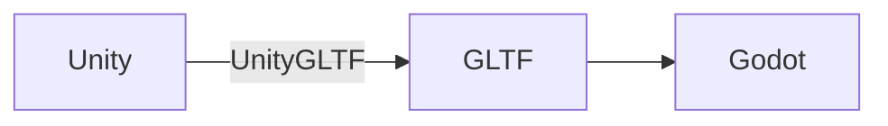
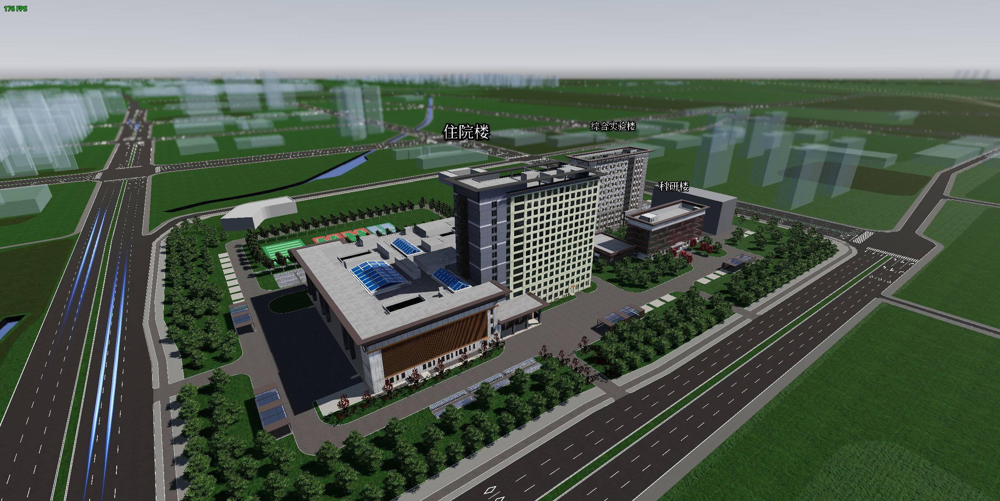

# Unity 场景迁移至 Godot

本文介绍如何高效地将 Unity 场景迁移到 Godot 引擎.

## 导出 Unity 场景为 GLTF

这里选择 GLTF 作为中间转换格式是因为:

- Godot 对 GLTF 支持良好.
- GLTF 官方提供了将 Unity 场景导出为 GLTF 的插件 [UnityGLTF](https://github.com/KhronosGroup/UnityGLTF).

插件安装后, 即可根据 [UnityGLTF 文档](https://github.com/KhronosGroup/UnityGLTF#exporting-gltf-files)的说明, 将 Unity 场景以 GLTF 格式导出到文件夹中.

## 将 GLTF 导入 Godot

!!! warning
    请直接将 UnityGLTF 生成的 GLTF 导入 Godot.  
    避免通过 Blender 转换类型, 在 Blender 中加载该 GLTF 场景, 可能会导致大量内容丢失, 直接导入 Godot 则不会出现此问题.

## 常见问题及修复

!!! tip
    GLTF 文件导入后生成的场景默认继承自该文件, 如果原 GLTF 文件有修改, 对应的场景也会自动更新.  
    但此类继承场景只能添加新节点, 无法修改或删除已有节点.  
    如果需要对场景进行修改, 右键点击根节点并选择 "Clear Inheritance".

    此外, 若场景较大, 建议保存为二进制格式 `scn`, 以提升加载和保存速度, 并减少文件体积.

由于 Unity 场景导出到 GLTF 是有损的, 在导入 Godot 后可能不一致.  
下面是一些常见问题的修复方法:

- **部分材质变为黑色**: 取消对应材质的 `Vertex Color | Use as albedo` 选项.
- **场景部分物体消失**: 通常是由于该物体在 Unity 中是半透明的, 只需要重新调整材质的透明度.

场景内会残留一些在 GLTF 和 Godot 中没有对应类型的节点, 可以检查并删除这些节点来清理场景.

## 效果展示

下图为 Unity 项目中的原始场景:

下图为将该场景导入 Godot 并进行修复后的场景:

