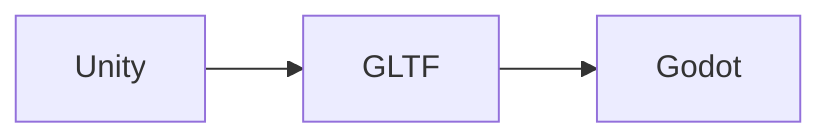

# Unity 迁移到 Godot

本文将讲述如何快速的将 Unity 的场景迁移到 Godot.

## 导出 Unity 场景为 GLTF

这里选择 GLTF 作为中间转换格式是因为:

- Godot 对 GLTF 有良好的支持.
- GLTF 官方提供了将 Unity 场景导出为 GLTF 的插件 [UnityGLTF](https://github.com/KhronosGroup/UnityGLTF).

## 将 GLTF 导入 Godot

!!! warning
    请将 UnityGLTF 生成的 GLTF 直接导入 Godot. 如果用 Blender 加载该 GLTF 场景, 可能会导致大量内容丢失, 直接导入 Godot 则不会.

## 常见问题及修复

!!! tip
    默认导入的场景继承自 GLTF 文件, 如果文件变更, 场景也会自动更新.  

由于 Unity 场景导出到 GLTF 是有损的, 在导入 Godot 后可能不一致.  
下面是一些常见问题的修复方法:

- **部分材质变为黑色**: 取消对应材质的 `Vertex Color | Use as albed` 选项.
- **场景部分物体消失**: 通常是由于该物体在 Unity 下的半透明的, 只需要重新调整材质的透明度.

场景内会残留一些在 GLTF 和 Godot 中没有对应类型的节点, 可以检查并删除这些节点来清理场景.

下图为 Unity 项目中的原始场景:

下图为导入 Godot 并进行修复后的场景:

