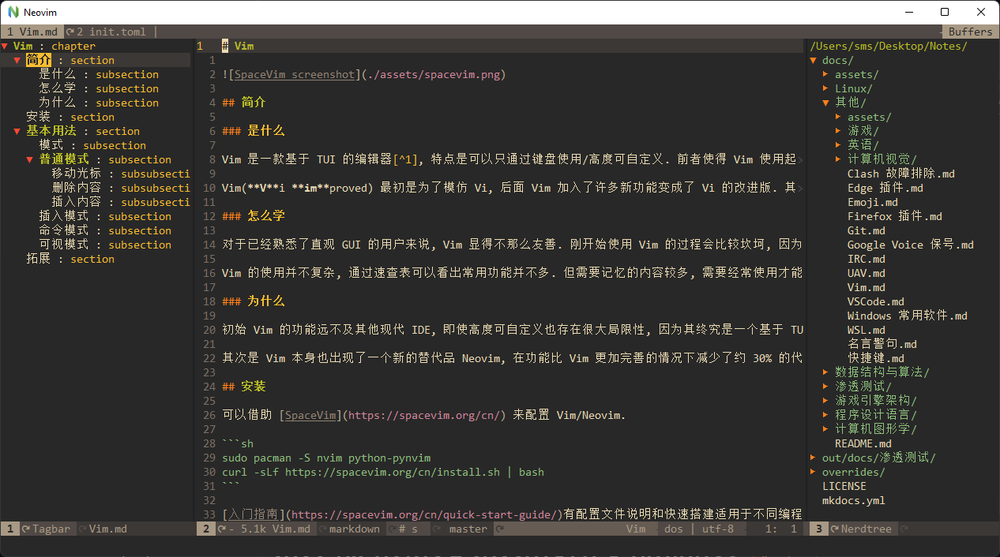
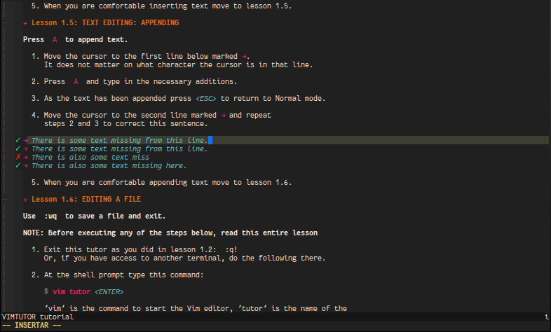

# Vim

  

## 简介

### 是什么

[Vim](http://www.vim.org/) 是一款基于 TUI 的编辑器[^1], 特点是可以只通过键盘使用/高度可自定义. 前者使得 Vim 使用起来十分高效, 后者使得 VIM 可以通过配置添加各种想要的功能.  

Vim(**V**i **im**proved) 最初是为了模仿 Vi, 后面 Vim 加入了许多新功能变成了 Vi 的改进版. 其中包含了不少现代 IDE 具备的基本功能.  

### 怎么学

{ align=right width=50% }  

对于已经熟悉了直观 GUI 的用户来说, Vim 显得不那么友善. 刚开始使用 Vim 的过程会比较坎坷, 因为一些简单的编辑功能需要重新学习. 但在逐渐熟悉操作后, 效率会逐渐提高, 直至超越曾经使用的 GUI.  

Vim 的使用并不复杂, 通过速查表可以看出常用命令并不多. 掌握 Vim 并不需要刻意记忆命令, 经常使用即可. [vimtutor](https://github.com/vim/vim/tree/master/runtime/tutor) 提供了一个交互式的入门教学, 时长约 30min.  

其次 Vim User Manual[^2] 也是值得一读的.  

### 为什么

初始 Vim 的功能远不及其他现代 IDE, 即使高度可自定义也存在很大局限性, 因为其终究是一个基于 TUI 的编辑器. Vim 的高效的键盘使用方案也被其他的现代 IDE 甚至包括浏览器通过插件所支持, 比如 Visual Studio Code 中的 Vim 插件. 因此即使不使用 Vim, 学习 Vim 依然十分有价值.  

其次是 Vim 本身也出现了一个新的替代品 Neovim, 在功能比 Vim 更加丰富的情况下减少了约 30% 的代码量. 拥有更活跃的社区和其他诸多优点.  

## 安装

可以借助 [SpaceVim](https://spacevim.org/cn/) 来配置 Vim/Neovim.  

```sh
sudo pacman -S nvim                                 # 安装 Neovim
sudo pacman -S python-pynvim                        # 或 pip install pynvim, 支持依赖 Python 的插件
curl -sLf https://spacevim.org/cn/install.sh | bash # 安装 SpaceVim
```

## SpaceVim

[SpaceVim 入门指南](https://spacevim.org/cn/quick-start-guide/)有配置文件说明和快速搭建适用于不同编程语言环境方法的索引.  

- 打开配置文件: `SPC f v d`, 可以通过修改配置文件 `~/.SpaceVim.d/init.toml` 来启用更多功能或安装插件.
- 更新全部插件: `:SPUpdate`, 对全部已安装的插件进行更新, 包括 SpaceVim 自身.
- 开启/关闭大纲: `F2`.
- 开启/关闭文件树: `F3`.
- 查找当前项目下的文件: `CTRL` `p`.

要启用 nvim-qt 中的右键文本编辑菜单, 往 ginit.vim 中添加一下内容:  

```vim
nnoremap <silent><RightMouse> :call GuiShowContextMenu()<CR>
inoremap <silent><RightMouse> <Esc>:call GuiShowContextMenu()<CR>
vnoremap <silent><RightMouse> :call GuiShowContextMenu()<CR>
```

SpaceVim 默认只启用了最基本的 [Layers](https://spacevim.org/layers/)(可以看作是特定功能的合集), 用户可以应根据自身需求启用他们来添加功能. 在用户进行简单的配置并重启后, 会自动下载所需的的插件并进行配置.  

## 基本用法

{ align=right width=60% }  

### 模式

- 普通模式(normal mode).
- 插入模式(insert mode).
- 可视模式(visual mode).
- 命令模式(command mode).

下面将列举各个模式下最常用的命令.  

### 普通模式

普通模式是默认的模式, 不同于其他以插入模式作为默认模式的无状态编辑器. 按键被用作以下功能.  

#### 移动光标

```txt
     ^       gg
     k       H
0 < h l > $  M
     j       L
     v       G
```

|                 |                          |
| --------------- | ------------------------ |
| `h`/`j`/`k`/`l` | 向左/下/上/右移动        |
| `0`/`\|`        | 移动到行首               |
| `$`             | 移动到行尾               |
| `gg`            | 移动到当前文件的第一行   |
| `G`             | 移动到当前文件最后一行   |
| `H`             | 移动到当前屏幕的第一行   |
| `M`             | 移动到当前屏幕的中间     |
| `L`             | 移动到当前屏幕的最后一行 |
| `w`             | 向后移动一个词           |
| `b`             | 向前移动一个词           |

#### 删除内容

|      |                                    |
| ---- | ---------------------------------- |
| `x`  | 删除光标上的当前字符               |
| `dd` | 删除一整行                         |
| `D`  | 删除当行光标之后的内容             |
| `C`  | 删除光标内容的内容，并进入插入模式 |

#### 插入内容

普通模式使用下列命令将会切换为插入模式.  

|     |                                              |
| --- | -------------------------------------------- |
| `i` | 在光标左侧进入插入模式                       |
| `I` | 在光标行的行首输入正文                       |
| `a` | 在光标右侧输入内容                           |
| `A` | 在光标所在行的行尾输入内容                   |
| `o` | 在光标处的下一行添增内容                     |
| `O` | 在光标处的上一行添增新行, 光标位于新行的行首 |

#### 查找

|          |                          |
| -------- | ------------------------ |
| `/foo`   | 查找 `key`               |
| `/foo\c` | 查找 `key`, 大小写不敏感 |
| `*`/`#`  | 向后/前查找光标处的词    |
| `n`/`N`  | 下/上一条匹配项          |

#### 其他

|      |                          |
| ---- | ------------------------ |
| `gx` | 在浏览器中打开光标处内容 |

### 插入模式

该模式也可以理解为 "编辑模式". 在普通模式下执行插入相关操作就会进入插入模式. 按 `Esc` 回到普通模式.  

### 命令模式

在普通模式下按 `:`/`/` 即可进入命令模式. 按 `Esc` 回到普通模式.  
此时光标会移动到屏幕最下方, 并等待用户输入命令. 可以使用 `Tab` 补全命令.  

#### 保存/退出

|           |                              |
| --------- | ---------------------------- |
| `:w`      | 写入(保存)                   |
| `:q`      | 退出                         |
| `:wq`     | 写入并退出                   |
| `:x`/`ZZ` | 写入并退出, 仅在有修改时写入 |

#### 打开文件

|                       |                               |
| --------------------- | ----------------------------- |
| `:e file`             | 打开文件 `file`               |
| `:sp file`(`:split`)  | 水平分割窗口并打开文件 `file` |
| `:vs file`(`:vsplit`) | 垂直分割窗口并打开文件 `file` |

#### 其他

|                     |                     |
| ------------------- | ------------------- |
| `:Tutor`            | vimtutor 交互式教程 |
| `:h key`(`:help`)   | 查看帮助            |
| `:h quickref`       | 查看快速参考        |
| `:n`                | 定位到第 `n` 行     |
| `:!cmd`             | 执行命令 `cmd`      |
| `:ter`(`:terminal`) | 打开内置终端        |

### 可视模式

在普通模式下按 `v` 即可进入可视模式. 按 `Esc` 回到普通模式.  

## 参见

- [Vi 与 Emacs 之间的编辑器之战](https://en.wikipedia.org/wiki/Editor_war)
- [Vim 插件合集](https://vimawesome.com/)

## 参考

- <https://quickref.me/vim> Vim 速查表
- <http://www.viemu.com/a_vi_vim_graphical_cheat_sheet_tutorial.html> Vi/Vim 速查表和教程

[^1]: 也有提供 GUI 的分支项目, 如 gVim/[macVim](https://github.com/macvim-dev/macvim).
[^2]: [Vim](https://neovim.io/doc/user/usr_01.html)/[Neovim](https://neovim.io/doc/user/usr_01.html).
