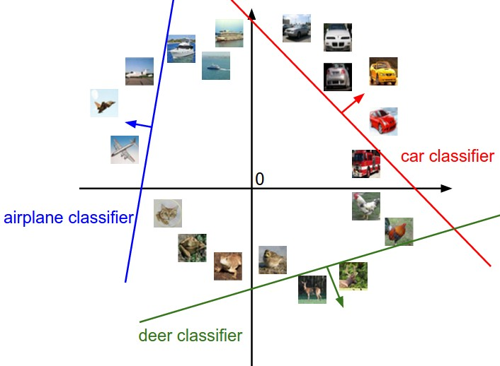
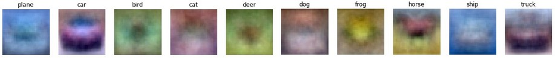

# 线性分类

**英文**: Linear Classification.  

## Parametric Approach

线性分类器:  

$$
f(x_i, W, b) = Wx_i + b
$$

  

输入:  

- $x_i$: 图像数据.
- $W$ (weights): 权重.
- $b$: 偏差.

输出:  

- n 个值, 分别表示每种图像类型的可能性.

## 解释

### 直线

将图像看成高纬的点.  
可以看出线性分类器函数类似一个直线的斜截式方程($y = kx + b$).  

  

从上图可以很直观的看出该方法所存在的问题, 同类型的图像不一定都能被直线所分割, 所分割的也不一定都是同类型的图像.  

### 模板

将 y 设为 1, 算出 x 的值并将结果可视化.  

将分类过程看作是检查图像和模板的相似度, 与 kNN 不同的是使用内积而不是 L1, L2 距离.  

## 损失函数 (Loss function)

用于识别分类器的好坏.  