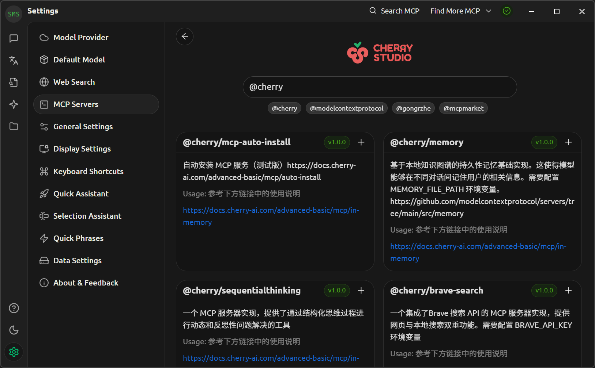

# 大语言模型使用指南

大语言模型 (Large Language Model, LLM) 指由具有大量参数 (通常大于 1B) 的神经网络组成的语言模型.  
本文不涉及技术细节, 专门介绍如何使用 LLM, 帮助读者快速上手.

## 客户端

### 优点

- **界面统一**: 可以通过统一的界面使用各种 LLM. 通过 API 接入各种 LLM 提供商, 可以访问不同的 LLM.

    { width=70% style="display: block; margin: 0 auto" }  

- **支持 MCP**: 部分客户端支持 MCP.
- **参数可调**: 可以自定义 Temperature/Top-P/上下文窗口等参数.
- **离线可用**: 客户端通常支持运行本地 LLM, 确保离线可用且数据安全.
- **开源透明**: 部分 LLM 客户端采用开源许可.

### 缺点

- **需要 API**: 会增加使用难度, 并产生额外成本. LLM 提供商的网页版通常可以免费使用, 而 API 则需要付费使用. 不过 API 价格通常较便宜, 而且用途更加广泛 (比如可以让翻译插件接入 LLM).
- **需要配置**: 初次使用需要配置 LLM 提供商的 API 密钥, 增加了使用门槛.
- **硬件要求**: 运行本地 LLM 需要强大的硬件.

### 桌面端

以下客户端均支持 Windows, Linux 和 macOS:

- **[Cherry Studio]**: 跨平台, 部分开源 (个人使用免费), 支持 MCP, 在线搜索, 图片/文档解析, 知识库, Ollama/LM Studio, GitHub Copilot.
- **[LM Studio]**: 跨平台, 闭源免费, **仅支持本地 LLM**, 界面简洁易用. 支持图片/文档解析, Flash Attention, 提供与 OpenAI API 兼容的本地服务器.
- **[LobeChat]**: 跨平台, 部分开源 (个人使用免费), 支持知识库, Ollama.
- **[Msty]**: 跨平台, 闭源免费 (提供付费高级版), 同时支持本地或远程 LLM, 支持在线搜索 (效果较差), 图片/文档解析, 知识库, Ollama.
- **[Jan]**: 跨平台, 开源 (Apache-2.0).

[Cherry Studio]: https://github.com/CherryHQ/cherry-studio
[LM Studio]:https://lmstudio.ai/
[LobeChat]: https://github.com/lobehub/lobe-chat
[Msty]: https://msty.app/
[Jan]: https://github.com/menloresearch/jan

Cherry Studio 等客户端本身并不支持本地 LLM, 但可以与 LM Studio 或 Ollama 组合使用, 同时支持本地和远程 LLM.

### 移动端

!!! warning
    目前常见手机只能以较慢的速度 (6 tok/sec) 运行 8B 参数的模型.

以下客户端均支持 Android:

- **[RikkaHub]**: 开源 (AGPLv3), 支持 MCP, 在线搜索 (**效果极差**).
- **[PocketPal]**: 开源 (MIT), **仅支持本地 LLM**. 支持 Flash Attention.
- **[MNN Chat]**: 开源 (Apache-2.0), **仅支持本地 LLM**, 支持 iOS (需要自行编译), 支持许多模型 (包括但不限于 Qwen3/DeepSeek), 有会话记录.
- **[Edge Gallery]**: 开源 (Apache-2.0), **仅支持本地 LLM**, 支持最新的 Gemma 3n 系列模型, 无法保持会话记录.

[RikkaHub]: https://github.com/rikkahub/rikkahub
[PocketPal]: https://github.com/a-ghorbani/pocketpal-ai
[MNN Chat]: https://github.com/alibaba/MNN
[Edge Gallery]: https://github.com/google-ai-edge/gallery

## 模型上下文协议

模型上下文协议 (Model Context Protocol, MCP) 是一种开源协议[^mcp], 旨在以标准化的方式向 LLM 提供上下文信息.  
LLM 可以与 MCP 服务器通信, 以拓展其功能.

[^mcp]: 由 Anthropic 公司于 2024 年 11 月提出.

MCP 服务器有以下部署方式:

- **远程部署**：适用于网页爬虫/API 调用等通用功能.
- **本地部署**：适用于文件系统访问/本地数据库操作等涉及敏感数据的功能, 确保离线可用且数据安全.

{ width=80% style="display: block; margin: 0 auto" }  

点击上图右上角的 `Search MCP` 按钮, 即可快速添加常见 MCP 服务器配置.

{ width=80% style="display: block; margin: 0 auto" }  

后续便可用通过下面方式在会话中启用 MCP 服务器:

{ width=60% style="display: block; margin: 0 auto" }  

### 推荐 MCP 服务器

- (内置) `@cherry/fetch`: 可以将网页 URL 直接发给 LLM, LLM 会爬取页面内容.
- `@modelcontextprotocol/server-sequential-thinking`: 引导 LLM 通过结构化思维过程实现动态和反思性解决问题.
- `@modelcontextprotocol/server-filesystem`: 访问本地文件系统.

## 知识库

知识库 (Knowledge Base) 是一种存储和检索信息的系统, 旨在向 LLM 提供新的/专有的上下文信息.  

下面将说明如何利用检索增强生成 (Retrieval-Augmented Generation, RAG) 检索知识库, 并最终引导 LLM 输出回答.  
RAG 一共有以下三个关键阶段:

1. **检索 (Retrieval)**: 将用户查询内容通过嵌入模型转为查询向量, 然后从向量数据库中检索相关文本片段.
2. **增强 (Augmentation)**: 将查询后得到的相关文本片段与用户查询内容进行合并, 得到增强的查询内容.
3. **生成 (Generation)**: LLM 根据增强后的查询内容生成最终的结果.

- RAG 检索阶段的各种方式类似传统的搜索引擎, 但其基于向量化技术, 具备语义检索能力.
- RAG 的本质依然是 "按需检索", 只会根据用户输入查询相关数据, 无法对知识库进行全面总结.
- RAG 可以从大量数据中提取相关信息.

    以 Cherry Studio 的 Web Search 工具为例, 其可以爬取大量网页内容, 创建一个临时知识库, 仅筛选出相关信息供 LLM 参考.  
    该功能可以使得网页搜索覆盖更多的搜索结果, 并提高内容的相关性. 显著提高了 LLM 回答的质量.

除了生成回答的 LLM, RAG 还需要借助两种模型:

- **嵌入模型 (Embedding Model)**: 将文本转换为向量表示, 用于生成向量数据库. 比如 Qwen3 Embedding (`text-embedding-v4`).
- **重排序模型 (Re-ranking Model)**: 对检索到的文本进行排序, 以提高相关性. 比如 Qwen3 Reranker (`gte-rerank-v2`).

其中重排序模型是可选的, 但可以显著提高检索结果的质量.

下面将以 Cherry Studio 为例, 描述如何创建一个关于 wgpu 的知识库:

{ width=50% style="display: block; margin: 0 auto" }  

其中 "Requested Document Chunks" 可以理解为搜索返回相关文本片段数, 这些片段一般被称为块 (Chunk). 该值过大可能导致过度检索, 无关信息过多反, 而降低生成质量.

找到 wgpu 的文档网站首页后, 通过 <https://www.xml-sitemaps.com> 等工具生成 Sitemap, 里面包含了该网页下所有子页面的 URL. 然后将 Sitemap 的 URL 添加到 Cherry Studio 中.

{ width=70% style="display: block; margin: 0 auto" }  

稍等片刻后即可看到绿色对勾, 表示向量数据库创建成功. 此时知识库已准备就绪, 可以在对话中启用.

## 本地 LLM

### 内存需求

| **参数规模/量化级别** | **FP16** | **Q8**  | **Q4**  | **Q2**  |
|-----------------------|----------|---------|---------|---------|
| **7B**                | ~16 GiB  | ~8 GiB  | ~4 GiB  | ~2 GiB  |
| **8B**                | ~18 GiB  | ~9 GiB  | ~5 GiB  | ~3 GiB  |
| **13B**               | ~29 GiB  | ~15 GiB | ~7 GiB  | ~4 GiB  |
| **30B**               | ~67 GiB  | ~34 GiB | ~17 GiB | ~9 GiB  |
| **70B**               | ~156 GiB | ~78 GiB | ~39 GiB | ~20 GiB |

!!! info
    上表数据仅供参考, 实际内存占用率还取决于上下文窗口等参数.

$$
\text{内存需求 (GiB)} = \frac{\text{参数数量} \times \text{量化位数 (B)}}{1024^3}
$$

### 量化级别

| 量化级别 | 质量 | 速度 | 内存占用 | 适用场景       |
|----------|----|-----|---------|------------|
| **FP16** | 最高 | 慢   | 最大     | 对质量要求极高 |
| **Q8**   | 很高 | 较慢 | 大       | 平衡质量和性能 |
| **Q4**   | 良好 | 快   | 中等     | **最佳平衡点** |
| **Q2**   | 一般 | 最快 | 最小     | 硬件受限场景   |

以 [DeepSeek-R1-0528-Qwen3-8B] 为例, 其参数量为 8B, 量化为 Q4_K_M.  
通过上表可以推测出所需内存大概为 5 GiB, 实际显存使用量为 5.3 GiB.

### 推荐模型

- **[DeepSeek-R1-0528-Qwen3-8B]**: 推理模型, 45.5 tok/sec, 约 5.3 GiB 内存占用.
- **[Qwen3-14B]**: 混合推理模型, 14 tok/sec, 约 5.6 GiB 内存占用.
- **[gemma-3-12b-it]**: 图像识别, 13 tok/sec, 约 7.7 GiB 内存占用.

**测试 GPU**: NVIDIA GeForce RTX 4060 Laptop GPU (8 GiB 显存).  
若使用 LM Studio 或 PocketPal, **建议启用 Flash Attention**, 以获得更快的推理速度和更大的上下文窗口.

[DeepSeek-R1-0528-Qwen3-8B]: https://huggingface.co/deepseek-ai/DeepSeek-R1-0528-Qwen3-8B
[Qwen3-14B]: https://huggingface.co/Qwen/Qwen3-14B
[gemma-3-12b-it]: https://huggingface.co/google/gemma-3-12b-it

## 参数

### 温度 (Temperature)

控制模型输出的随机性和创造性.

- **低温度**: 模型倾向于选择概率最高的词, 输出更确定.
- **高温度**: 增加低概率词被选中的机会, 输出更随机. 过高的温度可能导致输出内容不连贯 (逻辑性弱).

| 使用案例            | 温度 |
|-------------------|------|
| 代码生成/数学解题   | 0.0  |
| 数据抽取/分析       | 1.0  |
| 一通用对话          | 1.3  |
| 翻译                | 1.3  |
| 创意类写作/诗歌创作 | 1.5  |

如果使用的是推理模型, 可以适当降低温度 (如 $0.6$ [^temperature]).

对于编码/数学类任务, 为了提高逻辑性和质量, 应该将温度设为 $0$, 使其总是选择概率最高的词.

[^temperature]: <https://huggingface.co/deepseek-ai/DeepSeek-R1-0528-Qwen3-8B#temperature>

### 核采样 (Top-P)

影响模型考虑的候选词范围.

- **低核采样**: 只考虑最可能的少数词. 输出容易理解.
- **高核采样**: 考虑更多可能的词选择. 输出词汇更加丰富多样.

## Token

Token 是 LLM 处理文本的基本单位[^token], 也是 API 计费使用到的单位. 其与自然语言文本的换算关系大致为:

- 1 个英文字符 $\approx$ 0.3 token.
- 1 个中文字符 $\approx$ 0.6 token.

部分 LLM 客户端会显示精确的 token 数, 方便用户计算对话消耗的费用. 如果需要自行计算 token 数量, 则需要使用到相应模型的分词器 (tokenizer)[^tokenizer].

[^token]: 可以理解为 LLM 所使用语言的词, 该语言非任何人类语言.
[^tokenizer]: 不同模型的分词器并不相同.

## 供应商

受支持最广泛的 API 格式为 [OpenAI API], 除此自外还有 [Gemini API] 和 [Anthropic API].  
下面 LLM 供应商均支持 OpenAI API 格式接口:

- **[DeepSeek]**: [价格](https://api-docs.deepseek.com/zh-cn/quick_start/pricing/), 价格便宜, 非高峰时段使用有优惠.
- **[OpenAI]**: 必须使用电话号码注册. [价格](https://openai.com/api/pricing/), 价格及其昂贵.
- **[GitHub Models]**: GitHub 提供限制较严格的免费试用, 实际供应商为 Azure AI.
- **[SiliconFlow]**: 必须使用电话号码注册. 有几个 7B-9B 的免费模型, 但是速率限制非常严格, 难以用于网页翻译.
- **[OpenRouter]**.

[OpenAI API]: https://platform.openai.com/docs/api-reference/introduction
[Gemini API]: https://ai.google.dev/gemini-api/docs
[Anthropic API]: https://docs.anthropic.com/en/home

## 参考

- <https://en.wikipedia.org/wiki/Retrieval-augmented_generation>.

[DeepSeek]: https://platform.deepseek.com/
[OpenAI]: https://platform.openai.com/
[GitHub Models]: https://github.com/marketplace?type=models
[SiliconFlow]: https://cloud.siliconflow.cn/
[OpenRouter]: https://openrouter.ai/
