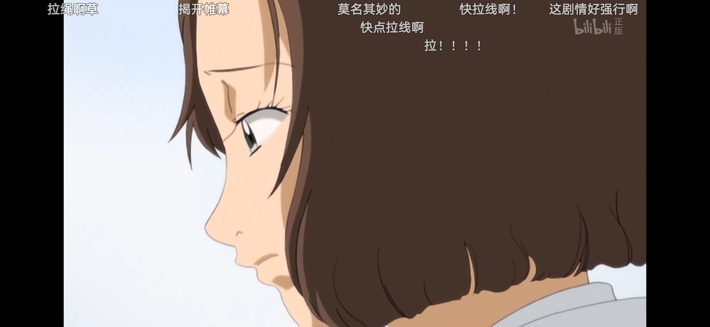
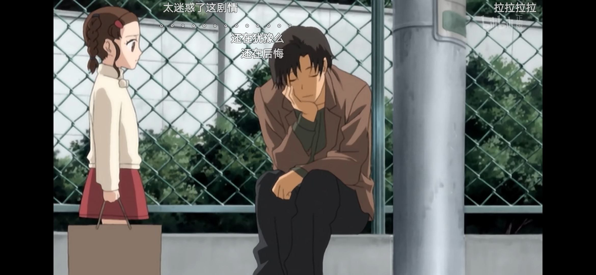

# 地狱少女 (地獄少女)

> Hell is empty and all the devils are here. - *William Shakespeare, The Tempest*

*地狱少女*作为一部单元剧, 地狱少女每集都会围绕一个与仇怨有关的故事展开. 当事的一方会通过 "地狱通信" 诅咒另一方坠入地狱, 一旦与地狱少女正式缔结契约, 被诅咒者便会立刻被送往地狱的深渊. 而诅咒者自身因咒杀他人, 死后亦将踏上前往地狱的不归路.

这不仅是一部讲述仇怨与复仇的剧集, 更是一部引发观众深思的作品. 它让我们看到了人性中的善恶冲突, 也让我们反思自己在面对类似情况时可能会做出的选择.

最初是因为喜欢这部作品的配乐*地獄の舟歌*, 然后才找到这部番剧. 好奇地狱少女讲述了一个怎样的虚构故事, 没想到却真的瞥见了真实的地狱.

前几集中, 被诅咒者往往背负着深重的罪孽. 比如第 2 集 *被魅惑的少女*, 在被诅咒者在即将对诅咒者实施不法侵害时被及时送入地狱, 因此观众可能会认为少女因为 "地狱通信" 得以躲过一劫. 在之后的几集中, 部分观众甚至将 "地狱通信" 视为正义的化身, 因为剧情总是被害人通过 "地狱通信" 寻求自己的正义, 并最终通过 "地狱通信" 将非正义的一方送入了地狱.

第 8 集 *寂静的交集*, 剧中出现了一名干涉者 (柴田一, 记者), 会参与案件并尝试阻止诅咒者通过 "地狱通信" 复仇. 干涉者的出现将对案件产生实质性的影响.  
此后讨论的焦点并不仅局限于 "地狱通信" 的正义和非正义, 还有干涉者的立场, 以及干涉的力度.

随着剧情的发展, 干涉者在发现之前的干涉未能取得有效成果时开始加大干涉力度. 在第 21 集 *和蔼的邻居*, 干涉者甚至将人偶从诅咒者手上夺过. 使用了除了口头劝说之外的干涉方式. 虽然干涉者声称自己的意图是希望诅咒者三思, 但却丢弃了人偶, 而非进行保管.

第 23 集 *病院之光*, 观众失去了上帝视野. 在之前的剧集中, 观众从上帝视角观察了整个故事的细节, 因此受害者和加害者的角色在观众的眼中非常的分明. 部分观众认为这是双赢, 坏人被送入地狱, 好人也得以复仇.  
而现实生活中, 人通常无法从上帝视角看到案件的全貌, 受害者和加害者的角色可能变得模糊. 第 23 集让观众也成为了这样一位未知全貌也不可能知全貌的旁观者.

观众虽然获得了观察单个案例的上帝视野, 但却依然被局限在剧中所提供的个案. 犹如管中窥豹, 难以对 "地狱通信" 做出全面的评价.

## 地狱空荡荡, 魔鬼在人间

正如威廉·莎士比亚在*暴风雨*中所写的: "地狱空荡荡，魔鬼在人间".

从第 1 集开始观众就开始通过弹幕 (Danmaku subtitling) 表达自己的看法, 部分观众内心的幽暗的开始通过弹幕展现.  
这一点在第 18 集 *被束缚的少女* 中尤为突出, 相比被加害人, 被害人和干涉者受到了更加强烈的批评, 仿佛被害人两条狗的死亡完全是自己一手造成的悲剧. 这些观众抨击被害人懦弱无能, 认为干涉人无权干涉别人复仇, 即使这样做也会使被害人也会坠入地狱.

这一现象, 无疑是对莎士比亚那句名言的深刻诠释.

仿佛间, 看见了大楼顶上的少女和楼下围观的看客[^1], 冷漠的看客甚至为自己的无情感到自豪.  
他们用冷酷的语言将悬崖边上的人推下, 少女跳楼后身亡, 而冷漠的看客也将在死后坠入地狱, 他们的灵魂将饱尝痛苦, 永世彷徨.

[^1]: <https://zh.wikipedia.org/wiki/%E5%BA%86%E9%98%B3%E5%A5%B3%E7%94%9F%E8%B7%B3%E6%A5%BC%E4%BA%8B%E4%BB%B6>
