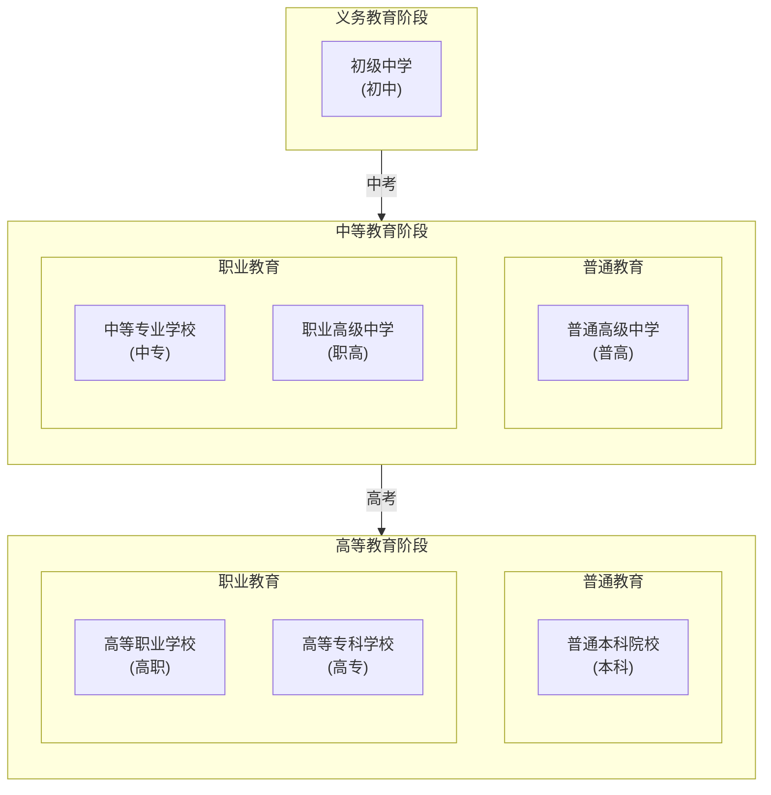

# 教育体系

```mermaid
flowchart TD
    subgraph C [义务教育阶段]
        初级中学["初级中学<br>(初中)"]
    end

    subgraph A [中等教育阶段]
        direction TD
        subgraph A1 [普通教育]
            普通高级中学["普通高级中学<br>(普高)"]
        end
        subgraph A2 [职业教育]
            中等专业学校["中等专业学校<br>(中专)"]
            职业高级中学["职业高级中学<br>(职高)"]
        end
    end

    subgraph B [高等教育阶段]
        direction TD
        subgraph B1 [普通教育]
            普通本科院校["普通本科院校<br>(本科)"]
        end
        subgraph B2 [职业教育]
            高等职业学校["高等职业学校<br>(高职)"]
            高等专科学校["高等专科学校<br>(高专)"]
        end
    end

    C -->|中考| A
    A -->|高考| B
```
