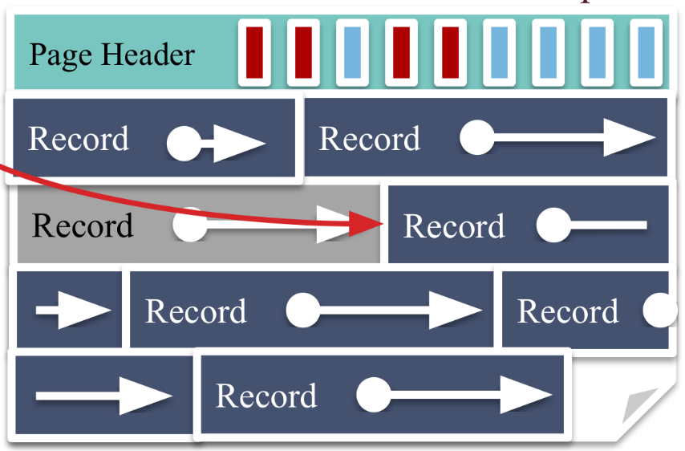

# 磁盘空间管理

文件 -> 页 -> 记录

## 文件结构

- 无序堆文件 (Unordered heap files): 记录无序的存储在页中.
- 集群堆文件 (Clustered heap files): 记录和页分组存储.
- 排序文件 (Sorted files): 记录和页有序存储.
- 索引文件 (Index files): B+ 树, 线性散列(Linear hashing, LH).

## 无序堆文件

为了支持行级操作, 需要跟踪以下内容:

- 文件中的页.
- 页的空闲空间.
- 页上的记录.

一种简单的方法将页的剩余空间保存在对应的页中, 插入数据前, 需要先寻找有足够空闲空间的页.  
这意味着需要通过遍历页来查找适合的页, 而遍历页就需要先将页从外存中加载到内存里, 既耗时又会显著的增加内存占用率.

插入数据前, 需要先寻找有足够空闲空间的页.

```rust
struct Page { ... }

impl Page {
    // ... SKIP ...

    fn insert(&mut self, record: Record) -> Result<()> { /* ... SKIP ... */ }
    fn delete(&mut self, index: usize) -> Result<()> { /* ... SKIP ... */ }
}
```

TODO: Page directory

## 页布局

- 记录长度是否可变?
- 如何通过记录 ID 查找记录? (记录 ID = (页, 记录在页中的位置))
- 如何添加和删除记录.

### 打包的定长度记录

  

```rust
struct PageHeader { TODO }
```

- 记录 ID: (page_id, number_in_page).
- 添加: 追加.
- 删除: 需要重新打包, 且记录 ID 将会发生变化.

如果需要保持记录之间紧密相连, 那么在记录被删除后, 必须将后面的记录前移以填补空缺. 这与数组的处理方式类似.  
不仅需要进行大量的移动操作, 而且还会导致记录在页中的偏移量发生改变, 进而导致记录 ID 发生变化.

### 未打包的定长度记录

  

该方法在页头部添加了一个 bitset, 用于表示是否存在记录. 这样删除记录就不需要移动其他记录.

- 记录 ID: (page_id, number_in_page).
- 添加: 寻找第一个空缺的记录槽, 设置对应的比特位.
- 删除: 清除对应的比特位.

与上一个方法相比, 该方法可以在常量时间内完成记录的删除, 并且能保持记录 ID 不变.

TODO: Slot directory
