# 求解器

## YASS

### 流程图

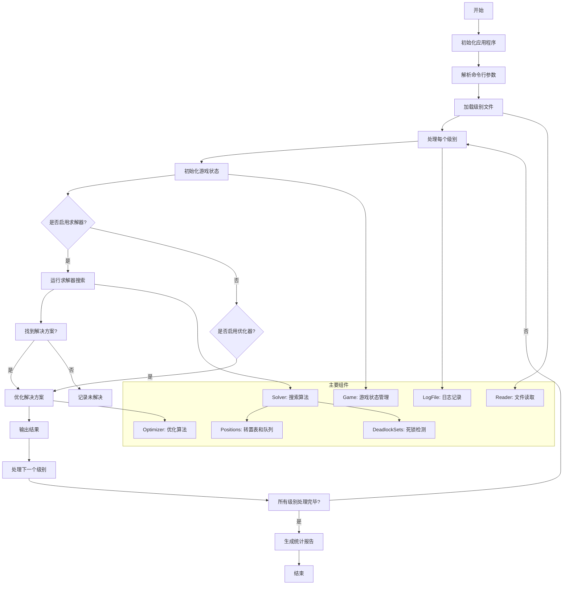
```mermaid
flowchart TD
    A[开始] --> B[初始化应用程序]
    B --> C[解析命令行参数]
    C --> D[加载级别文件]
    D --> E[处理每个级别]
    E --> F[初始化游戏状态]
    F --> G{是否启用求解器?}
    G -->|是| H[运行求解器搜索]
    G -->|否| I{是否启用优化器?}
    H --> J[找到解决方案?]
    J -->|是| K[优化解决方案]
    J -->|否| L[记录未解决]
    I -->|是| K
    K --> M[输出结果]
    M --> N[处理下一个级别]
    N --> O[所有级别处理完毕?]
    O -->|否| E
    O -->|是| P[生成统计报告]
    P --> Q[结束]

    subgraph "主要组件"
        R[Game: 游戏状态管理]
        S[Solver: 搜索算法]
        T[Optimizer: 优化算法]
        U[Positions: 转置表和队列]
        V[DeadlockSets: 死锁检测]
        W[Reader: 文件读取]
        X[LogFile: 日志记录]
    end

    F --> R
    H --> S
    K --> T
    S --> U
    S --> V
    D --> W
    E --> X
```

### 模块关系图

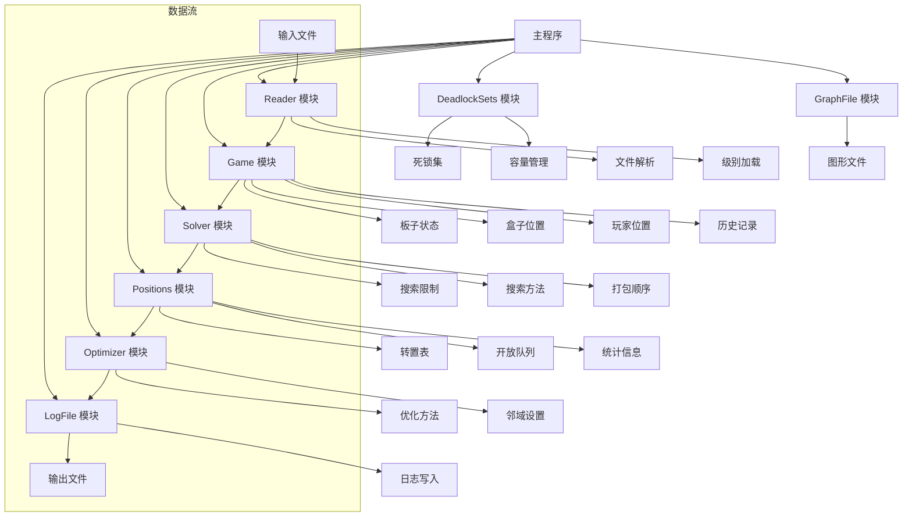
```mermaid
graph TD
    A[主程序] --> B[Game 模块]
    A --> C[Solver 模块]
    A --> D[Optimizer 模块]
    A --> E[Positions 模块]
    A --> F[DeadlockSets 模块]
    A --> G[Reader 模块]
    A --> H[LogFile 模块]
    A --> I[GraphFile 模块]

    B --> J[板子状态]
    B --> K[盒子位置]
    B --> L[玩家位置]
    B --> M[历史记录]

    C --> N[搜索限制]
    C --> O[搜索方法]
    C --> P[打包顺序]

    D --> Q[优化方法]
    D --> R[邻域设置]

    E --> S[转置表]
    E --> T[开放队列]
    E --> U[统计信息]

    F --> V[死锁集]
    F --> W[容量管理]

    G --> X[文件解析]
    G --> Y[级别加载]

    H --> Z[日志写入]
    I --> AA[图形文件]

    subgraph "数据流"
        BB[输入文件] --> G
        G --> B
        B --> C
        C --> E
        E --> D
        D --> H
        H --> CC[输出文件]
    end
```

### 类图

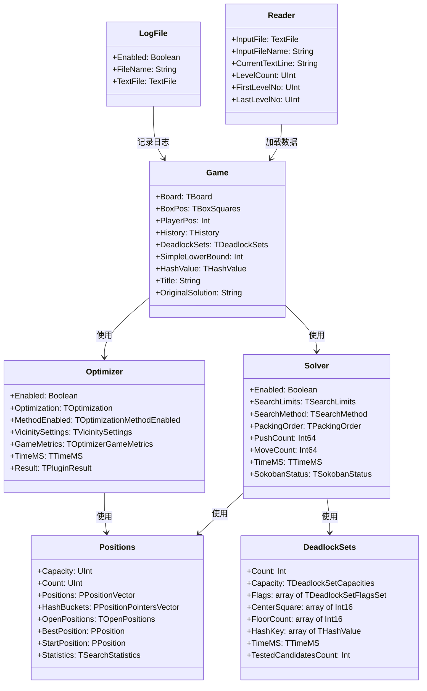
```mermaid
classDiagram
    class Game {
        +Board: TBoard
        +BoxPos: TBoxSquares
        +PlayerPos: Int
        +History: THistory
        +DeadlockSets: TDeadlockSets
        +SimpleLowerBound: Int
        +HashValue: THashValue
        +Title: String
        +OriginalSolution: String
    }

    class Solver {
        +Enabled: Boolean
        +SearchLimits: TSearchLimits
        +SearchMethod: TSearchMethod
        +PackingOrder: TPackingOrder
        +PushCount: Int64
        +MoveCount: Int64
        +TimeMS: TTimeMS
        +SokobanStatus: TSokobanStatus
    }

    class Optimizer {
        +Enabled: Boolean
        +Optimization: TOptimization
        +MethodEnabled: TOptimizationMethodEnabled
        +VicinitySettings: TVicinitySettings
        +GameMetrics: TOptimizerGameMetrics
        +TimeMS: TTimeMS
        +Result: TPluginResult
    }

    class Positions {
        +Capacity: UInt
        +Count: UInt
        +Positions: PPositionVector
        +HashBuckets: PPositionPointersVector
        +OpenPositions: TOpenPositions
        +BestPosition: PPosition
        +StartPosition: PPosition
        +Statistics: TSearchStatistics
    }

    class DeadlockSets {
        +Count: Int
        +Capacity: TDeadlockSetCapacities
        +Flags: array of TDeadlockSetFlagsSet
        +CenterSquare: array of Int16
        +FloorCount: array of Int16
        +HashKey: array of THashValue
        +TimeMS: TTimeMS
        +TestedCandidatesCount: Int
    }

    class Reader {
        +InputFile: TextFile
        +InputFileName: String
        +CurrentTextLine: String
        +LevelCount: UInt
        +FirstLevelNo: UInt
        +LastLevelNo: UInt
    }

    class LogFile {
        +Enabled: Boolean
        +FileName: String
        +TextFile: TextFile
    }

    Game --> Solver : 使用
    Game --> Optimizer : 使用
    Solver --> Positions : 使用
    Solver --> DeadlockSets : 使用
    Optimizer --> Positions : 使用
    Reader --> Game : 加载数据
    LogFile --> Game : 记录日志
```

### 时序图

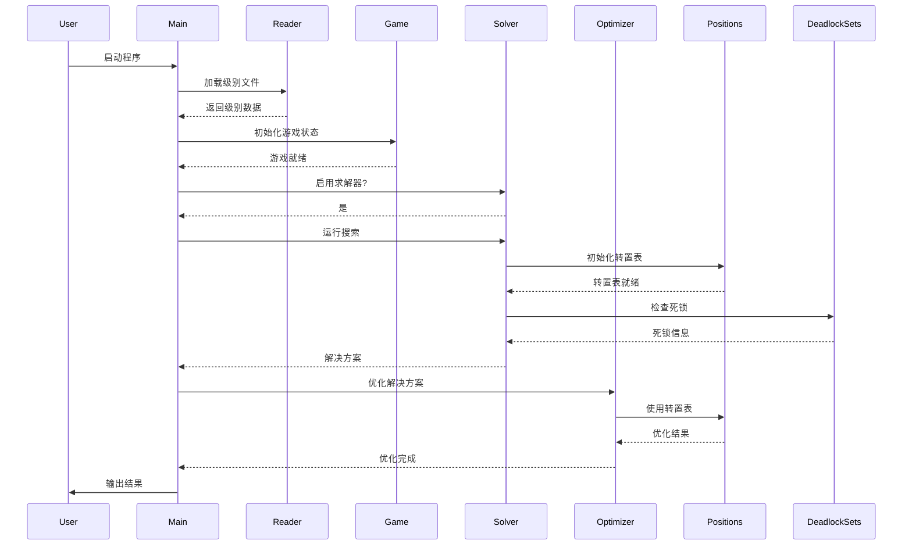
```mermaid
sequenceDiagram
    participant User
    participant Main
    participant Reader
    participant Game
    participant Solver
    participant Optimizer
    participant Positions
    participant DeadlockSets

    User->>Main: 启动程序
    Main->>Reader: 加载级别文件
    Reader-->>Main: 返回级别数据
    Main->>Game: 初始化游戏状态
    Game-->>Main: 游戏就绪
    Main->>Solver: 启用求解器?
    Solver-->>Main: 是
    Main->>Solver: 运行搜索
    Solver->>Positions: 初始化转置表
    Positions-->>Solver: 转置表就绪
    Solver->>DeadlockSets: 检查死锁
    DeadlockSets-->>Solver: 死锁信息
    Solver-->>Main: 解决方案
    Main->>Optimizer: 优化解决方案
    Optimizer->>Positions: 使用转置表
    Positions-->>Optimizer: 优化结果
    Optimizer-->>Main: 优化完成
    Main->>User: 输出结果
```

### 搜索算法流程图

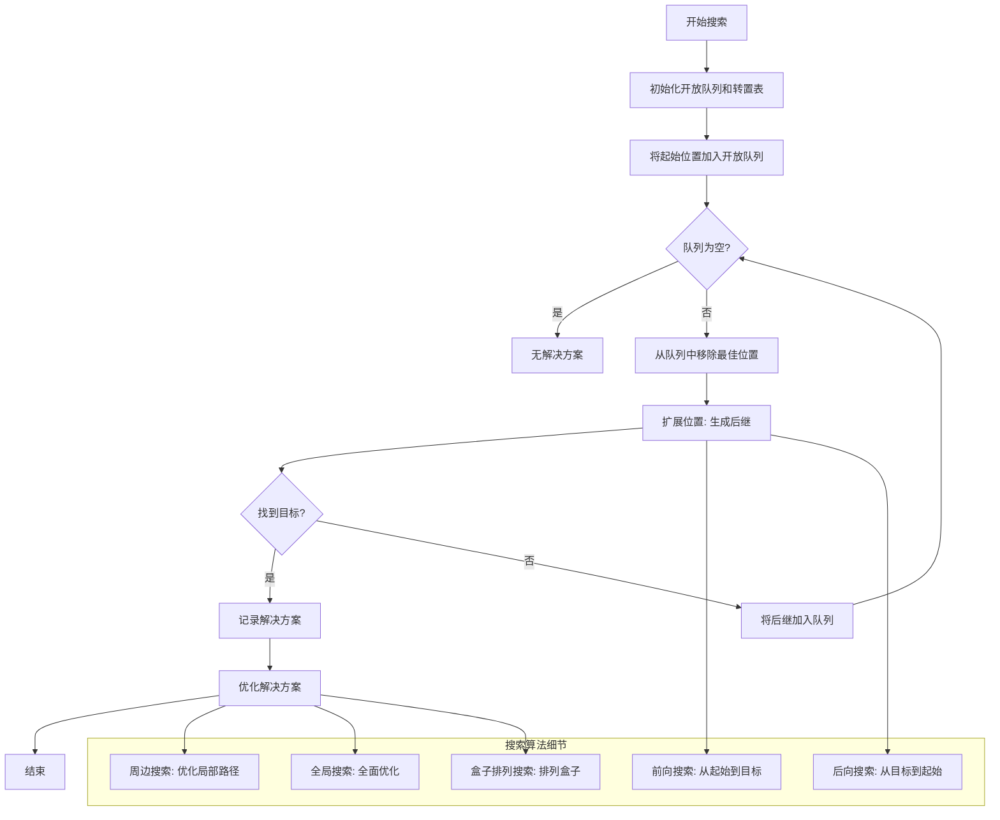
```mermaid
flowchart TD
    A[开始搜索] --> B[初始化开放队列和转置表]
    B --> C[将起始位置加入开放队列]
    C --> D{队列为空?}
    D -->|是| E[无解决方案]
    D -->|否| F[从队列中移除最佳位置]
    F --> G[扩展位置: 生成后继]
    G --> H{找到目标?}
    H -->|是| I[记录解决方案]
    H -->|否| J[将后继加入队列]
    J --> D
    I --> K[优化解决方案]
    K --> L[结束]

    subgraph "搜索算法细节"
        M[前向搜索: 从起始到目标]
        N[后向搜索: 从目标到起始]
        O[周边搜索: 优化局部路径]
        P[全局搜索: 全面优化]
        Q[盒子排列搜索: 排列盒子]
    end

    G --> M
    G --> N
    K --> O
    K --> P
    K --> Q
```

## Festival

### 主要类图

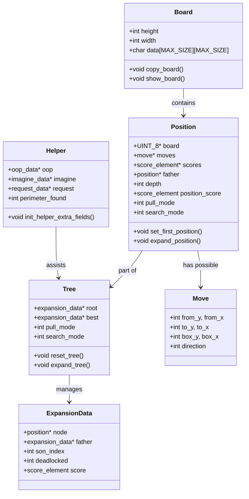
```mermaid
classDiagram
    class Board {
        +int height
        +int width
        +char data[MAX_SIZE][MAX_SIZE]
        +void copy_board()
        +void show_board()
    }

    class Position {
        +UINT_8* board
        +move* moves
        +score_element* scores
        +position* father
        +int depth
        +score_element position_score
        +int pull_mode
        +int search_mode
        +void set_first_position()
        +void expand_position()
    }

    class Tree {
        +expansion_data* root
        +expansion_data* best
        +int pull_mode
        +int search_mode
        +void reset_tree()
        +void expand_tree()
    }

    class Helper {
        +oop_data* oop
        +imagine_data* imagine
        +request_data* request
        +int perimeter_found
        +void init_helper_extra_fields()
    }

    class ExpansionData {
        +position* node
        +expansion_data* father
        +int son_index
        +int deadlocked
        +score_element score
    }

    class Move {
        +int from_y, from_x
        +int to_y, to_x
        +int box_y, box_x
        +int direction
    }

    Board --> Position : contains
    Position --> Tree : part of
    Tree --> ExpansionData : manages
    Helper --> Tree : assists
    Position --> Move : has possible
```

### 搜索流程图

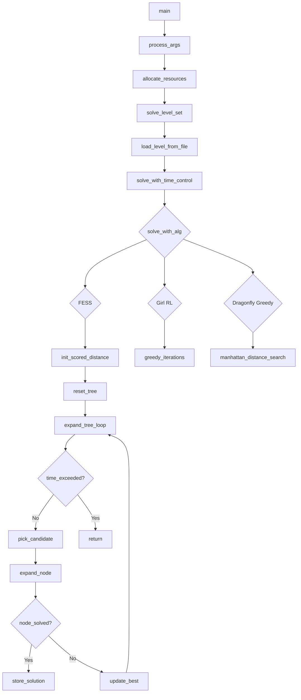
```mermaid
flowchart TD
    A[main] --> B[process_args]
    B --> C[allocate_resources]
    C --> D[solve_level_set]
    D --> E[load_level_from_file]
    E --> F[solve_with_time_control]
    F --> G{solve_with_alg}
    G --> H{FESS}
    G --> I{Girl RL}
    G --> J{Dragonfly Greedy}
    H --> K[init_scored_distance]
    K --> L[reset_tree]
    L --> M[expand_tree_loop]
    M --> N{time_exceeded?}
    N -->|No| O[pick_candidate]
    O --> P[expand_node]
    P --> Q{node_solved?}
    Q -->|Yes| R[store_solution]
    Q -->|No| S[update_best]
    S --> M
    N -->|Yes| T[return]
    I --> U[greedy_iterations]
    J --> V[manhattan_distance_search]
```

### 模块依赖图

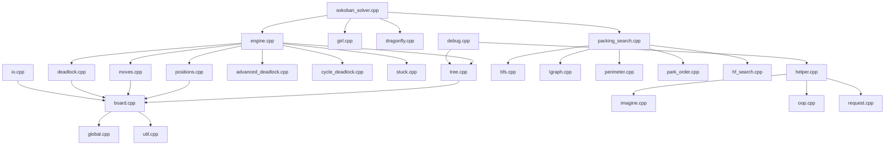
```mermaid
graph TD
    sokoban_solver.cpp --> engine.cpp
    sokoban_solver.cpp --> girl.cpp
    sokoban_solver.cpp --> dragonfly.cpp
    sokoban_solver.cpp --> packing_search.cpp
    engine.cpp --> tree.cpp
    engine.cpp --> positions.cpp
    engine.cpp --> moves.cpp
    engine.cpp --> deadlock.cpp
    engine.cpp --> advanced_deadlock.cpp
    engine.cpp --> cycle_deadlock.cpp
    engine.cpp --> stuck.cpp
    tree.cpp --> board.cpp
    positions.cpp --> board.cpp
    moves.cpp --> board.cpp
    deadlock.cpp --> board.cpp
    board.cpp --> global.cpp
    board.cpp --> util.cpp
    helper.cpp --> imagine.cpp
    helper.cpp --> oop.cpp
    helper.cpp --> request.cpp
    packing_search.cpp --> bfs.cpp
    packing_search.cpp --> \graph.cpp
    packing_search.cpp --> perimeter.cpp
    packing_search.cpp --> park_order.cpp
    packing_search.cpp --> hf_search.cpp
    io.cpp --> board.cpp
    debug.cpp --> tree.cpp
    debug.cpp --> helper.cpp
```

### 死锁检测模块图

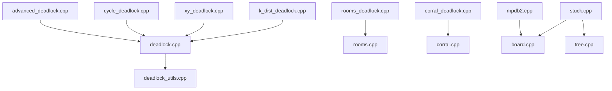
```mermaid
graph TD
    deadlock.cpp --> deadlock_utils.cpp
    advanced_deadlock.cpp --> deadlock.cpp
    cycle_deadlock.cpp --> deadlock.cpp
    xy_deadlock.cpp --> deadlock.cpp
    k_dist_deadlock.cpp --> deadlock.cpp
    rooms_deadlock.cpp --> rooms.cpp
    corral_deadlock.cpp --> corral.cpp
    mpdb2.cpp --> board.cpp
    stuck.cpp --> tree.cpp
    stuck.cpp --> board.cpp
```

### 启发式和评分模块图

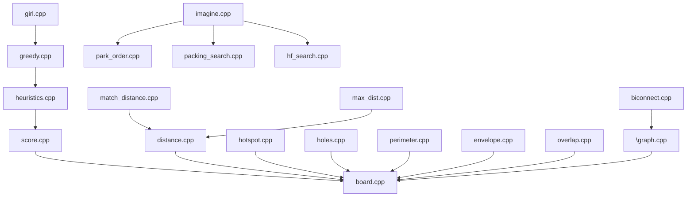
```mermaid
graph TD
    score.cpp --> board.cpp
    heuristics.cpp --> score.cpp
    greedy.cpp --> heuristics.cpp
    girl.cpp --> greedy.cpp
    imagine.cpp --> park_order.cpp
    imagine.cpp --> packing_search.cpp
    imagine.cpp --> hf_search.cpp
    distance.cpp --> board.cpp
    match_distance.cpp --> distance.cpp
    max_dist.cpp --> distance.cpp
    hotspot.cpp --> board.cpp
    holes.cpp --> board.cpp
    perimeter.cpp --> board.cpp
    envelope.cpp --> board.cpp
    overlap.cpp --> board.cpp
    biconnect.cpp --> \graph.cpp
    \graph.cpp --> board.cpp
```

## 数据结构关系图

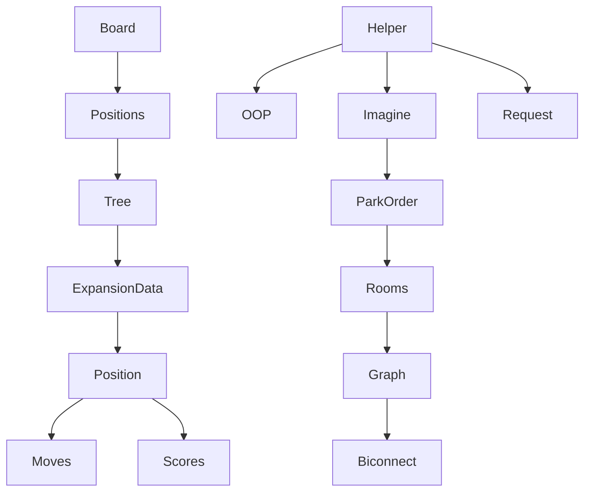
```mermaid
graph TD
    Board --> Positions
    Positions --> Tree
    Tree --> ExpansionData
    ExpansionData --> Position
    Position --> Moves
    Position --> Scores
    Helper --> OOP
    Helper --> Imagine
    Helper --> Request
    Imagine --> ParkOrder
    ParkOrder --> Rooms
    Rooms --> Graph
    Graph --> Biconnect
```
