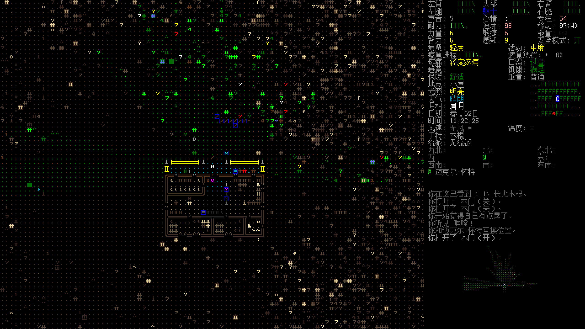

# Cataclysm: Dark Days Ahead

!!! info
    本文基于 `0.H (Herbert) Stable Release` (2024-11-23) 版本.

Cataclysm: Dark Days Ahead (DDA, CDDA) 是一款回合制的末日生存游戏, 代码由 C++ 编写, 并开源 (CC BY-SA 3.0 协议) 在 GitHub 上.

## 入门

由于该游戏入门门槛较高, 且网上缺乏较新的高质量教学内容. 这里推荐由 世纪枭隼Peregrine 制作的高质量视频系列:

- <https://www.bilibili.com/video/BV1vZQfYfEM9?p=3&vd_source=b0a1d90ff65d8547a0ffc9ce4d68bcfd>

## 常用键位

- `?`: 打开**键位菜单**, 可以查看或设置当前可以使用的操作以及对应的按键.
- `Enter`: 打开**行动菜单**.

- `i`: 打开**库存**, 在其他游戏里也称为背包.
- `g`: 拾起周围物品.
- `V`: 进入**查看模式**, 快速查看视野范围内的物品和生物.
- `x` 或 `;`: 进入**查看模式**, 查看周遭的环境. 在 ASCII 模式下, 新手难以辨别场景中的事物, 可以借助该功能获取场景的详细描述. 在光照充足的时候还能直接看到某个位置上摆放的物品. 为确保玩家能看清画面, 通常会缩放视口, 导致视口无法完整的包含 @ 的视野. 查看模式还可以用于移动视口, 以便在缩放不变的情况下看清视野内的其他事物. 除此之外侧边栏的方位指示器 (即罗盘) 也是一个获取视野外信息的好方式.
- `T`: 在**查看模式下**, 自动前往视野内选中的地点.
- `C`: 直接与附近 NPC 交谈, 无需走到他们身边.

!!! info
    玩家无需专门记忆键位, 仅在需要的时候查看键位菜单即可. 不同的版本键位可能存在差异, 比如 `v` 在 `0.G` 版本对应心情菜单, 在 `0.H` 版本则对应插入菜单. `0.H` 版本中的心情菜单则需通过 `@` `m` 打开.

## 设置

**选项菜单**可以直接从主菜单的**设置**里或在游戏内按 `Esc` `2` 进入.  
开始游戏前值得调整的设置选项:

- **常规**:
    - **自动标记**: 启动全部自动标记功能.
    - **游戏声音**: 如果需要启动游戏内音效, 将 `选择音效包` 设置为 `CC-Sounds`.
    - **输入操作**: 启用 `使用拼音搜索`.
    - **游戏体验**: 如果你使用 ASCII 画面游玩, 可以启用 `显示物品符号`.
- **界面**:
    - **计量单位**: 因为游戏内涉及大量数值, 因此有必要设置熟悉的计量单位. 相关选项位于 `选项 | 界面 | 计量单位` 中.
- **图形**:
    - **贴图包 (图像包)**: 游戏自带多种贴图包, 游戏内场景和地图均可使用贴图包.
    
        如果想使用 ASCII 画面, 有两种方式:

        - 使用 `ASCIITiles` 贴图包: 支持贴图包的功能 (如画面缩放, 靠近后显示内部物品).
        - 禁用 `使用贴图包`: 可以获得类似纯 TUI 的效果, 不支持贴图包的功能, 但是可以自定义字体.

        为了保持观感统一, 通常还需要设置对应的 `选择大地图贴图包`, 比如 `ASCIITiles` 贴图包对应的大地图贴图包为 `ASCII Overmap`.

    - **全屏显示**: 可以设置窗口显示模式 (全屏/无边框/否 (即窗口化) 等).
    - **字体设置**: 可以调节字体大学, 建议为 2 的 n 次方 (即 8, 16, 32).
    - **色彩滤镜**: 默认的设置可能导致视野范围不明确, 可以将 `地图记忆色彩模式` 调整为 `暗色旧照片` (默认为 `旧照片`). 相关选项还有 `生物标记大小` 和 `敌人标记闪烁速度`.
    - **小地图**: `小地图绘制模式` 对观感影响较大, 可以根据喜好自行设置.

!!! warning
    部分设置选项仅在游戏重启后生效.

## 按键设置

默认的常用全局操作 `下一页` 和 `上一页` 被分配到了不常用的上下翻页键. 可以将其分别添加 `J` 和 `K` 键.

## HiDPI

在 Windows 下, 为确保游戏能正确且清晰的显示, 还需要进行以下设置:

1. 在游戏程序文件 `cataclysm-tiles.exe` 上右键, 选择 `Properties`.
2. 打开 `Compatibility | Settings | Change high DPI settings`.
3. 在新窗口的 `High DPI scaling override` 下, 勾选 `Override high DPI scaling behavior.`, 并将 `Scaling performed by` 设置为 `Application`.

!!! warning
    可能导致主菜单下鼠标定位不正确, 但游戏内暂无问题.

## 自动移动

移动是最常用的操作, 该游戏主要提供了两种自动移动的方式:

- 在**查看模式**下, 可以通过按 `T` 自动行走至选择的地点.
- 在**地图**下, 可以按下 `W` 指定目的地, 会显示自动规划的路径 (会吸附途径的道路), 再次按下 `W` 即可通过该路径自动前往指定地点.

还有一些高级功能, 可以在特定情形下自动化某些工作:

- **高级物品管理**: 例如抓握购物车收集物品的时候, 可以直接将附近的物品放入购物车内.
- **搬运物品**: 批量搬运无法放入背包中的物品 (只能手持的).
- **区域管理**: 可以用于自动整理家中的物资, 或自动从某个区域内提取物资.

## 战斗建议

初期玩家走路移动速度比大部分怪物快, 因此可以随时脱战. 但一旦受到伤害就可能降低行动能力, 进而更容易受到下一波攻击, 导致恶性循环.  
因此使用可以范围攻击的武器, 避免怪物近身:

- 有范围攻击的远程武器, 如矛 (`武器 | 刺击 | 矛`)/石头.
- 弹药充足的枪械. 请注意, 枪械射击时产生的噪音会吸引怪物.

## 其他建议

- 可以通过主菜单的**游戏教程**来引导式的学习基础操作. 教程无法被正常保存, 因此必须一次性完成. 重新载入已保存的教程世界不会再显示 Tips.
- 可以通过利用世界生成参数/无限点数来降低生存难度, 提高学习效率. 降低死亡风险后, 玩家便可以有更多机会学习战斗以外的知识.
- 可以通过为**调试菜单**绑定按键来启用作弊功能, 这可以帮助玩家快速学习一些操作, 比如驾驶汽车.

!!! warning
    游戏仅提供 `S` 保存并退出的选项, 若不想保存当前存档, 可以通过 `Alt` `F4` 或在命令行下 `Ctrl` `C` 来强制退出游戏.  
    若要进行手动存档管理, 建议从设置中关闭自动保存. 选项位于 `选项 | 常规 | 自动保存 | 自动存档`.

## 游戏机制

### 尸体复活

游戏内的生物尸体 (僵尸/人类/动物) 会在一定时间 (约 6 小时) 后以僵尸的形态重新复活. 刚复活时血量较低, 但会随着时间的流逝逐渐恢复.  
如果使用贴图包 `UltiCa`, 会复活的尸体的右下角会显示一个警告标志.

防止尸体复活主要有以下两种方法:

- **砸碎**: 最快速简单的方式, 但是砸碎酸液僵尸这类怪物 可能导致酸液溅射到自己身上造成伤害.
- **屠宰**: 需要消耗大量时间, 但是可以安全的分解酸液僵尸这类怪物. 其中 `解剖尸体` 可以提升对怪物身体构造的了解, 以便在战斗中攻击他们的弱点.

### 角色与世界

- 世界是随机生成的 (可以指定一些生成参数, 如城市密度), 无限大的 (在玩家探索的过程中动态拓展).
- 角色是完全可自定义的 (除非选定了职业受限的场景), 一个世界里可以创建多个角色, 他们共享这个世界 (地图与物资).

矮人要塞中也存在相似的设定, 即使原角色死亡, 玩家依然可以创建新的角色重新回到这个世界. 看到之前角色所留下的痕迹, 甚至继承其遗产.  

虽然该游戏允许在单个世界里同时创建多个角色, 但这**并非设计目标**.  
由于目前的 NPC 实现等问题 [^concurrent], 在单个世界中创建多个角色可能引入 BUG.  
因此不建议在上一个角色未死亡的情况下在相同的世界里创建新角色.

相关选项位于 `选项 | 默认世界 | 死后世界存档处理`, 默认为 `重置`.

[^concurrent]: https://github.com/CleverRaven/Cataclysm-DDA/issues/26126#issuecomment-564313167

### 实现气泡 (Reality bubble)

实现气泡是游戏内部实现的一种机制, 该机制可能导致**意料外的行为**, 所以玩家应该对该机制有所了解.  
玩家行动后, 游戏仅会更新玩家周围的区域 (即实现气泡内), 而非整个世界. 这是一种常见的优化手段, 避免模拟带来过大的性能开销.  
这意味着气泡外的大部分事物将跳过更新 (比如火灾), 仿佛时间暂停了一般, 不会在玩家重新进入时加速时间流逝到当前时间点, 而只会继续.  
少数的特定事物 (如植物的生长/怪物的进化/事物的腐烂) 依然受时间影响. 推测的原因是这类特定事物不会对周遭环境产生影响, 因此较为容易模拟.

## 常用配方

- **工具**
    - [掘土棒] (1 级挖掘).
- **家具**
    - [火塘]\: 石头可以通过砸开[大块岩石]获得.

[掘土棒]: https://cdda-guide.nornagon.net/item/digging_stick?lang=zh_CN&v=0.H-RELEASE
[火塘]: https://cdda-guide.nornagon.net/furniture/f_firering?lang=zh_CN&v=0.H-RELEASE
[大块岩石]: https://cdda-guide.nornagon.net/item/rock_large?lang=zh_CN&v=0.H-RELEASE

## 字体

将字体文件移动到 `font` 中, 并在 `config/fonts.json` 中添加相应字体.

- `typeface`: UI 使用的字体.
- `map_typeface`: 场景使用的字体.
- `overmap_typeface`: 地图使用的字体.

## 音效包

从 `0.H` 版本开始, 官方开始发布带 [CC-Sounds](https://github.com/Fris0uman/CDDA-Soundpacks) 音效包的版本.

## 参见

- CDDA 参考手册 (Hitchhiker's Guide to the Cataclysm): <https://cdda-guide.nornagon.net/>
- CDDA GitHub: <https://github.com/CleverRaven/Cataclysm-DDA>
- CDDA 官网: <https://cataclysmdda.org/>
- CDDA 中文攻略手册: <https://surflurer.github.io/CDDA-CN-Guide/>
- <https://docs.google.com/document/u/0/d/1xw3byB87rUeYA6Cll2Asf1HbfnhNAXaen1ntxX_LglA>
