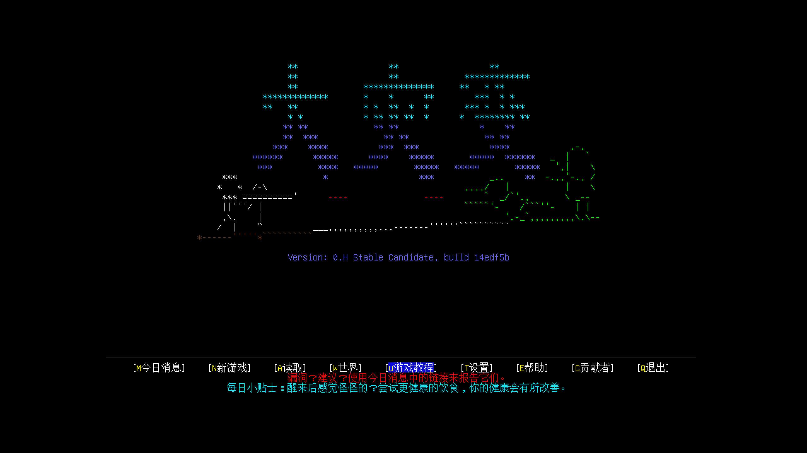
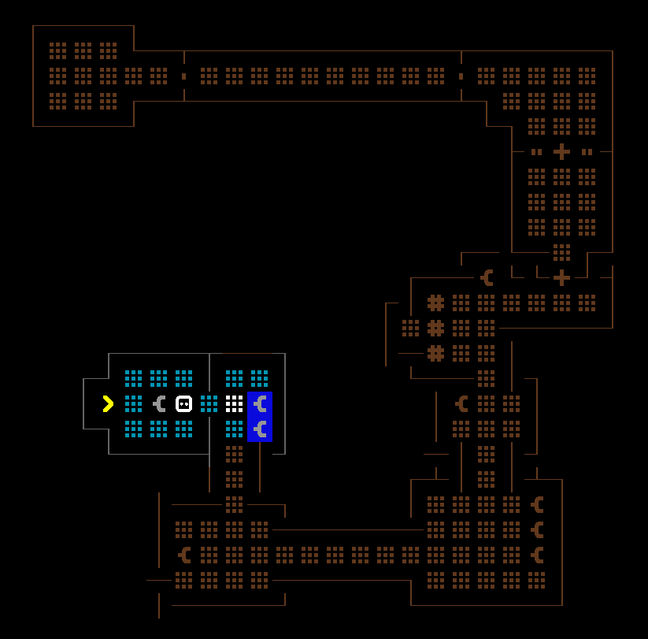

# Cataclysm: Dark Days Ahead

!!! warning
    本文基于实验性质的 `0.H Stable Candidate, build ec77c5f` 版本.

Cataclysm: Dark Days Ahead (DDA, CDDA) 是一款回合制的末日生存游戏, 代码由 C++ 编写, 并开源在 GitHub 上.

虽然 DDA 在 LibreGameWiki 被分类为 Roguelike 类型, 但其更接近沙盒类型.

## 快速入门

### 常用键位

- `?`: 打开**键位菜单**, 可以查看当前可以使用的操作以及对应的按键.
- `i`: 打开**库存**, 在其他游戏里也称为背包.
- `g`: 拾起周围物品.
- `x` 或 `;`: 进入**查看模式**, 查看周遭的环境. 在 ASCII 模式下, 新手难以辨别场景中的事物, 可以借助该功能获取场景的详细描述. 在光照充足的时候还能直接看到某个位置上摆放的物品. 为确保玩家能看清画面, 通常会缩放视口, 导致视口无法完整的包含 @ 的视野. 查看模式还可以用于移动视口, 以便在缩放不变的情况下看清视野内的其他事物. 除此之外侧边栏的方位指示器(即罗盘)也是一个获取视野外信息的好方式.

!!! info
    玩家无需专门记忆键位, 仅在需要的时候查看键位菜单即可. 不同的版本键位可能存在差异, 比如 `v` 在 `0.G` 版本对应心情菜单, 在 `0.H` 版本则对应插入菜单. `0.H` 版本中的心情菜单则需通过 `@` `m` 打开.

### 设置

**选项菜单**可以直接从主菜单或在游戏内按 `Esc` `2` 进入.  
开始游戏前值得调整的设置选项:

- **计量单位**: 因为游戏内涉及大量数值, 因此有必要设置熟悉的计量单位. 相关选项位于 `选项 | 界面 | 计量单位` 中.
- **贴图包**: 游戏自带多种贴图包, 游戏内场景和地图均可使用贴图包. 相关选项位于 `选项 | 图形 | 图像包` 中.
- **显示**: 选项位于 `选项 | 图形 | 渲染调整 | 全屏显示`. 可以设置窗口显示模式(全屏/无边框/否(即窗口化)等).
- **字体大小**: 选项位于 `选项 | 图形 | 字体设置`.

!!! warning
    部分设置选项仅在游戏重启后生效.

#### HiDPI

在 Windows 下, 为确保游戏能正确且清晰的显示, 还需要进行以下设置:

1. 在游戏程序文件 `cataclysm-tiles.exe` 上右键, 选择 `Properties`.
2. 打开 `Compatibility | Settings | Change high DPI settings`.
3. 在新窗口的 `High DPI scaling override` 下, 勾选 `Override high DPI scaling behavior.`, 并将 `Scaling performed by` 设置为 `Application`.

### 战斗建议

初期玩家走路移动速度比大部分怪物快, 因此可以随时脱战. 但一旦受到伤害就可能降低行动能力, 进而更容易受到下一波攻击, 导致恶性循环.  
因此使用可以范围攻击的武器, 避免怪物近身:

- 有范围攻击的远程武器, 如矛 (`武器 | 刺击 | 矛`)/石头.
- 弹药充足的枪械. 请注意, 枪械射击时产生的噪音会吸引怪物.

### 其他建议

新手可以通过游戏自带的**游戏教程**引导式的学习基础操作.  
请一次性完成教程, 重新载入已保存的教程世界不会再显示 Tips.

在入门时, 可以通过利用世界生产参数/无限点数来降低生存难度, 提高学习效率. 降低死亡风险后, 玩家便可以有更多机会学习战斗以外的知识.

!!! warning
    游戏仅提供 `S` 保存并退出的选项, 若不想保存当前存档, 可以通过 `Alt` `F4` 或在命令行下 `Ctrl` `C` 来强制退出游戏.  
    若要进行手动存档管理, 建议从设置中关闭自动保存. 选项位于 `选项 | 常规 | 自动保存 | 自动存档`.

## Reality bubble

Reality bubble 是游戏内部实现的一直机制, 此处提及是因为其可能产生玩家**意料外的行为**.  
玩家行动后, 游戏仅会更新玩家周围的部分区域, 而非整个世界. 这是一种常见的优化手段, 避免模拟带来过大的性能开销.  
这意味着气泡外的大部分事物将跳过更新, 仿佛时间暂停了一般, 不会再玩家重新进入时加速时间流逝到当前时间点, 而只会继续.  
少数的特定事物 (如植物的生长/怪物的进化/事物的腐烂) 依然受时间影响. 推测的原因是这类特定事物不会对周遭环境产生影响, 因此较为容易模拟.

## 字体

将字体文件移动到 `font` 中, 并在 `config/fonts.json` 中添加相应字体.

- `typeface`: UI 使用的字体.
- `map_typeface`: 场景使用的字体.
- `overmap_typeface`: 地图使用的字体.

<!-- 音效包
https://github.com/Fris0uman/CDDA-Soundpacks -->

## 参见

- DDA GitHub: <https://github.com/CleverRaven/Cataclysm-DDA>  
- DDA 官网: <https://cataclysmdda.org/>
- DDA 游戏内物品查询: <https://cdda-guide.nornagon.net/>
- DDA 中文攻略手册: <https://surflurer.github.io/CDDA-CN-Guide/>
