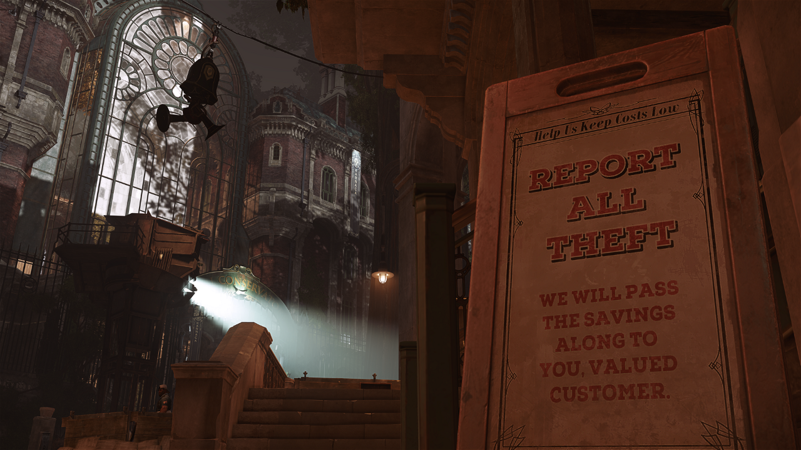
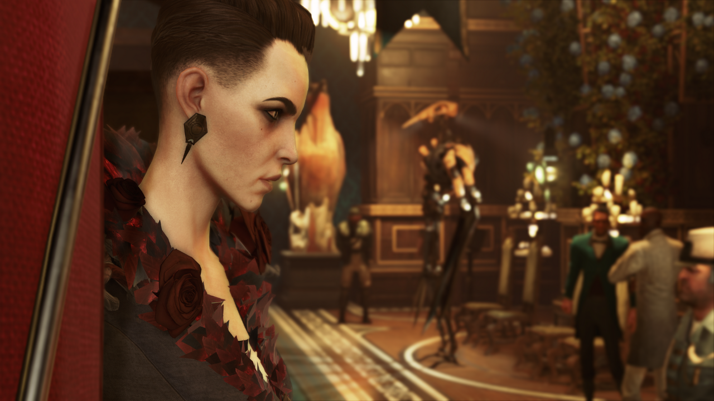
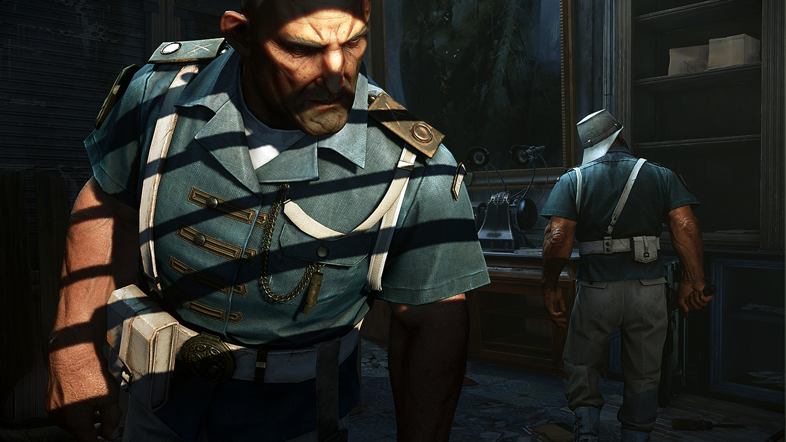
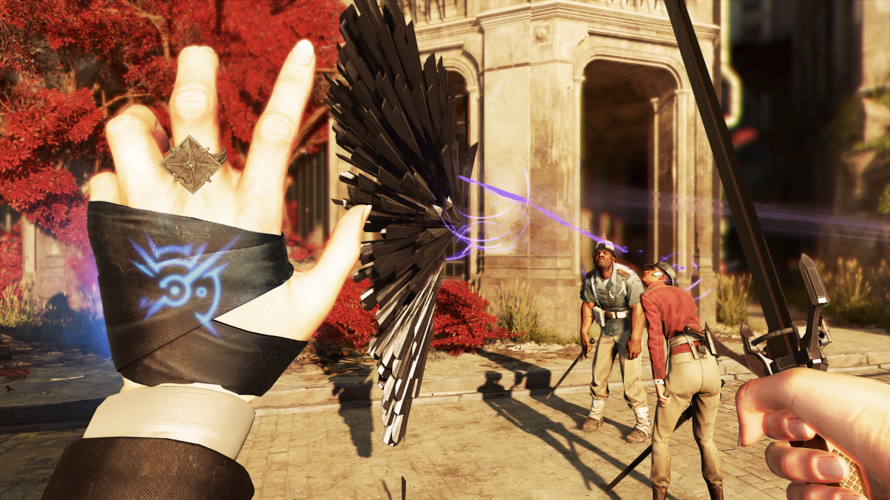
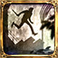
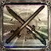
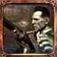

# Dishonored 2

  

**中文**: 耻辱 2.  

## 测评

**类型**: 第一人称, 潜行, 单人.  

| 项目 | 评分 | 描述             |
| ---- | ---- | ---------------- |
| 总体 | 10   |                  |
| 画面 | 8    |                  |
| 音效 | 6    |                  |
| 优化 | 6    | 帧率浮动大       |
| 剧情 | 10   | 有完整的世界背景 |

### 优点

- 优秀的关卡设计, 如机关宅邸(Clockwork mansion).
- 玩法多样: 通过武器和超能力可以看出这款游戏并不只有潜行一种玩法, 直接与敌人正面冲突也是一种十分刺激的玩法. 虽然存在 "混乱度" 的设定, 但对游玩的影响不大.
- 高可玩性: 双主角/二周目 "游戏+" 和多剧情分支的设计让这部作品的可玩性变得很高.
- 难度设定方面十分的合理: 提供多种难度, 最低难度使得第一次体验这类型游戏的新手可以很容易地上手, 而高难度又能给经验丰富的玩家带来充足的挑战.
- 优秀的存档机制: 可以在游戏内通过快捷键快速存档/回档, 这对于潜行类游戏来说十分重要. 并且支持多个存档, 因此无需担心出现 "死档".

### 缺点

- 优化不佳: 在较大的场景下帧率的波动会变得十分严重, 带来卡顿感.
- 存在崩溃现象: 在游玩时遇到过若干次崩溃现象, 部分玩家存在到达特定区域就崩溃的现象.

{ width=70% style="display: block; margin: 0 auto" }  

## 背景

故事发生在第一代策反事件15年之后, 艾米莉成为了群岛帝国(Empire of the Isles)新的女皇. 曾被道德(Daud)流放到虚空之境的德莱拉(Delilah Copperspoon)回归并成功夺取了政权, 声称自己才是皇位真正的继承人.  

### 主角

本作共有两名主角, 玩家可以在第一章选择其中一名主角进行游玩. 两位主角拥有不同的能力.  

- **艾米莉**·考德温(Emily Kaldwin, Emily Drexel Lela Kaldwin): 25 岁, 女皇.
- **科尔沃**·阿塔诺(Corvo Attano): 54 岁, 皇家护卫, 艾米莉的亲生父亲, 第一代主角.

## 玩法

### 暗杀

在不惊动敌人的情况下使其昏迷或死亡.  

- 死亡: 从敌人后方接近, 在较短的距离内使用普通攻击可以处决敌人.
- 昏迷: 在不被发现的情况下接近敌人可以勒晕敌人.

可以在靠近敌人后直接勒晕敌人或使用其他道具远程击晕敌人. 空瓶不一定都能击晕敌人, 而且在击中目标后会发出一定的声响.  

以下技巧有助于更好的暗杀:  

- 可以直接行走到目标后方, 在其出现感叹号后冲刺并勒晕对方.
- 在勒晕敌人的过程中可以提前长按 `搬运` 键(`F`)在第一时间抱起敌人.

### 敌人

{ width=70% style="display: block; margin: 0 auto" }  

敌人的状态有以下几种:  

- 正常: 敌人会做手头的事情, 在发现异常(听到声音/看见你/发现尸体等)时会警觉. 头上没有显示或显示 `带白色边框的透明感叹号`.
- 警觉: 敌人头上显示 `带红色边框的白色感叹号`, 会主动搜寻可疑的位置.  
  该阶段的敌人看见你后感叹号会直接变成 `红色的感叹号`.
- 战斗: 敌人发现了你, 并将对你展开攻击.
- 逃跑: 敌人认为无法击败你后踉跄着逃跑.
- 轻度昏迷/睡眠: 该情况下敌人完全没有视野, 但依然会感知周围声音.
- 昏迷.

敌人主要有以下几种类型:  

- 普通人类: 武器可能只有剑, 可能也有枪. 包含守卫(Grand Guard)等.
- 发条战士(Clockwork soldier): 前后方都有视野, 无法被暗杀.
  但可以利用背后的弱点结合刀枪秒杀.
- 女巫(Brigmore Witch): 有超能力, 包括瞬移/远程攻击. 一旦开战比较难对付.
- 狼狗(Wolfhound): 有嗅觉, 在一定范围内会被感知到. 血量低.
- 墓地猎犬(Gravehound):

   激活的头骨可以通过远超攻击销毁, 玩家靠近后会变成墓地猎犬, 击杀后会变成未激活的头骨掉落.  
   未激活的头骨可以通过投掷销毁以**彻底杀死**墓地猎犬, 头骨碰撞后会爆炸并发出响声. 若未销毁会在一定时间后重新变成墓地猎犬.  

### 超能力

{ width=70% style="display: block; margin: 0 auto" }  

以下几个能力较为重要:  

- 瞬移(Far Reach, Blink): 该能力不仅可以在敌人眼前穿梭/加快无声前进的速度, 还可以到达正常方法无法到达的地方.
- 骨牌(Domino): 仅艾米莉, 可以将作用在一个敌人的效果映射到多个敌人. 可以节约弹药/同时消灭多个敌人.
- 黑暗视觉(Dark Vision): 可透视高亮物品, 便于收集.

与超能力相关的道具有:  

- 符文(Runes): 用于升级超能力.
- 骸骨护符(Bonecharms): 装备以提供加成, 可以进行分解和制作(仅艾米莉).

## 成就

成就可以分为以下几类:  

- 主线类: 完成最主要的几个任务, 使用不同的主角, 达成不同的混乱度. 该类成就最容易达成.
- 支线类: 完成特定的支线任务. 该类成就较容易达成, 在通关后可以回到任意任务完成成就, 但部分成就是跨越多个任务的.
- 收集类: 收集场景中的特定物品. 该类成就较难达成, 收集要素缺一不可, 部分成就是跨越多个任务的.

成就图标有三种金属边框, 分别为铜/银/金, 达成难度递增.  

下面讨论以下几个成就和达成技巧:  

1. Clean Hands: 全关卡不击杀任何人.  
     
   包括平民, 敌人(包含非人类的)(FIXME)以及目标. 每个主要目标都有一个不杀死而解除其威胁的方法.  
   值得注意的是, 最后一关中, 击杀目标德莱拉的分身不算击杀.  

2. Shadow: 全关卡不被发现.  
     
   该成就难度最高. 被发现的标志是 `红色的感叹号`, 即使平民也可能出现. 因此不要在平民的面前进行犯罪行为, 或者在其出现 `红色的感叹号` 前将其勒晕.  
   `带红色边框的白色感叹号` 代表警觉, 并不算被发现.  

3. Flesh and Steel: 不使用超能力.  
     
   该成就对游戏体验影响很大, 建议在确保通关至少一次再尝试. 其中 `瞬移` 能力是到达某些地方的必要前提. 而且只有拥有超能力才能制作 `骸骨护符`.  
   作为 `光幕` 能源的风力发电机无法被关闭, 因此 `自动布线器` 会更加有用. 也可以通过走其他路线绕过 `光幕`.  
   达成此成就的方法很简单, 在 `界外魔` 向你提供 `虚空印记` 的时候拒绝, 并通关即可.  

4. Fearless Fall: 从研究院最高处跳下并处决下方的一名敌人.  
     
   最高处位于研究院中央建筑顶部的屋顶, 有一个放置了骸骨护符的鸟巢.  
   可以先投掷手榴弹吸引敌人前来调查.  

5. Heartbeat Reaper: 1.5 秒内杀死 6 个敌人.  
     
   击晕六个敌人放在一起, 然后使用范围性攻击同时击杀他们.  

6. Fatal Redirect: 用敌人的子弹击杀敌人.  
     
   获得反弹子弹能力后贴着使用枪械的敌人的脸.  

利用存档可以快速/没有副作用的完成某些成就, 比如某些需要击杀敌人的成就可以存在再击杀然后回档, 这样既可以解锁成就又不算击杀.  

以下要点对完成成就会有极大帮助:  

1. 存档  
   该功能可以极大地减少任务失败的后果. 该游戏可以随时存档, 这一功能十分重要且需要频繁使用.  
   使用快捷键可以进行快速存档(`F5`)和读档(`F9`), 但是这种方法只会重复使用一个挡位, 可能会让这唯一的挡位变成 `死档`. 因此还需要再确保周边环境安全的情况下在菜单栏选择挡位进行存档.  

2. 统计数字  
   菜单栏中的统计数字里统计了许多重要的数据, 如击杀人数/被发现次数等. 在存档前应该先查看这些数据来确保这个存档是有效的.  
   其中 `玩家死亡次数` 不受回档影响.  

## 参见

- [Bilibili 耻辱 1 剧情简介](https://www.bilibili.com/video/BV1pG411b7eK)
- [Bilibili 耻辱 2 剧情简介](https://www.bilibili.com/video/BV1cG41157qU)
- [Steam 成就](https://steamcommunity.com/stats/403640/achievements)
- [Bilibili 全收集流程](https://www.bilibili.com/video/BV1kt411B7tj)
- [Bilibili 界外魔之死 DLC 全收集流程](https://www.bilibili.com/video/BV1H4411V7HN)
- *The Art of Dishonored 2* 官方艺术设定集图册
- <https://dishonored.fandom.com/wiki/Paintings>

## 参考

- <https://dishonored.fandom.com/wiki/Dishonored_Wiki>
- <https://www.bilibili.com/read/cv2295412>
