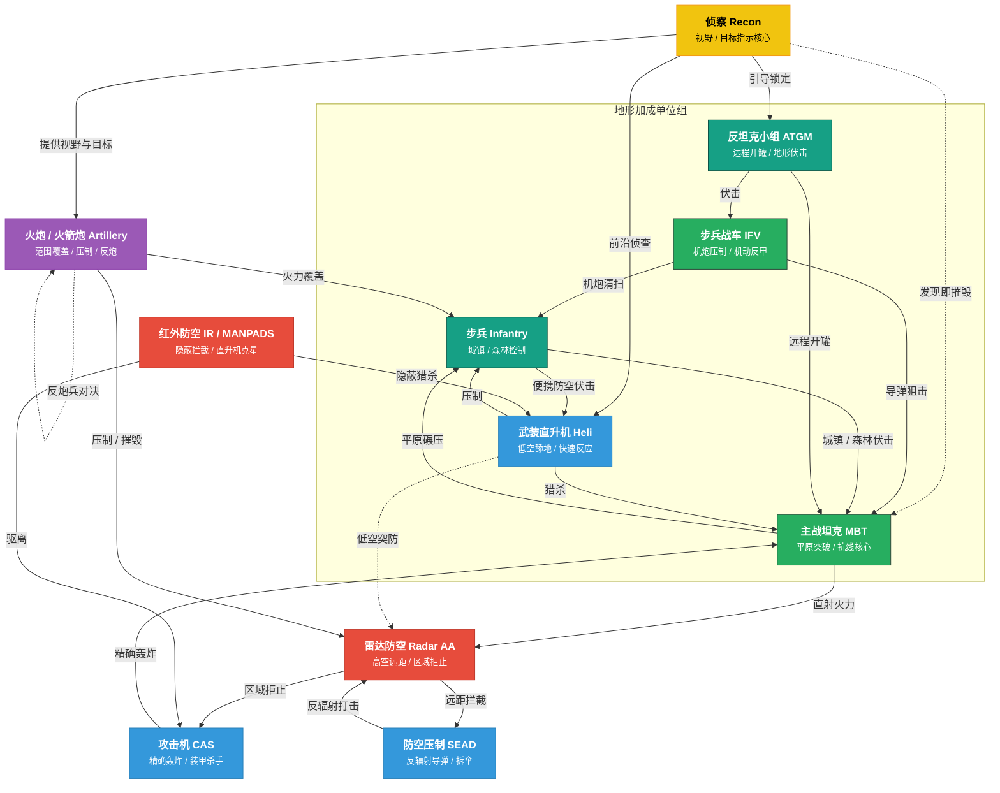

# Broken Arrow

**中文**: 断箭.  

## 防空压制

防空压制 (Suppression of Enemy Air Defenses, SEAD) 是指通过使用反辐射导弹 (Anti-Radiation Missile, ARM) 来摧毁或压制敌方防空雷达和导弹系统的战术.

以下是具备 SEAD 能力的战斗机:

- **美国**: Prowler (x4), F-16CJ (x4), F-35A (x2), F-15EX (x2).
- **俄罗斯**: Su-24MP (x3), Su-34 (x2), MiG-35 (x4), Su-57 (x4), Su-25 (x2).

其中 (xN) 表示最多可携带 N 枚 ARM.

以下是具备 SEAD 能力的直升机:

- **美国**: AH-1Z Viper (x2).
- **俄罗斯**: Ka-52 Katran (x2).

以下作战单位应该设置编号, 便于快速选中:

- **远程火力**: 快速为前线提供火力支援.
- **雷达防空**: 便于在发现 SEAD-capable 战机时快速关闭雷达.

## 单位克制关系

## 金牌要求

获取金牌的条件需且仅需满足金牌要求, 可以忽略铜牌和银牌要求.

### 美军任务

| 任务                                               | 金牌要求                                                         |
|----------------------------------------------------|------------------------------------------------------------------|
| 表演时刻 (Show Time)                               | • 在困难难度下完成任务. • 在 30 分钟内完成所有目标.           |
| 和平卫士 (Peacekeeper)                             | • 在困难难度下完成任务. • 不要损失任何单位.                   |
| 空军基地劫案 (Airbase Heist)                       | • 在困难难度下完成任务. • 在 30 分钟内完成任务.               |
| 巨浪来袭 (The Big Wave)                            | • 在困难难度下完成任务. • 在 10 分钟内占领堡垒.               |
| 追踪与狂怒 (Tracked and Furious)                   | • 在困难难度下完成任务. • 不要损失任何一辆车辆.               |
| 夜色属于我们 (We Own The Night)                    | • 在困难难度下完成任务. • 不要损失任何一架直升机.             |
| 吸血鬼 (Vampires)                                  | • 在困难难度下完成任务. • 不要损失任何一架飞机.               |
| 暴雨来袭 (Heavy Rain)                              | • 在困难难度下完成任务. • 不要让任何单位被伊斯坎德尔导弹击毁. |
| 狩猎季节 (Hunting Season)                          | • 在困难难度下完成任务. • 消灭防空设施且不损失直升机.         |
| 朋友的小帮手 (With a little help from our friends) | • 在困难难度下完成任务. • 不使用豹式坦克赢得任务.             |
| 断箭 (Broken Arrow)                                | • 在困难难度下完成任务. • 遵循本内特的计划.                   |

### 俄军任务

| 任务                                         | 金牌要求                                                          |
|----------------------------------------------|-------------------------------------------------------------------|
| 边检 (Papers Please)                         | • 在困难难度下完成任务. • 使用最少的乘员组.                    |
| 停电 (Blackout)                              | • 在困难难度下完成任务. • 撤离全部幸存步兵与车辆.              |
| 冷港行动 (Operation Cold Harbour)            | • 在困难难度下完成任务. • 不借助巴塔林, 独自占领港口全部目标.  |
| 自助加油 (Self Service)                      | • 在困难难度下完成任务. • 在 45 分钟内完成任务.                |
| 禁航水域 (Forbidden Waters)                  | • 在困难难度下完成任务. • 用 SSO 或海军特种击杀 50 个敌方单位. |
| 搜救 (Search & Rescue)                       | • 在困难难度下完成任务. • 在 40 分钟内占领城市.                |
| 空降兵之旅 (The Ride of the VDV)             | • 在困难难度下完成任务. • 不使用 BMD-4M 或 Sprut-SD.           |
| 通往菲德勒绿地之路 (Road to Fiddler's Green) | • 在金牌难度下完成任务. • 不向上校请求任何援助.                |

## 教程

- [For those who aren't military geeks](https://steamcommunity.com/sharedfiles/filedetails/?id=3501205842): 介绍了常见的概念和术语, 可以帮助快速入门.

## 资源

- <https://ba-hub.net>
- <https://barmory.net>

## 参考

- <https://steamcommunity.com/sharedfiles/filedetails/?id=3505492842>
