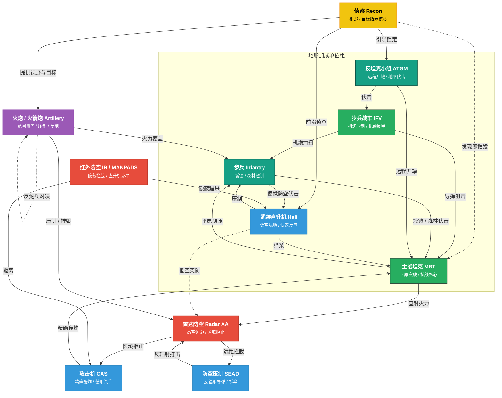
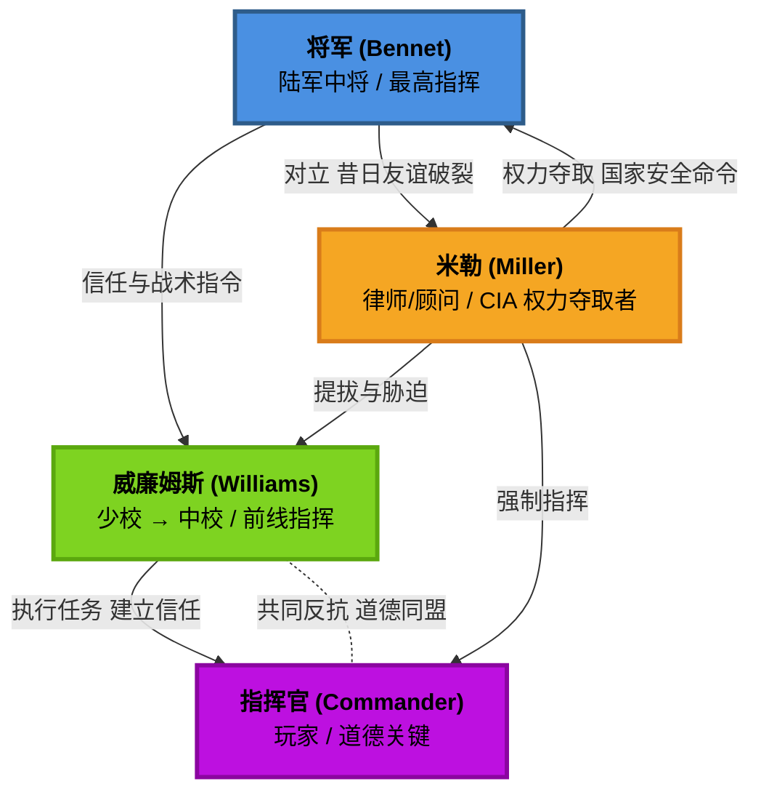
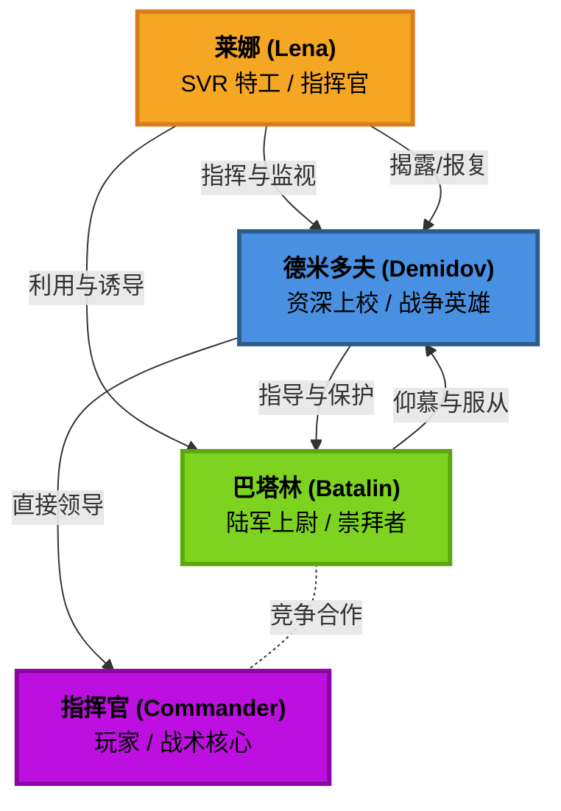

# Broken Arrow

**中文**: 断箭.  

## 防空压制

防空压制 (Suppression of Enemy Air Defenses, SEAD) 是指通过使用反辐射导弹 (Anti-Radiation Missile, ARM) 来摧毁或压制敌方防空雷达和导弹系统的战术.

以下是具备 SEAD 能力的战斗机:

- **美国**: Prowler (x4), F-16CJ (x4), F-35A (x2), F-15EX (x2).
- **俄罗斯**: Su-24MP (x3), Su-34 (x2), MiG-35 (x4), Su-57 (x4), Su-25 (x2).

其中 (xN) 表示最多可携带 N 枚 ARM.

以下是具备 SEAD 能力的直升机:

- **美国**: AH-1Z Viper (x2).
- **俄罗斯**: Ka-52 Katran (x2).

以下作战单位应该设置编号, 便于快速选中:

- **远程火力**: 快速为前线提供火力支援.
- **雷达防空**: 便于在发现 SEAD-capable 战机时快速关闭雷达.

## 单位克制关系

## 波罗的海战役

### 金牌要求

获取金牌的条件**需且仅需满足金牌要求**, 无需同时满足铜牌和银牌要求.

#### 美军任务

| 任务                                           | 金牌要求                                                                      |
|------------------------------------------------|-------------------------------------------------------------------------------|
| 好戏上演 (Show Time)                           | • 在困难难度下完成任务. • 在 30 分钟内完成所有目标.                       |
| 和平捍卫者 (Peacekeeper)                       | • 在困难难度下完成任务. • 不要损失任何单位.                               |
| 空军基地惊天劫案 (Airbase Heist)               | • 在困难难度下完成任务. • 在 30 分钟内完成任务.                           |
| 巨浪 (The Big Wave)                            | • 在困难难度下完成任务. • 在 10 分钟内占领堡垒.                           |
| 钢铁洪流 (Tracked and Furious)                 | • 在困难难度下完成任务. • 不要损失任何一辆车辆.                           |
| 夜幕主宰者 (We Own The Night)                  | • 在困难难度下完成任务. • 不要损失任何一架直升机.                         |
| 吸血鬼! (Vampires)                             | • 在困难难度下完成任务. • 不要损失任何一架飞机.                           |
| 铁雨天降 (Heavy Rain)                          | • 在困难难度下完成任务. • 不要让任何单位被伊斯坎德尔 (Iskander) 导弹击毁. |
| 狩猎季节 (Hunting Season)                      | • 在困难难度下完成任务. • 消灭防空设施且不损失直升机.                     |
| 好友相助 (With a little help from our friends) | • 在困难难度下完成任务. • 不使用豹式坦克 (Leopards) 赢得任务.             |
| 断箭 (Broken Arrow)                            | • 在困难难度下完成任务. • 遵循本内特 (Bennet) 的计划.                     |

#### 俄军任务

| 任务                               | 金牌要求                                                                    |
|------------------------------------|-----------------------------------------------------------------------------|
| 请出示证件 (Papers Please)         | • 在困难难度下完成任务. • 使用最少的乘员组.                             |
| 停电 (Blackout)                    | • 在困难难度下完成任务. • 撤离全部幸存步兵与车辆.                       |
| 冷港行动 (Operation Cold Harbour)  | • 在困难难度下完成任务. • 不借助巴塔林 (Batalin), 独自占领港口全部目标. |
| 自助服务 (Self Service)            | • 在困难难度下完成任务. • 在 45 分钟内完成任务.                         |
| 禁航水域 (Forbidden Waters)        | • 在困难难度下完成任务. • 用 SSO 或 Spetsnaz VMF 击杀 50 个敌方单位.    |
| 搜索与救援 (Search & Rescue)       | • 在困难难度下完成任务. • 在 40 分钟内占领城市.                         |
| 舍我其谁 (The Ride of the VDV)     | • 在困难难度下完成任务. • 不使用 BMD-4M 或 Sprut-SD.                    |
| 归宿之路 (Road to Fiddler's Green) | • 在困难难度下完成任务. • 不向上校请求任何援助.                         |

### 金牌技巧

**冷港行动**

- 可以在 "夺取港口登陆场" 时提前将部分 PDSS 部署在码头左侧, 便于后续快速占领左侧区域. 进入下一阶段后使用直升机快速清剿左侧区域的敌人, 然后占领.
- 占领左侧区域后, 巴塔林并不会主动占领右侧区域, 因此后续一定能达成 "独自占领港口全部目标" 这一条件.

**禁航水域**

- 在 SSO 或 Spetsnaz VMF 完成击杀时, 屏幕左侧会显示喇叭图标和当前击杀数.
- 可以依靠 Spetsnaz VMF 或其他侦察单位提供视野, 然后通过 SSO 的 Kornet-M 从远距离打击敌方人员和载具单位.
- 如需轻松完成 50 击杀的目标, 需要让其他单位在合适的时候启用 "仅还击", 避免直接击杀敌军单位.

**舍我其谁**

- 集中兵力防御单个位置, 所有位置都被敌方占领才会判定为任务失败.

**归宿之路**

- 任务前期德米多夫上校会询问玩家需要何种增援, 选择不需要任何增援即可.

### 人物关系

#### 美军

#### 俄军

## 教程

- [For those who aren't military geeks](https://steamcommunity.com/sharedfiles/filedetails/?id=3501205842): 介绍了常见的概念和术语, 可以帮助快速入门.

## 资源

- <https://ba-hub.net>
- <https://barmory.net>

## 参考

- <https://steamcommunity.com/sharedfiles/filedetails/?id=3505492842>
