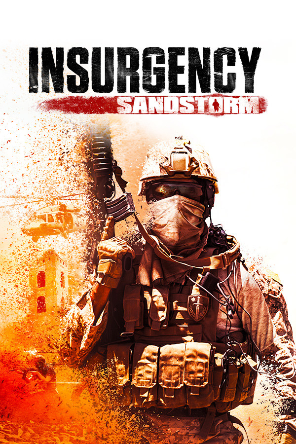

# Insurgency: Sandstorm

**中文**: 叛乱: 沙漠风暴.  

{ width=30% style="display: block; margin: 0 auto" }  

## 测评

**类型**: FPS, 单人, 多人合作, 多人竞技.  

| 项目 | 评分 | 描述 |
|----|------|------|
| 总体 | 9    |      |
| 画面 | 10   |      |
| 音效 | 8    |      |
| 优化 | 9    |      |
| 剧情 | -    |      |

叛乱: 沙漠风暴是一款偏硬核的第一人称设计游戏.  

偏硬核的元素主要有以下几点:  

- 平均 TTK 短.
- 真实的弹药管理: 备弹为携带的弹匣, 且只能查看单个弹匣内的大致子弹数.
- HUD 有限: 比如没有手雷指示器, 需要根据手雷落地碰撞的响声判断手雷的落点.

## 优点

- 枪械模型质量很高.
- PvE + PvP.

## 优化

- 阴影质量 (Shadow Quality): `中` 或更高.
- 运动模糊 (Motion Blur): `关`.
- 布娃娃数量 (Ragdoll Count): `低`.
- 材质流池 (Texture Streaming Pool): `高`.

## 参见

- [不同选项画面对比](https://www.reddit.com/r/insurgency/comments/rjl6wu/comment/hp43udc/?utm_source=share&utm_medium=web2x&context=3).
