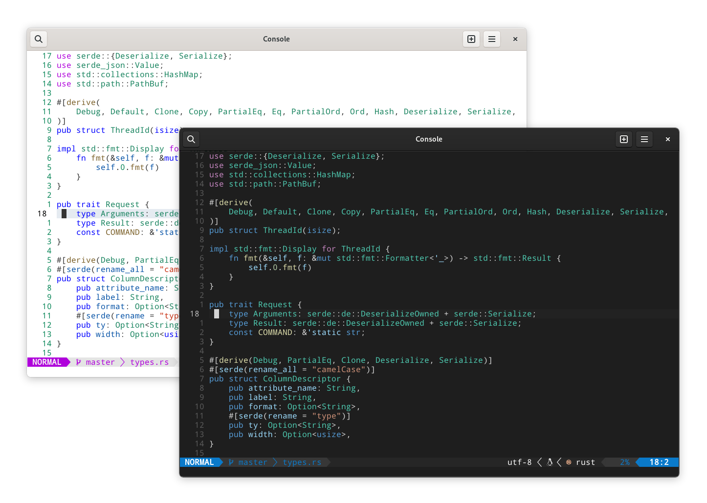
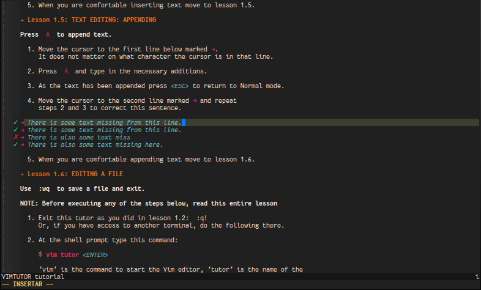
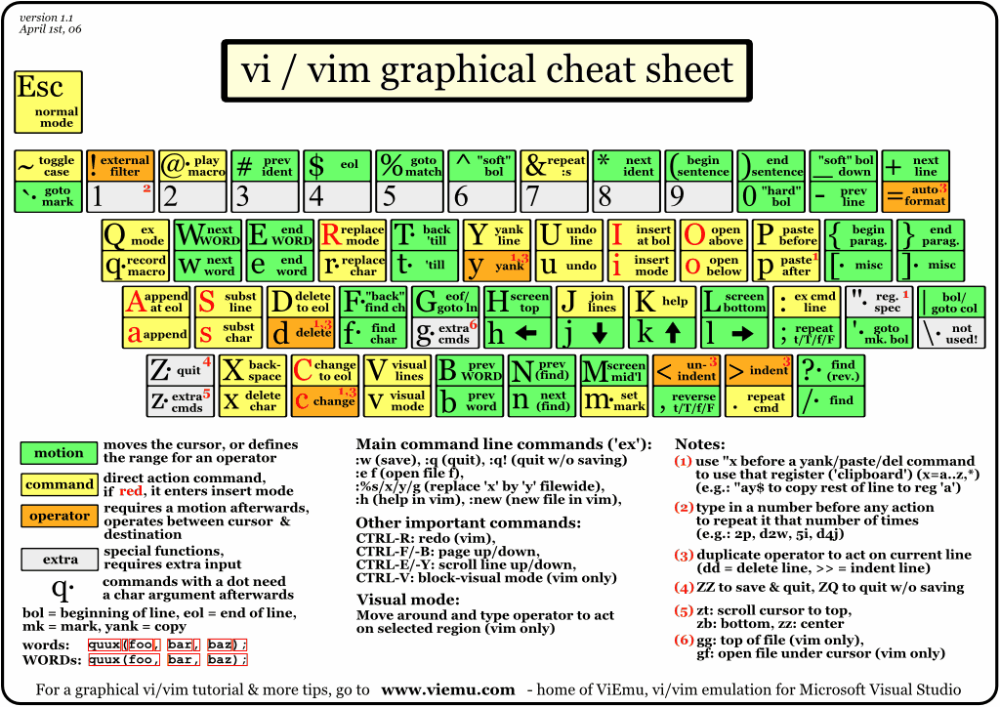

# Vim

{ width=80% style="display: block; margin: 0 auto" }  

## 简介

### 是什么

[Vim](http://www.vim.org/) 是一款基于 TUI 的编辑器[^1], 特点是可以只通过键盘使用/高度可自定义. 前者使得 Vim 使用起来十分高效, 后者使得 VIM 可以通过配置添加各种想要的功能.  

Vim(**V**i **im**proved) 最初是为了模仿 Vi, 后面 Vim 加入了许多新功能变成了 Vi 的改进版. 其中包含了不少现代 IDE 具备的基本功能.  

### 怎么学

对于已经熟悉了直观 GUI 的用户来说, Vim 显得不那么友善. Vim 的上手难度明显高于其他常见的基于 GUI 的编辑器.  

刚开始使用 Vim 的过程会比较坎坷, 因为一些简单的编辑功能需要重新学习, 而且曾经熟悉的编辑方法可能不再适用.
但是, 随着操作的熟练程度的提高, 用户的编辑效率也会逐步提升, 甚至超过以前使用的基于 GUI 的编辑器.  

Vim 的使用并不复杂, 通过速查表可以看出常用命令并不多.  
掌握 Vim 并不需要刻意记忆命令, 经常使用即可. [vimtutor](https://github.com/vim/vim/tree/master/runtime/tutor) 提供了一个交互式的入门教学, 时长约 30min.  

使用熟悉的 IDE 并且使用 Vim 的键位来进行学习或过渡, 减少 Vim 的上手难度.  

{ width=70% style="display: block; margin: 0 auto" }  

其次 Vim User Manual[^2] 也是值得一读的.  

### 为什么

相比于其他现代 IDE, 初始 Vim 的功能较为简单, 而且其高度可自定义的特性也受到了 TUI 编辑器的限制.
因此, 在学习 Vim 之前, 应该先对其优缺点有一个清晰的认识.  

对于一些简单的编辑操作(例如修改配置文件), 只需掌握 Vim 的基本用法即可.
但是, 如果要利用 Vim 进行开发, 就需要更深入地学习 Vim 的高级功能, 并且至少要达到纯键盘编辑的效率能够与其他 GUI 编辑器相媲美, 以免降低开发效率.  

Vim 高效的键盘使用方案也被其他的现代 IDE 甚至包括浏览器通过插件所支持, 比如 Visual Studio Code 中的 [Vim 插件](https://marketplace.visualstudio.com/items?itemName=vscodevim.vim) 和 Chrome 浏览器中的 [Vimium C 插件](https://chrome.google.com/webstore/detail/vimium-c-all-by-keyboard/hfjbmagddngcpeloejdejnfgbamkjaeg).
因此即使不直接使用 Vim, 学习 Vim 依然十分有价值.  

其次是 Vim 本身也出现了一个新的替代品 Neovim, 在功能比 Vim 更加丰富的情况下减少了约 30% 的代码量. 拥有更活跃的社区和其他诸多优点.  

Vim 在终端下运行, 这意味着 Vim 可以直接在字符界面中和 SSH 里使用.  

## 快速入门

{ align=right width=60% }  

### 模式

- 普通模式(normal mode).
- 插入模式(insert mode).
- 可视模式(visual mode).
- 命令模式(command mode).

下面将列举各个模式下最常用的命令.  

### 普通模式

普通模式是默认的模式, 不同于其他以插入模式作为默认模式的无状态编辑器. 按键被用作以下功能.  

#### 移动光标

相比使用方向键, 使用字母能更快/更容易的移动光标. 由于只有4个键且使用频率较高, 很快就能适应.  

```txt
     ^       gg
     k       H
0 < h l > $  M
     j       L
     v       G
```

|                 |                          |
| --------------- | ------------------------ |
| `h`/`j`/`k`/`l` | 向左/下/上/右移动        |
| `0`/`|`         | 移动到行首               |
| `$`             | 移动到行尾               |
| `^`             | 移动到行内第一个非空字符 |
| `gg`            | 移动到文件的第一行       |
| `G`             | 移动到文件最后一行       |
| `H`             | 移动到屏幕的第一行       |
| `M`             | 移动到屏幕的中间         |
| `L`             | 移动到屏幕的最后一行     |
| `w`             | 向后移动一个词           |
| `W`             | 向后移动一个词, 忽略标点 |
| `b`             | 向前移动一个词           |
| `B`             | 向前移动一个词, 忽略标点 |

#### 翻动页面

|            |             |
| ---------- | ----------- |
| `zz`       | 居中当前行. |
| `Ctrl` `u` | 向上翻半页. |
| `Ctrl` `d` | 向下翻半页. |

#### 删除内容

|      |                                    |
| ---- | ---------------------------------- |
| `x`  | 删除光标上的当前字符               |
| `dd` | 删除一整行                         |
| `D`  | 删除当行光标之后的内容             |
| `C`  | 删除光标内容的内容, 并进入插入模式 |

#### 插入内容

普通模式使用下列命令将会切换为插入模式.  

|     |                                              |
| --- | -------------------------------------------- |
| `i` | 在光标左侧进入插入模式                       |
| `I` | 在光标行的行首输入正文                       |
| `a` | 在光标右侧输入内容                           |
| `A` | 在光标所在行的行尾输入内容                   |
| `o` | 在光标处的下一行添增内容                     |
| `O` | 在光标处的上一行添增新行, 光标位于新行的行首 |

#### 查找

|          |                              |
| -------- | ---------------------------- |
| `/<foo>`   | 向后查找 `<foo>`               |
| `/<foo>\c` | 向后查找 `<foo>`, 大小写不敏感 |
| `?<foo>`   | 向前查找 `<foo>`               |
| `*`/`#`  | 向后/前查找光标处的词        |
| `n`/`N`  | 下/上一条匹配项              |

#### 跳转

|            |                         |
| ---------- | ----------------------- |
| `Ctrl` `o` | 跳转到上一次跳转的位置. |
| `Ctrl` `i` | 跳转到下一次跳转的位置. |
| `gx`       | 打开光标处内容          |

### 插入模式

该模式也可以理解为 "编辑模式". 在普通模式下执行插入相关操作就会进入插入模式. 按 `Esc` 回到普通模式.  

### 命令模式

在普通模式下按 `:`/`/` 即可进入命令模式. 按 `Esc` 回到普通模式.  
此时光标会移动到屏幕最下方, 并等待用户输入命令. 可以使用 `Tab` 补全命令.  

#### 保存/退出

|           |                              |
| --------- | ---------------------------- |
| `:w`      | 写入(保存)                   |
| `:q`      | 退出                         |
| `:wq`     | 写入并退出                   |
| `:x`/`ZZ` | 写入并退出, 仅在有修改时写入 |

#### 打开文件

|                       |                               |
| --------------------- | ----------------------------- |
| `:e file`             | 打开文件 `file`               |
| `:sp file`(`:split`)  | 水平分割窗口并打开文件 `file` |
| `:vs file`(`:vsplit`) | 垂直分割窗口并打开文件 `file` |

#### 按键宏

|          |                          |
| -------- | ------------------------ |
| `q<reg>` | 开始录制宏到寄存器 `reg` |
| `q`      | 结束录制宏.              |
| `@<reg>` | 执行宏 `reg`             |

#### 其他

|                     |                        |
| ------------------- | ---------------------- |
| `:Tutor`            | vimtutor 交互式教程    |
| `:h key`(`:help`)   | 查看帮助               |
| `Ctrl` `]`          | 在帮助中跳转到指定 tag |
| `:n`                | 定位到第 `n` 行        |
| `:!cmd`             | 执行命令 `cmd`         |
| `:ter`(`:terminal`) | 打开内置终端           |

#### 全局操作

在命令模式下, `%` 表示所有行, 可以结合其他命令执行一些全局操作, 比如 `:%d` 删除文件全部内容, `:%y` 拷贝文件全部内容.  

### 可视模式

在普通模式下按 `v` 即可进入可视模式. 按 `Esc` 回到普通模式.  

## 安装

```sh
sudo pacman -S nvim          # 安装 Neovim
sudo pacman -S python-pynvim # 或 pip install pynvim, 支持依赖 Python 的插件
```

!!! tips
    使用 `sudoedit` 而不是 `sudo vim`.  
    若已经完成编辑, 可以使用 `:w !sudo tee %`.  

## 配置

Neovim 的配置文件位置:  

- Linux: `~/.config/nvim`.
- Windows: `%LocalAppData%/nvim`.

在配置 neovim 时, 可能会遇到配置文件中存在语法错误等问题, 导致 neovim 无法正常启动或运行.
这种情况下, 可以使用 `nvim -u NONE` 命令来忽略配置文件, 从而继续使用 neovim 的基本功能.  

### 按键映射

默认的 `Esc` 按键不在主键盘区内, 常见的等价键位有 `Ctrl` `C`/`Ctrl` `[`, 常见的替代键位有 `jk`/`jj`/`CapsLock`.  
更换键位后可以将原键位映射到 `<nop>` 来使其失效, 以提高切换到新键位的效率.  

### 预配置

#### [AstroNvim](https://github.com/AstroNvim/AstroNvim)

**仅适用于 Neovim**.  

```sh
# 安装
git clone https://github.com/AstroNvim/AstroNvim ~/.config/nvim
nvim +PackerSync
```

- 安装 LSP: `:LspInstall <name>`.
- 安装语法高亮: `:TSInstall <name>`.
- 更新插件: `:PackerSync`.
- 更新 AstroNvim: `:AstroUpdate`.

#### [SpaceVim](https://spacevim.org/cn/)

适用于 Vim/Neovim.  

```sh
curl -sLf https://spacevim.org/cn/install.sh | bash                   # 安装
curl -sLf https://spacevim.org/cn/install.sh | bash -s -- --uninstall # 卸载
```

[SpaceVim 入门指南](https://spacevim.org/cn/quick-start-guide/)有配置文件说明和快速搭建适用于不同编程语言环境方法的索引.  

- 打开配置文件: `SPC f v d`, 可以通过修改配置文件 `~/.SpaceVim.d/init.toml` 来启用更多功能或安装插件.
- 更新全部插件: `:SPUpdate`, 对全部已安装的插件进行更新, 包括 SpaceVim 自身.
- 开启/关闭大纲: `F2`.
- 开启/关闭文件树: `F3`.
- 查找当前项目下的文件: `CTRL` `p`.

要启用 nvim-qt 中的右键文本编辑菜单, 往 ginit.vim 中添加一下内容:  

```vim
nnoremap <silent><RightMouse> :call GuiShowContextMenu()<CR>
inoremap <silent><RightMouse> <Esc>:call GuiShowContextMenu()<CR>
vnoremap <silent><RightMouse> :call GuiShowContextMenu()<CR>
```

SpaceVim 默认只启用了最基本的 [Layers](https://spacevim.org/layers/)(可以看作是特定功能的合集), 用户可以应根据自身需求启用他们来添加功能. 在用户进行简单的配置并重启后, 会自动下载所需的的插件并进行配置.  

#### [NvChad](https://github.com/NvChad/NvChad)

**仅适用于 Neovim**.  

```sh
# 安装
git clone https://github.com/NvChad/NvChad ~/.config/nvim --depth 1 && nvim

# 卸载
rm -rf ~/.config/nvim
rm -rf ~/.local/share/nvim
rm -rf ~/.cache/nvim
```

- 管理 LSP/DAP/Linter/Formatter: `:Mason`
- 安装语法高亮: `:TSInstall <name>`.
- 更新插件: `:PackerSync`.
- 查看快捷键: `:Telescope keymaps`.

## GUI

[Neovide](https://neovide.dev/) 为 Neovim 提供了一个 GUI 界面, 并支持了一些终端上难以实现的功能.  
GUI 可以为 Vim/Neovim 提供界面美化(如内部窗口的透明模糊背景)/平滑动画(如窗口切换/大小变化)等功能, 为用户提供更舒适/流畅的编程体验.  

更多项目请参考 [Neovim Wiki](https://github.com/neovim/neovim/wiki/Related-projects#gui).  

## 插件

| 名称               | 描述                                                                  |
| ------------------ | --------------------------------------------------------------------- |
| [leap.nvim]        | 快速光标跳转, 主要适用于跨行移动, 相比搜索再跳转的方法更快.           |
| [vim-visual-multi] | 多光标.                                                               |
| [vim-lastplace]    | 打开文件时回到上次编辑的位置.                                         |
| [instant.nvim]     | 远程结对编程, 类似 Visual Studio Live Share 的简化版, 只具备基本功能. |
| [hardtime.nvim]    | 帮助培养良好的键盘工作流.                                             |

[leap.nvim]: https://github.com/ggandor/leap.nvim
[vim-visual-multi]: https://github.com/mg979/vim-visual-multi
[vim-lastplace]: https://github.com/farmergreg/vim-lastplace
[instant.nvim]: https://github.com/jbyuki/instant.nvim
[hardtime.nvim]: https://github.com/m4xshen/hardtime.nvim

## 错误排查

若部分功能无法正常使用, 可以通过执行 `:checkhealth` 来进行自动排查故障, 并根据结果修复故障.  

## 参见

- <https://this-week-in-neovim.org/>
- [A guide to using Lua in Neovim](https://github.com/nanotee/nvim-lua-guide)
- [Vi 与 Emacs 之间的编辑器之战](https://en.wikipedia.org/wiki/Editor_war)
- [Vim Awesome](https://vimawesome.com/)
- [Awesome Neovim](https://github.com/rockerBOO/awesome-neovim)

## 参考

- [Interactive Vim tutorial (openvim.com)](https://www.openvim.com/tutorial.html)
- [Vim Cheat Sheet & Quick Reference](https://quickref.me/vim)
- [Graphical vi-vim Cheat Sheet and Tutorial (viemu.com)](http://www.viemu.com/a_vi_vim_graphical_cheat_sheet_tutorial.html)

[^1]: 也有提供 GUI 的分支项目, 如 gVim/[macVim](https://github.com/macvim-dev/macvim).
[^2]: [Vim](https://neovim.io/doc/user/usr_01.html)/[Neovim](https://neovim.io/doc/user/usr_01.html).
