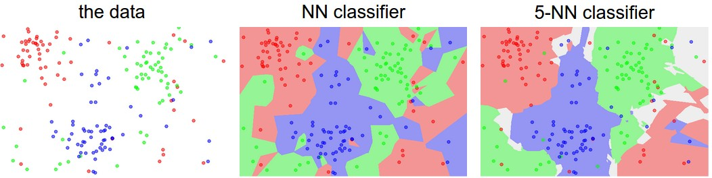

# 图像分类(Image Classification)

## 概述

图像分类是计算机视觉的一个核心任务.  

### 挑战

该任务主对于人类来说十分简单, 这些工作会在大脑中自动完成. 但是对于计算机却十分困难, 因为
主要有以下挑战:  

  

- 视口变换(Viewport variation): 物体可能从多个观察角度被观察.
- 缩放变换(Scale variation): 物体大小可能发生缩放. (指的是现实中的大小, 而不是图像中的)
- 变形(Deformation): 物体可能存在多种姿态.
- 遮挡(Occlusion): 物体的部分可能被其他物体遮挡.
- 光照条件(Illumination conditions): 物体可能处在在不同光照条件下.
- 背景杂乱(Background clutter): 物品可能处在一个十分杂乱的背景下.
- 不同变种(Intra-class variation): 物体可能存在多种变种.

一个物体的图像可能存在以上几种情况, 其中每一项都会导致图像数据全部发生变化, 但都是同一个物体的图像. 因此算法要有足够的鲁棒性才能正确识别这些图像.  

### 数据驱动方法(Data-driven Approach)

对于图像分类这种复杂的工作, 通过编写专门的算法来识别特定的类别是困难且效果有限的. 通过给与许多例子并使用学习算法来自动学习不同分类物品所具有的视觉特点, 这类方法被称为数据驱动方法.  

## 最近邻(Nearest Neighbor Classifier, NN classifier)

如果将该算法的实现分成训练和预测两个阶段, 那么训练阶段只是将训练集记录下来, 在后续的预测阶段使用. 不预测则不需要进行计算, 属于惰性学习(lazy learning).  
计算单个像素之间的差值的绝对值并求和.  
本质上就是两个矩阵求差取平均值后求所有元素之和.  
缺点也十分明显, 每分类一张图像就需要遍历整个数据集因此效率十分低下. 且因为判断方式过于简单, 精度也很低.  

- L1 曼哈顿距离(Manhattan distance).

    $$ d_1(I_1, I_2) \sum_p | I^p_1 - I^p_2 | $$

- L2 欧几里得距离(Euclidean distance).

    $$ d_2(I_1, I_2) \sqrt{ \sum_p ( I^p_1 - I^p_2 ) } $$

## K最近邻(K-Nearest Neighbors Classifier, KNN classifier)

KNN 在 NN 的基础上进行了一些改进, 单个像素点的分类不再仅取决于与最近的一个点的距离, 而是取决于最近的 K 个点的距离.  

  

上图展示了当 K = 1 和 K = 5 时的分类结果. NN 就是当 K = 1 时的一个特例.  

## 超参数(Hyperparameters)

KNN 中的 K 值就是一个超参数, 这个参数是需要人工指定而不是通过训练自动推断得出的.  

## 数据集(Dataset)

数据集包含了许多带标签的图像, 这些标签表明了图像的类别.  
数据集大致需要被分成三个部分:  

- 训练(train), 这部分用于训练模型.
- 验证(validation), 这部分用于测试效果, 然后根据效果调节超参数.
- 测试(test), 用于测试算法的效果, 模拟实际的任务.

可以简单的将这三部分分别看作平时学习/模拟考试/考试, 因此三组数据之间不应该有交集.  

## 参考

- <https://cs231n.github.io/classification/>
