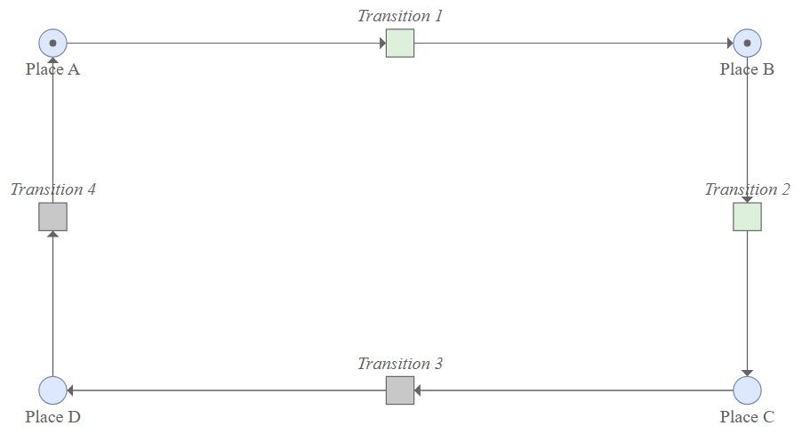

# Petri 网

**英文**: Petri net

## 简介

{ width=80% style="display: block; margin: 0 auto" }

Petri 网是用于描述分布式系统的数学建模语言, 名称来源于发明者 Carl Adam Petri, 最初目的是用于描述化学过程.  
通过 Petri 网对并发系统进行建模后, 就可以利用其数学特性进行分析.

Petri 网由三种元素组成:

1. **库所 (Place)**: 即上图的圆形节点.
2. **变迁 (Transition)**: 即上图的方形节点.
3. **有向弧 (Arc)**: 用于连接库所和变迁.

## 定义

Petri 网是一个三元组 $N = (P, T, F)$, 其中:

- $P$ 和 $T$ 是两个不相交的有限集, 分别表示库所和变迁.
- $F \subseteq (P \times T) \cup (T \times P)$ 是弧的集合.

TODO: 令牌 (Token).  
TODO: 说明 Petri 网的运行方式.

## 高级 Petri 网 (High-level Petri nets)

高级 Petri 网在 Petri 网的基础上添加了以下内容:

- Color: 令牌可以包含其他属性. 可为其他属性建模.
- Time: 变迁带有 $T_{min}$ 和 $T_{max}$ 属性, 表示激发所需要的最短完成和最长完成时间. 可用于性能分析.
- Hierarchy: Petri 网可以包含子网 (subnet), 而子网可以包含其他子网.

## 参见

- <https://pes.vsb.cz/petrineteditor/>.
- [Petri Net Markup Language](https://www.pnml.org/papers/PNML_CTT.pdf).
- <http://petrinet.org/>.
