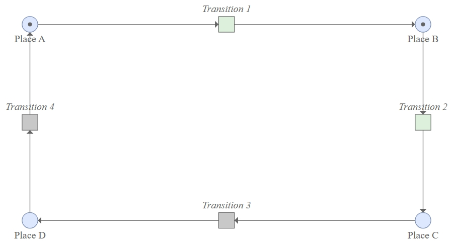

# Petri 网

**英文**: Petri net

{ width=80% style="display: block; margin: 0 auto" }

Petri 网由三种元素组成:

1. **库所(Place)**: 即上图的圆形节点.
2. **变迁(Transition)**: 即上图的方形节点.
3. **有向弧(Arc)**: 用于链接库所和变迁.

---

令牌(Token).

---

```txt
place <place_name>
transition <transition_name>

p1(red)
p2(yellow)
p3(green)
t1[]
t2[]
t3[]

p1 -> t1 -> p2 -> t2 -> p3 -> t3 -> p1
```

```rs
struct Place {
    label: String,
    next: Vec<Rc<Transition>>,
}

struct Transition {
    next: Vec<Rc<Place>>,
}
```

## 参见

- <https://pes.vsb.cz/petrineteditor/>.
- [Petri Net Markup Language](https://www.pnml.org/papers/PNML_CTT.pdf).
- <http://petrinet.org/>.
