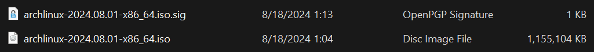
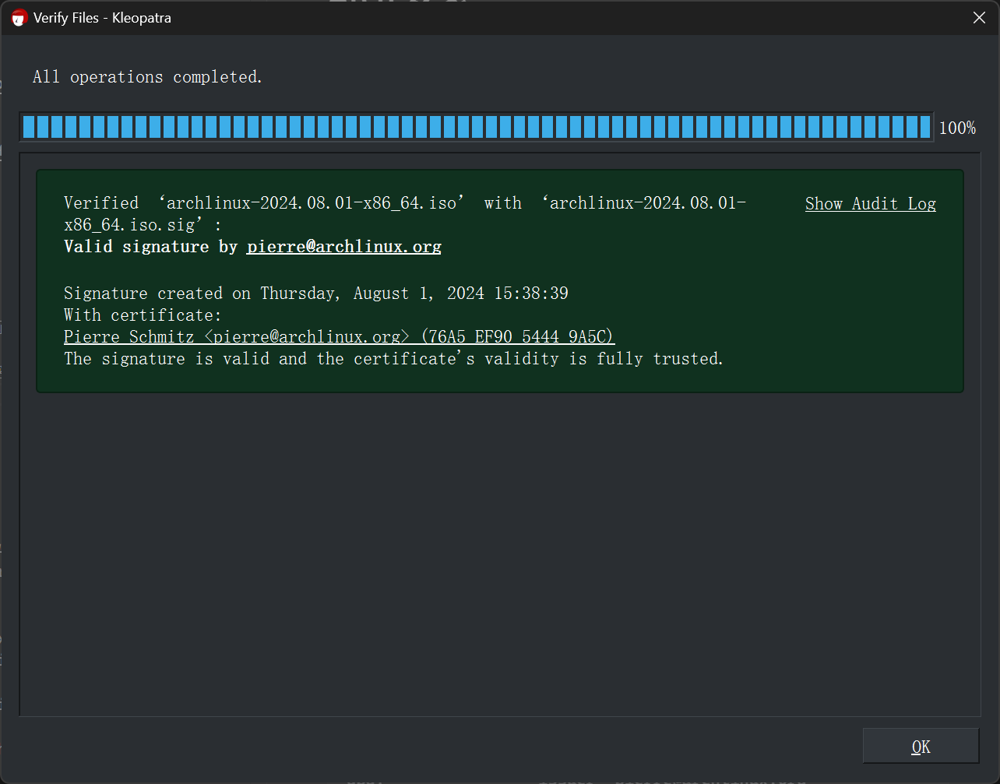
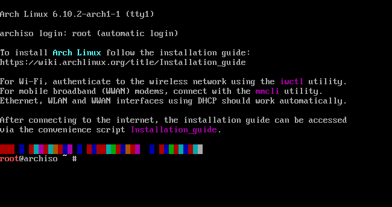

# Arch 安装

官方安装指南: <https://wiki.archlinuxcn.org/wiki/%E5%AE%89%E8%A3%85%E6%8C%87%E5%8D%97>.

## 前置条件

1. U 盘: 将被格式化, 因此应先转移U盘内已有的数据.
2. 良好的网络: 安装时会使用到网络.
3. 充足的电量.
4. 准备安装 Arch Linux 的电脑有至少 3GiB 的外存空间.

## 下载镜像文件

从[官网](https://archlinux.org/download/)下载镜像文件和 PGP 签名文件.



## 验证镜像文件 (可选)

使用 PGP 验证镜像文件.

### GUI

如果已安装 Kleopatra, 可以直接双击签名文件进行验证.

如果提示密钥未知, 点击 `Search` 来从服务器上搜索该密钥. 导入对应密钥后将自动重新验证.



出现以上信息则表示验证成功.

### CLI

```console
> gpg --keyserver-options auto-key-retrieve --verify .\archlinux-2024.12.01-x86_64.iso.sig
gpg: assuming signed data in '.\\archlinux-2024.12.01-x86_64.iso'
gpg: Signature made 12/01/24 05:50:47 GMT Standard Time
gpg:                using EDDSA key 3E80CA1A8B89F69CBA57D98A76A5EF9054449A5C
gpg:                issuer "pierre@archlinux.org"
gpg: Good signature from "Pierre Schmitz <pierre@archlinux.org>" [full]
gpg:                 aka "Pierre Schmitz <pierre@archlinux.de>" [full]
```

出现以上信息则表示验证成功.

!!! info
其他验证方法 (如 sha256sum) 请参考[官网](https://archlinux.org/download/)上的 `Download verification` 部分.

## Live USB

将镜像文件 (即下载的 iso 文件) 烧录到 U 盘中, 然后从 U 盘启动 Arch Linux.  
后续将通过从 U 盘上启动的 Arch Linux 来为电脑安装新的 Arch Linux.

## 从 Live USB 启动

成功启动后应该能看到如下界面:



若命令输出大量内容可能超出显示范围, 可以将其传递给 `less` 命令来查看完整内容, 如: `ip addr | less`.  
通过 `Ctrl` `Alt` F1-6 切换到其他终端, 可同时执行命令.

如遇到空间不足的问题, 可以通过下面命令解决:

```console
# mount -o remount,size=2G /run/archiso/cowspace
```

## 连接 Wi-Fi

```console
# iwctl
[iwd]# device list                   # 列出无线网卡
[iwd]# station wlan0 scan
[iwd]# station wlan0 get-networks
[iwd]# station wlan0 connect <ESSID> # 连接指定 Wi-Fi, 连接成功后对应 Network name 的左侧会出现 `>` 标识
[iwd]# exit                          # 连接成功后即可退出
```

```console
# nmcli dev wifi
# nmcli dev wifi connect <ESSID> password <PASSWORD>
```

## 网络

```console
# ping archlinux.org       # 检查是否有网络连接
# timedatectl set-ntp true # 时间同步
```

## 更换源

请参见: <https://archlinux.org/mirrorlist/>.

## 分区

!!! danger
该步骤存在较高风险, 需谨慎操作.  
 如果已经安装了 Windows, 注意不要修改属于 Windows 的 NTFS 文件系统类型的分区.  
 可以使用 `lsblk --fs` 查看文件系统类型.

```console
# fdisk -l
# lsblk
# cfdisk /dev/sda
# lsblk
```

现代计算机标签类型建议选择 GPT.

bootloader 分区大小通常为 128/256/512.  
创建完分区后选中该分区, 按 `b` 标记为可启动的.

按需创建其他分区, 至少创建一个. 用于存放根目录.

创建完全部分区后按 `W` 写入来应用修改. 然后按 `q` 退出.

## 创建分区

选择合适的文件系统创建并格式化分区, 下面以 ext4 为例.

```console
# mkfs.fat -F 32 /dev/efi_system_partition
# mkfs.ext4 /dev/root_partition
# mkswap /dev/swap_partition
```

其他文件系统请参考 [ArchWiki](https://wiki.archlinux.org/title/File_systems#Types_of_file_systems).

创建交换分区使用的命令是 `mkswap`.

## 挂载分区

```console
# mount /dev/root_partition /mnt
# mkdir /mnt/boot
# mount --mkdir /dev/efi_system_partition /mnt/boot
# lsblk
```

如果有 swap 分区, 还需执行下面命令:

```console
# swapon /dev/swap_partition
```

## 安装

```console
# pacstrap /mnt linux linux-firmware base base-devel neovim
```

安装基本软件. 可以将 neovim 替换成其他编辑器或使用 nano.  
也可以在后续 chroot 进入新系统环境后进行安装.

```console
# genfstab -U /mnt >> /mnt/etc/fstab
```

```console
# arch-chroot /mnt /bin/bash
```

## 安装 GRUB

```console
[]# pacman -S grub
[]# grub-install /dev/sda
[]# grub-mkconfig -o /boot/grub/grub.cfg
```

## 安装网络管理器

根据系统的用途选择合适的网络管理器.

```console
[]# pacman -S networkmanager
[]# systemctl enable NetworkManager
```

## 安装 microcode

根据 CPU 品牌安装 microcode, 只需要安装一个.

```console
[]# pacman -S intel-ucode # Intel CPU
[]# pacman -S amd-ucode   # AMD CPU
```

## 设置密码

通过下面的命令为 root 设置密码:

```console
[]# passwd
```

!!! warning
使用数字键盘时需注意 `Num Lock`.

## 设置语言

修改文件 `/etc/local.gen`, 取消需要使用语言的注释, 可以同时启用 UTF-8 和 ISO-8859-1.

应用修改:

```console
[]# locale-gen
```

修改文件 `/etc/locale.conf`, 添加下面内容来设置需要使用的语言:

```conf
LANG=en-US.UTF-8
```

## 设置主机名

修改文件 `/etc/hostname`, 填写主机名.

## 设置时区

利用补全功能选择时区.

```console
[]# ln -sf /user/share/zoneinfo/Asia/Shanghai /etc/localtime
```

详情请参考 [ArchWiki](https://wiki.archlinux.org/title/System_time#Time_zone).

```console
[]# exit
# umount -R /mnt
# reboot
```

## 安装 KDE Plasma

### 添加用户

创建用户并设置密码.

### 用户组权限管理

```console
# useradd -m -G wheel <username> # 创建家目录并将用户添加到 wheel 用户组. useradd --create-home --groups <username>
# passwd <username>
```

https://wiki.archlinux.org/title/Users_and_groups#User_groups

### 手动权限管理

```console
# useradd <username>
# passwd <username>

# mkdir /home/<username>
# chown <username> /home/<username>
# chgrp <username> /home/<username>
# chmod 700 /home/<username>
```

!!! info
Arch Linux 默认不包含 `adduser`, 可以从 AUR 安装. 但是 AUR 安装器通常需要非 root 权限用户. 因此手动添加用户.

### 安装 Plasma

```console
# pacman -S plasma-meta
```

建议选项:

- 音频: `pipewire-jack`.
- 字体: `noto-fonts`.

显示服务器建议默认使用 Wayland, 较为保守的用户可以使用 X Window System.

```console
# pacman -S plasma-wayland-session
```

可以选择性安装模拟终端, 以便在桌面环境下使用终端.

```console
pacman -S alacritty
```

或者在进入桌面环境后, 通过组合按键 `Ctrl` `Alt` `F3` 切换到其他 TTY, 通过组合按键 `Ctrl` `Alt` `F2` 切回桌面环境.

---

开启 SDDM 自动登录

---

```console
sudo systemctl enable sddm.service
```

---

```
xdg-user-dirs-update
```
