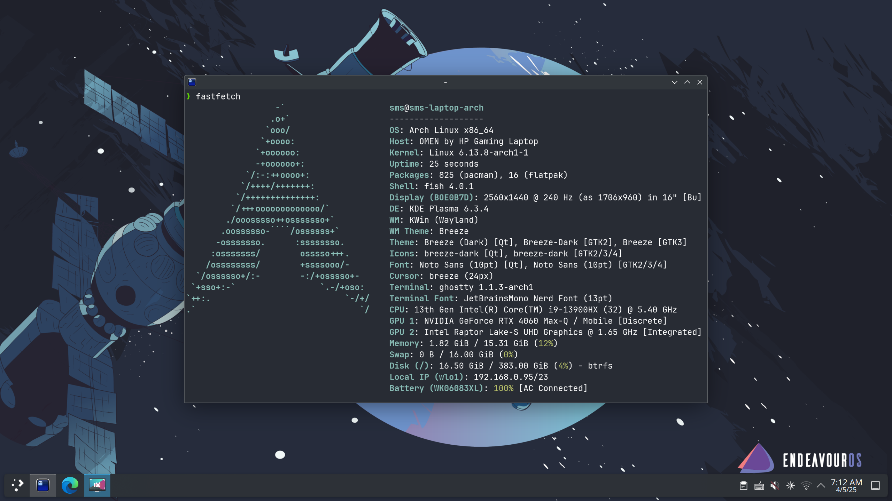
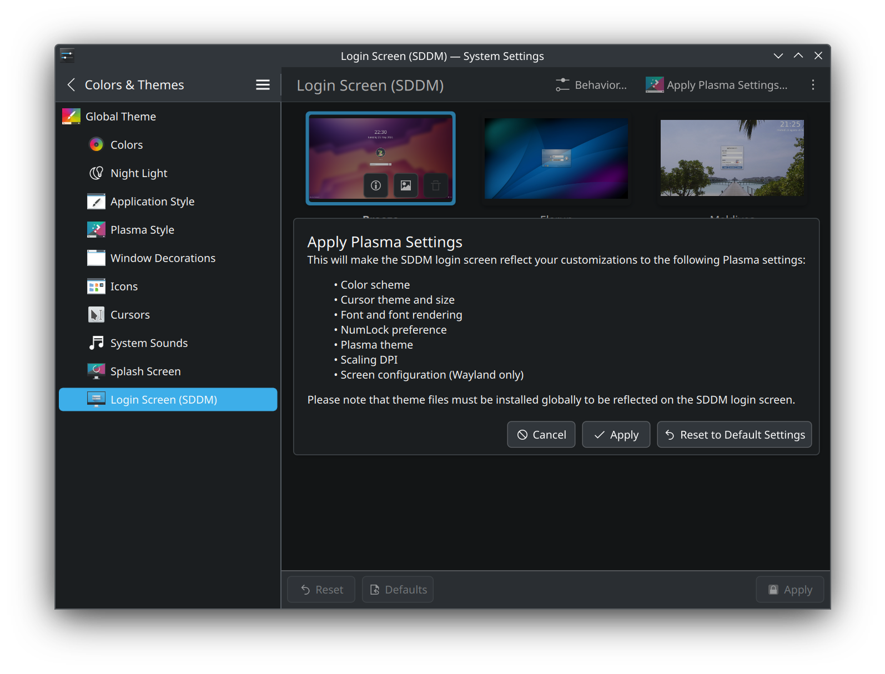

# 安装 KDE

{ width=80% style="display: block; margin: 0 auto" }  

进入登录界面或桌面环境后, 通过组合按键 `Ctrl` `Alt` `F3` 切换到其他 TTY, 通过组合按键 `Ctrl` `Alt` `F2` 切回登录界面或桌面环境.

## 安装 Plasma

```sh
sudo pacman -S plasma-meta power-profiles-daemon
```

建议选项:

- **多媒体**: `qt6-multimedia-ffmpeg`.
- **音频**: `pipewire-jack`.
- **字体**: `noto-fonts`.

安装中文字体:

```sh
sudo pacman -S noto-fonts-cjk
```

默认日语字体优先级别更高, 会导致中文显示异常. 在 `~/.fonts.conf` 中写入下面内容, 修改优先级:

```xml
<?xml version="1.0"?>
<!DOCTYPE fontconfig SYSTEM "fonts.dtd">
<fontconfig>
  <alias>
    <family>sans-serif</family>
    <prefer>
      <family>Noto Sans CJK SC</family> <!-- 简体中文优先 -->
      <family>Noto Sans CJK TC</family>
      <family>Noto Sans CJK JP</family>
    </prefer>
  </alias>
  <alias>
    <family>monospace</family>
    <prefer>
      <family>Noto Sans Mono CJK SC</family>
      <family>Noto Sans Mono CJK TC</family>
      <family>Noto Sans Mono CJK JP</family>
    </prefer>
  </alias>
</fontconfig>
```

如果不使用 Discover (KDE 的包管理 GUI 程序), 可以通过下面命令卸载:

```sh
sudo pacman -Rdd discover archlinux-appstream-data
```

在当前用户的家目录下创建常用目录:

```sh
xdg-user-dirs-update
```

详情请参考 [ArchWiki](https://wiki.archlinux.org/title/XDG_user_directories).

## 安装 SDDM

```sh
sudo pacman -S sddm
sudo systemctl enable sddm.service
```

!!! warning
    请确保已经创建一个普通用户, 否则 SDDM 将不会显示任何可登录的用户.

### 启用 HiDPI

在文件 `/etc/sddm.conf.d/hidpi.conf` 中添加下面内容:

```conf
[Wayland]
EnableHiDPI=true

[X11]
EnableHiDPI=true
```

如果选择基于 Qt 的登录界面 (如 Breeze), 以 150% 的缩放倍率为例, 还需要追加下面内容:

```conf
[General]
GreeterEnvironment=QT_SCREEN_SCALE_FACTORS=1.5,QT_FONT_DPI=192
```

详情请参考 [ArchWiki](https://wiki.archlinux.org/title/SDDM#DPI_settings).

## 启用 Num Lock

### 命令行启用

详情请参考 [ArchWiki](https://wiki.archlinux.org/title/Activating_numlock_on_bootup#Console).

### 登录界面启用 (SDDM)

点击 `System Settings | Colors & Themes | Login Screen (SDDM) | Apply Plasma Settings...`.

{ width=80% style="display: block; margin: 0 auto" }  

### 登录后启用

将 `System Settings | Keyboard | NumLock on startup` 设置为 `Turn on`.

## 打印机

```sh
sudo pacman -S cups system-config-printer
sudo systemctl enable --now cups.socket
```
