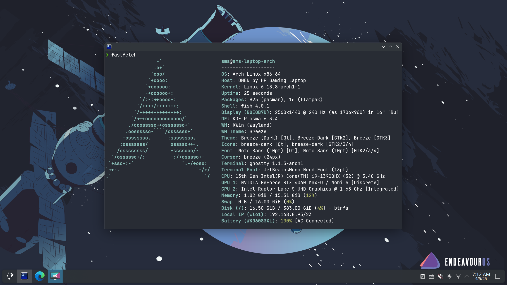

# 安装 KDE Plasma



## 安装 Plasma

```sh
pacman -S plasma-meta
```

建议选项:

- 多媒体: `qt6-multimedia-ffmpeg`.
- 音频: `pipewire-jack`.
- 字体: `noto-fonts`.

如果你不使用 Discover (KDE 的包管理 GUI 程序), 可以通过下面命令卸载:

```sh
pacman -Rdd discover archlinux-appstream-data
```

在当前用户的家目录下创建常用目录:

```sh
xdg-user-dirs-update
```

详情请参考 [ArchWiki](https://wiki.archlinux.org/title/XDG_user_directories).

## 安装 SDDM

```sh
pacman -S sddm
systemctl enable sddm.service
```

### 启用 HiDPI

在文件 `/etc/sddm.conf.d/hidpi.conf` 中添加下面内容:

```conf
[Wayland]
EnableHiDPI=true

[X11]
EnableHiDPI=true
```

如果选择基于 Qt 的登录界面 (如 Breeze), 以 150% 的缩放倍率为例, 还需要追加下面内容:

```conf
[General]
GreeterEnvironment=QT_SCREEN_SCALE_FACTORS=1.5,QT_FONT_DPI=192
```

详情请参考 [ArchWiki](https://wiki.archlinux.org/title/SDDM#DPI_settings).

## 启用 Num Lock

### 命令行启用

详情请参考 [ArchWiki](https://wiki.archlinux.org/title/Activating_numlock_on_bootup#Console).

### 登录界面启用 (SDDM)

点击 `System Settings | Colors & Themes | Login Screen (SDDM) | Apply Plasma Settings...`.


### 登录后启用

将 `System Settings | Keyboard | NumLock on startup` 设置为 `Turn on`.
