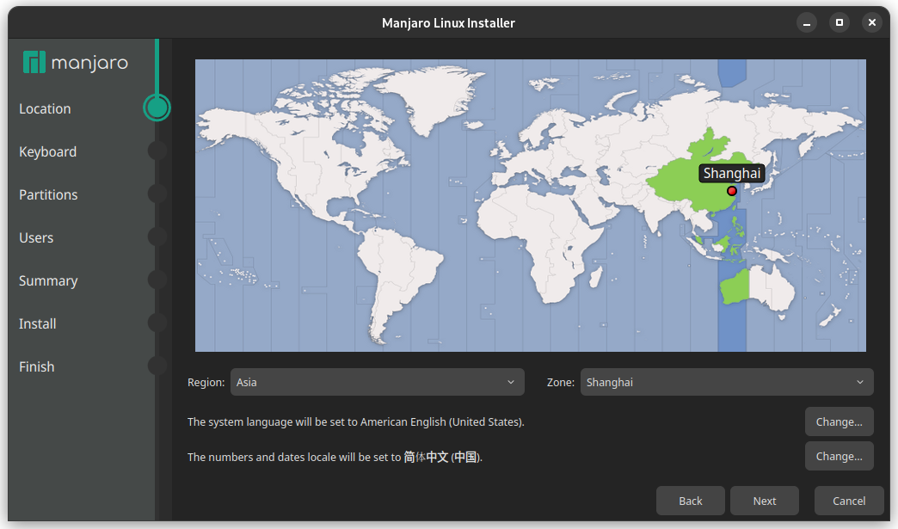

# Manjaro 安装

在硬盘的指定位置安装 [Manjaro](https://manjaro.org/), 适用于多系统用户/SSD 与 HDD 混合的用户.  

## 前置条件

1. **U 盘**: 安装过程将格式化 U 盘, 请提前转移 U 盘中的所有数据.
2. **良好的网络**: 确保有稳定的网络连接, 安装过程可能需要使用到网络.
3. **供电保障**: 确保设备有充足电量或接入电源, 避免安装过程中断电导致的系统损坏.

## 步骤概览

1. **创建启动介质**: 制作 Manjaro 的 USB 启动盘 (Live USB).
2. **从 U 盘启动**: 通过 BIOS 启动菜单或调整引导顺序来启动 Manjaro.
3. **系统安装**: 利用从 Live USB 启动的 Manjaro 系统, 安装新的 Manjaro 到硬盘.

## 下载系统镜像

!!! info
    Manjaro 官网 UI 更新频繁, 因此相关图片可能已过时. 但操作步骤应该大致不变.

从官网 ([x86](https://manjaro.org/products/download/x86), [ARM](https://manjaro.org/products/download/arm)) 中挑选心仪的桌面环境, 并下载对应的系统镜像文件.  

- **KDE Plasma**: Wayland 下最好的分数倍缩放支持.
- **Gnome**: 美观, 对分数倍缩放支持**不佳**.
- **Xfce**: 轻量, 适合性能较差的电脑.

{ width=40% }
{ width=40% }  

点击 `More` 可以看到更多信息. 默认是 `Full` 完整版, 也可以选择 `Minimal` 最小版, 仅提供了基本的桌面环境, 没有安装附加的软件.  

- 点击 `Signature` 可以下载电子签名文件, 然后使用 PGP 对镜像文件进行校验.
- 点击 `Image` 直接下载镜像文件.
- 点击 `Torrent` 下载种子文件, 然后使用 BitTorrent 下载器进行下载.
- 点击 `Checksum` 下载校验哈希值.

## 验证镜像文件 (可跳过)

```ps1
certutil -hashfile <IMAGE_FILE_PATH> SHA256
```

可能的结果为:

```txt
SHA256 hash of manjaro-gnome-24.0.3-240702-linux69.iso:
8a121303e64d78832399336f7aed307887f31f010886bcf408c34aa3ee8d5fc5
CertUtil: -hashfile command completed successfully.
```

官网提供的对应 Checksum 如下:

```txt
8a121303e64d78832399336f7aed307887f31f010886bcf408c34aa3ee8d5fc5  manjaro-gnome-24.0.3-240702-linux69.iso
```

校验哈希值一致, 镜像文件完整.

## 下载烧录软件

常用的烧录软件有以下两款, 都是开源软件:

- Rufus (开源, 仅支持 Windows): <https://github.com/pbatard/rufus>

    通过 [scoop] 管理器安装:

    ```ps1
    scoop install rufus
    ```

    或从[官网](http://rufus.ie/zh/)下载软件.

    !!! warning
        自动更新可能失效, 新的系统镜像使用较早版本的 Rufus 可能导致失败, 因此建议从官网下载最新版本.  

- Etcher (开源, 跨平台, 商业化, 有广告): <https://github.com/balena-io/etcher>

    通过 [scoop] 管理器安装:

    ```
    scoop install etcher
    ```

    或从[官网](https://etcher.balena.io/)下载软件.

## 烧录镜像到 U 盘中

1. 插入 U 盘.
2. 在烧录软件中选择对应的 U 盘和系统镜像文件.
3. 开始烧录, 耗时大约 3-5 min.

    !!! warning
        U 盘将被快速格式化.

## 从 Live USB 启动

!!! warning
    需要在 BIOS 中**禁用** Secure Boot, 否则无法从 U 盘里启动系统.  
    部分 BIOS (比如 Lenovo) 不会在启动失败的时候给出具体原因, 此时需要检查 Secure Boot 是否处于启用状态.

开机时按下指定按键进入 BIOS 设置, 然后选择从 U 盘启动.  

| 制造商  | 按键             |
|---------|------------------|
| Acer    | F12, F9, F2, Esc |
| Apple   | Option           |
| Asus    | Esc              |
| Clevo   | F7               |
| Dell    | F12              |
| Fujitsu | F12, Esc         |
| HP      | F9               |
| Huawei  | F12              |
| Intel   | F10              |
| Lenovo  | F12              |
| MSI     | F11              |
| Samsung | Esc, F12, F2     |
| Sony    | F11, Esc, F10    |
| Toshiba | F12              |
| others  | F12, Esc         |

!!! tip
    不同电脑进入 BIOS 设置的方式和从 U 盘启动的操作不同, 需根据自己的电脑型号查找具体操作方式.  

!!! warning
    请谨慎修改 BIOS 选项, 错误的设置可能导致系统无法启动. 记录所修改的 BIOS 选项, 以便失败后复原.

## 安装 Manjaro

### 欢迎

{ width=80% style="display: block; margin: 0 auto" }  

点击窗口最下方的 `Launch installer`.  

{ width=80% style="display: block; margin: 0 auto" }  

!!! info
    Calamares 安装程序在运行过程中可能会出现崩溃的情况, 此时需要耐心重试.

### 位置

选择时区和系统语言.  

{ width=80% style="display: block; margin: 0 auto" }  

### 键盘

选择键盘类型与布局, 通常默认设置即可.  
如果使用的不是美式键盘或布局不是 QWERTY 则需注意.  
该选项可以在安装后到 Manjaro Settings 中调整.  

{ width=80% style="display: block; margin: 0 auto" }  

### 分区

!!! danger
    该步骤存在较高风险, 需谨慎操作.  
    如果已经安装了 Windows, 注意不要修改属于 Windows 的 NTFS 文件系统类型的分区.  

!!! warning
    当 `/boot` 分区采用 btrfs 文件系统配合 GRUB 作为引导程序时, 会导致启动菜单无法保存上次选择的启动项. 这将给双系统用户带来不必要的麻烦.

选择手动分区.  

{ width=80% style="display: block; margin: 0 auto" }  

根据硬盘类型和空间进行分区. 在进行分区时, 应该先对 [FHS] 具有基本了解.  

- SSD: EFI(`/boot/efi`), root(`/`), swap.
- HDD: home(`/home`).

{ width=80% }  
{ width=80% }  
{ width=80% }  
{ width=80% }  
{ width=80% }  

{ width=80% }  
{ width=80% }  

### 用户

设置用户名/计算机名/密码.  

{ width=80% style="display: block; margin: 0 auto" }  

### 办公

如果暂时无法确定合适的办公套件或打算通过 flatpak 安装, 可以跳过此步骤 (选择 `No office suite`), 待系统安装完成后再进行办公套件的安装.

### 总览

{ width=80% style="display: block; margin: 0 auto" }  

### 安装

点击 `Install` 开始在指定分区安装 Manjaro.  

{ style="display: block; margin: 0 auto" }  
{ width=80% style="display: block; margin: 0 auto" }  

!!! info
    `misc postinstall configurations` 步骤需要调用 pacman 下载内容, 因此可能耗时较长.  

可以点击进度条右侧的按钮显示安装日志.  

{ width=80% style="display: block; margin: 0 auto" }  

### 结束

系统成功安装后将显示此提示.  

{ width=80% style="display: block; margin: 0 auto" }  

## 安装后配置

- [包管理](../Arch/Arch_包管理.md).
- 时间同步: 在设置中开启时间同步, 如果是双系统请参考[双系统时间不一致](../../双系统时间不一致.md).
- 启用备份: 使用 Timeshift 对系统进行定期备份.

## 参见

- [Manjaro Wiki](https://wiki.manjaro.org/index.php/Main_Page)

[scoop]: ../../Windows/Windows_包管理.md
[FHS]: https://refspecs.linuxfoundation.org/FHS_3.0/index.html
