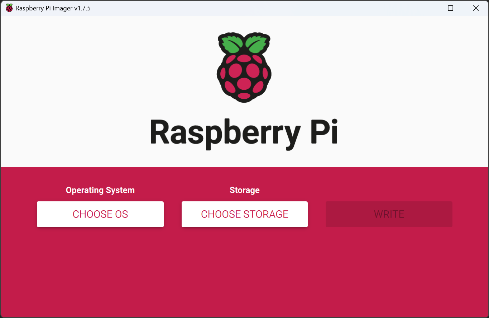
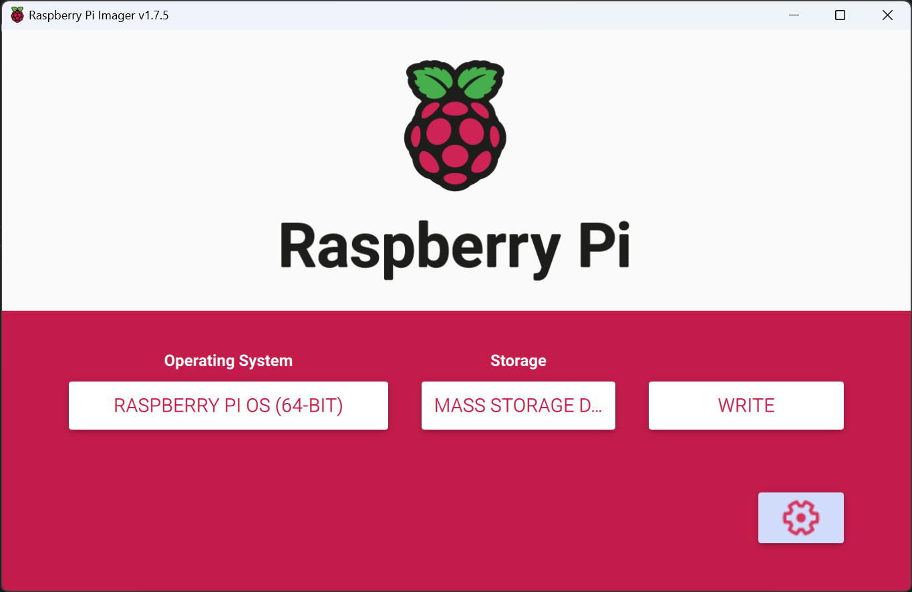
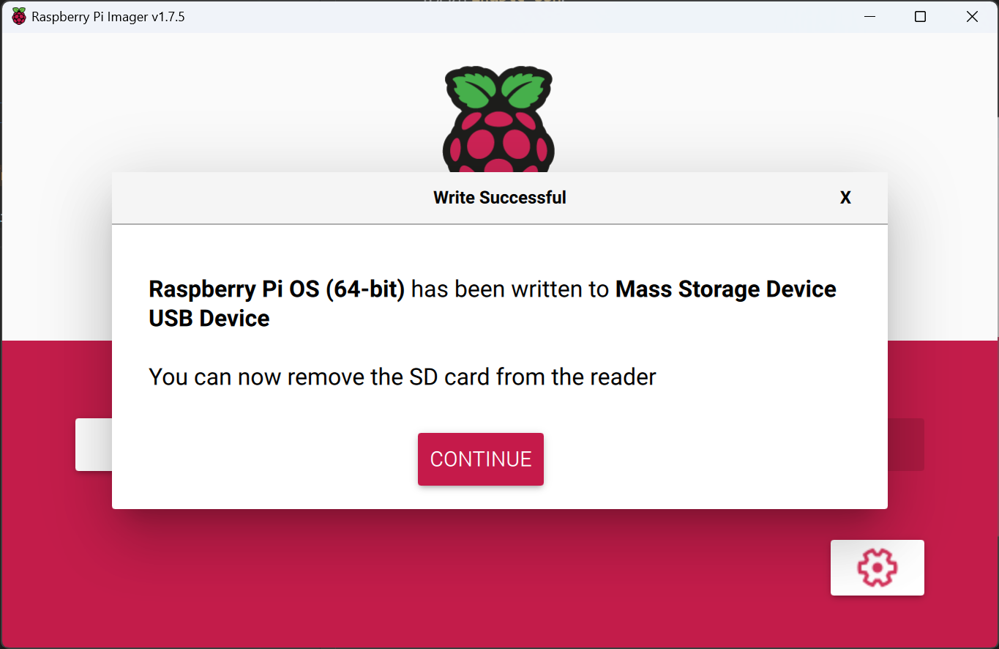

# Raspberry Pi OS 安装

安装 Raspberry Pi Imager.  

```console
> scoop install raspberry-pi-imager # Windows
> sudo apt install rpi-imager
```

  

选择操作系统, 本文以 `Raspberry Pi OS (64-bit)` 为例.
选择要烧录的设备.

在右下角的设置中:  

1. 启用 `Enable SSH`.
2. 配置用户名和密码.
3. 配置无线局域网.
4. 配置本地化. 选择合适的时区, 键盘布局为 `us`.
5. 点击 `Save`.

  

点击 `WRITE` 开始烧录, 烧录过程大概耗时 10 min.  
烧录过程主要分为写入和验证两个阶段.  

  
