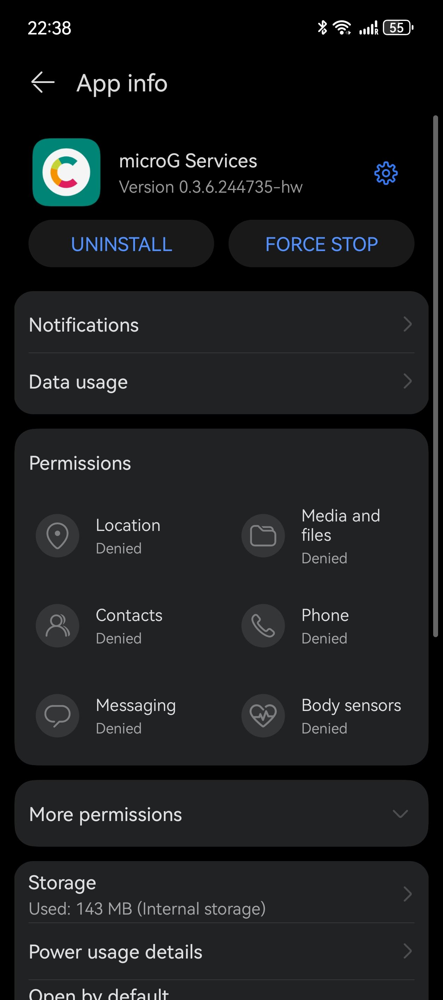

# microG

## 简介

2019 年 5 月, 华为被美国政府纳入实体清单, 导致谷歌无法向华为新机型提供 Google Mobile Services (GMS) 授权​.  
这将导致由 GMS 提供的服务无法使用, 例如:

- 依赖 GMS 的即时通讯软件无法进行消息推送, 这意味着用户收到新的消息后手机不会给出任何提示, 需要用户定期打开应用检查是否收到新的消息.
- 依赖 Google 地图的应用可能会在尝试展示地图时直接崩溃.

microG 是 GMS 的开源实现 (Apache 2.0), 主要特点可以参考[官方 Wiki](https://github.com/microg/GmsCore/wiki#features).

## 安装

可以从 [GitHub](https://github.com/microg/GmsCore/wiki/Downloads)下载或从 microG 的 F-Droid 仓库[^1]安装下面服务:

需先安装 microG 的三款软件:

- microG Services (`com.google.android.gms`).
- microG Companion (`com.android.vending`).
- Services Framework Proxy (`com.google.android.gsf`).

如果是华为手机, 则需要将前两个替换为下面的特殊版本:

- `com.google.android.gms-hw`.
- `com.android.vending-hw`.

该版本只能从官网下载获取.

由于这些组件属于服务而非应用, 安装后不会在应用菜单显示图标.  
需要从应用设置中进入 microG Services 的设置界面, 如下图所示:

{ width=50% style="display: block; margin: 0 auto" }

点击右上角的蓝色齿轮图标即可进入 microG 的设置界面.

进入设置界面后可以选择性的登录 Google 账号, 以使用更多 GMS 功能, 如消息推送.

启用消息推送需要以下步骤:

1. 登录 Google 账号.
2. 注册设备.
3. 启用消息推送功能 (默认开启).
4. 打开相关软件, 检查是否出现在 microG 的设置页面中.

## 应用商店

microG 并不能完全取代 GMS 的所有功能, 比如付费等. 因此无法支持 Google Play 商店.

目前最理想的 Google Play 开源 (GPLv3) 替代品是 [Aurora Store](https://gitlab.com/AuroraOSS/AuroraStore). 开源从 F-Droid 的官方仓库或 IzzyOnDroid F-Droid 仓库下载. [代码仓库](https://gitlab.com/AuroraOSS/AuroraStore/-/releases)也提供了 APK 文件的下载.

F-Droid 不是 Google Play 的替代品, 以 Element X 应用为例:

- Google Play 上的版本支持 GMS 的消息推送.
- F-Droid 上的版本**不支持** GMS 的消息推送, 而是使用 UnifiedPush.

与 F-Droid 不同, Aurora Store 的 APK 文件是直接从官方的 Google Play 商店下载[^2].

[^1]: 需启用 microG F-Droid repo 仓库 (<https://microg.org/fdroid/repo>).
[^2]: <https://gitlab.com/AuroraOSS/AuroraStore#aurora-store>
