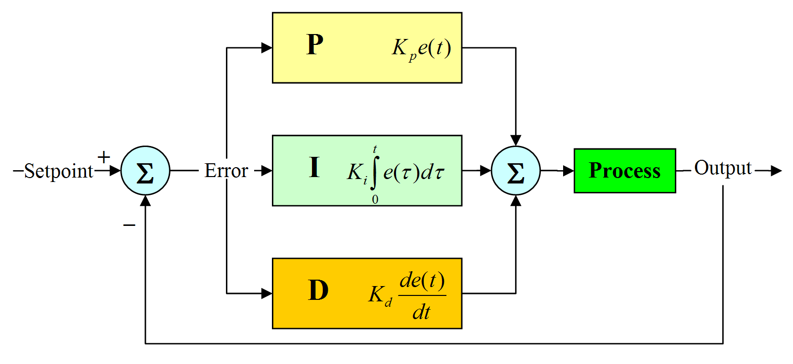

# PID 控制算法

在现实中对事物的控制不能达到完全精确. 如果使用开环的控制系统将导致误差不断积累, 最终达到某个阈值, 失去对事物的控制. 利用 PID 来构建一个闭环控制系统, 可以自动调节输出接近设定的目标值.  

该算法由三部分组成, 分别是比例(Proportional, P)单元, 积分(Integral, I)单元和微分(Derivative, D)单元.  

  

注解:

- $K_p$: 比例调节参数.
- $K_i$: 积分调节参数.
- $K_d$: 微分调节参数.
- $e(t)$: 当前误差.

## 稳态误差(Steady-State Errors)

系统从一个稳态过渡到新的稳态, 或系统受扰动作用又重新平衡后, 系统出现的偏差.  

## 参数

- P: 比例单元.

    结果为误差与 $K_p$ 的乘积. 误差越大调节力度越大, 快速减小误差; 误差越小调节力度越小.  

- I: 积分单元.

    结果为积分与 $K_i$ 的乘积. 积分为误差与时间的乘积之和, 因此考虑到了不同时间段的误差. 若误差长期没有得到修正, 存在稳态误差, 积分会不断增加, 最终会使误差会不断接近零.  

- D: 微分单元.

    若误差缩小微分单元为负, 时间变化量越小, 整体的绝对值越大. 因此可以减少超调和振荡, 提高系统的响速度和稳定性.  

通过下图可以直观的看出三种参数对整体调节效果的影响:  

  

I 的值近似等于曲线与 $y = 1$ 之间构成的面积.  

## 调节参数

三个公式都包含各自的调节参数, 这三个调节参数分别控制三个部分计算的结果对控制的影响大小, 应根据实际应用将它们调整到最适合的值.  
调试 PID 控制参数主要方式有:

- 人工调整.
- [齐格勒-尼科尔斯方法](https://zh.wikipedia.org/wiki/齐格勒－尼科尔斯方法).
- PID 调试软件.

## 实现

```cpp
float kP = ..., kI = ..., kD = ...; // 这三个参数的值由用户指定
float target = ...;                 // 期望达到的值

struct PIDState
{
  float kP, kI, kD;
  float integral = 0.f;
  float prev_error;
};

float pid(float target, float actual, float dt, PIDState& state)
{
  const float error = target - actual;
  state.prev_error  = error;

  const float p   = state.kP * error;
  state.integral += state.kI * error * dt;
  const float d   = state.kD * (error - state.prev_error) / dt;

  return p + state.integral + d;
}

auto prev_timepoint = get_current_timepoint();
while(true)
{
  const auto timepoint = get_current_timepoint();
  const auto dt        = timepoint - prev_timepoint;
  prev_timepoint       = timepoint;

  const float actual = read(...); // 获取实际数据
  const float output = pid(target, actual, dt);
  write(output); // 进行调整
}
```

## 参考

- <https://zh.wikipedia.org/wiki/PID控制器>
- <https://www.bilibili.com/video/BV1jr4y1P7qK/?spm_id_from=333.788.recommend_more_video.0>
