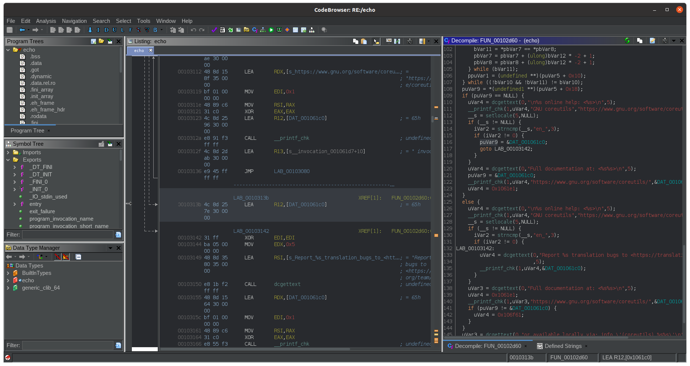
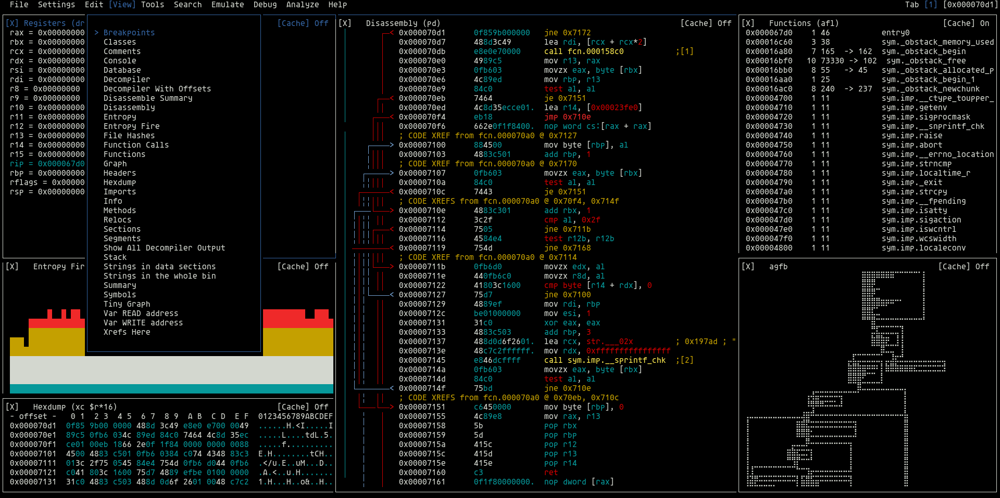
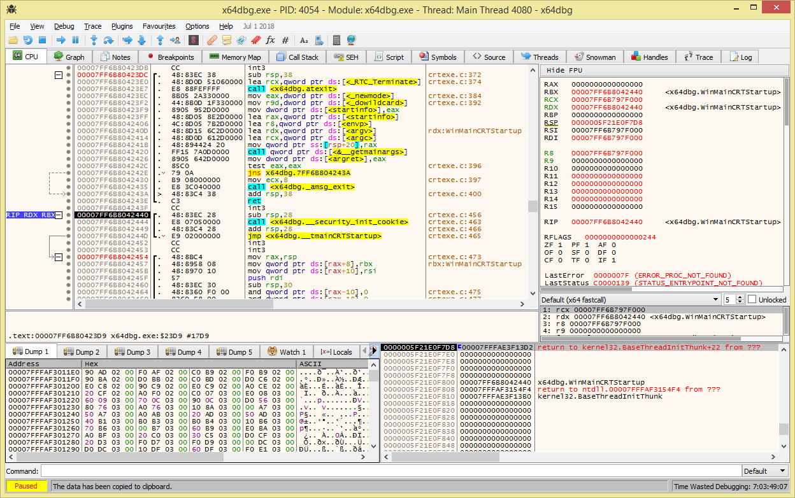

# 反汇编器

**英文**: Disassembler.  

!!! info
    由于许多反汇编器已经同时具备静态分析和动态调试功能, 因此这里反汇编器同时指代逆向工程框架.  

- [IDA Pro](#ida-pro): 可调试, 反编译, 跨平台, 天价.
- [Ghidra](#ghidra): 可调试, 反编译, 免费, 开源, 跨平台.
- [Radare2](#radare2): 可调试, 免费, 开源, 命令行.

## [IDA Pro](https://hex-rays.com/ida-pro/)

  

由于高昂的售价, 使得 IDA Pro 自身也变成了被逆向的对象.  

- 提供了只包含部分功能的免费版本 [IDA Free](https://hex-rays.com/ida-free/).  
- 部分键位和大多数软件并不相同, 具体请参考[快捷键](https://www.hex-rays.com/products/ida/support/freefiles/IDA_Pro_Shortcuts.pdf).  

插件支持 Python 和 IDC 语言.  
使用方法请参考手册(帮助->帮助, F1).  

!!! warning "Apple Silicon M1"
    IDA Pro 的 [ARM 版本](https://hex-rays.com/blog/ida-pro-on-apple-silicon/)暂时未泄露, 因此使用 Apple Silicon M1 的电脑需要借助 Wine 来运行 IDA Pro.  

## [Ghidra](https://github.com/NationalSecurityAgency/ghidra)

  

这是一个由 NSA 维护的项目, 因此即使是开源项目也需谨慎使用.  
[Dark Theme](https://github.com/zackelia/ghidra-dark) 需要另行安装.  

!!! warning
    该项目早期版本在未修复的已知的远程可执行漏洞 [CVE-2021-44228](https://cve.mitre.org/cgi-bin/cvename.cgi?name=cve-2021-44228), 详情请参考[安全警告](https://github.com/NationalSecurityAgency/ghidra#security-warning).  
    请根据手册来进行补丁.  

插件仅支持 Java 语言.  
使用方法请参考手册(Help->Contents).  

## [Radare2](https://github.com/radareorg/radare2)

  

更多内容请参考[常用插件](https://github.com/radareorg/radare2#plugins)和[插件](https://r2wiki.readthedocs.io/en/latest/home/radare-plugins/).  
常用插件:  

- [iaito](https://github.com/radareorg/iaito) 为 Radare2 提供了一个官方的 GUI.  
- [r2ghidra](https://github.com/radareorg/r2ghidra) Ghidra 反编译器的集成.

普通平台下的安装方法不同, 具体请参考[安装方法](https://github.com/radareorg/radare2#installation).  
使用方法请参考[在线手册](https://book.rada.re/)和[Wiki](https://r2wiki.readthedocs.io/).  

### 快速入门

1. [启动](https://book.rada.re/first_steps/commandline_flags.html)

    ```sh
    r2 [程序名称]
    r2 -d [程序名称] # 对程序进行调试
    ```

    之后便进入 radar2 内部的命令行.  

2. [分析/反编译](https://book.rada.re/analysis/code_analysis.html)

    ```sh
    > aaa      # 对全部函数进行分析
    > afl      # 列出全部函数
    > afl~main # 查看包含特定关键字的函数
    
    > s main     # 定位到指定函数
    > pdf        # 输出反编译结果
    > pdf @ main # 输出 main 函数的反编译结果
    > pdc        # 输出反编译结果
    ```

    其中 `~` 类似 `| grep `, 可在不同命令中使用. 

3. [视觉模式](https://r2wiki.readthedocs.io/en/latest/options/capv/visual-mode/)

    ```sh
    V  # 进入 V(视觉) 模式
    VV # 进入 VV(流程图) 模式
    V! # 进入 V!(可视ASCII艺术面板) 模式
    ```

    进入视觉模式后可以按 `p` 进行切换, 按 ` `/`V` 在 V 和 VV 模式之间切换, 按 `Shift+!` 进入视觉面板模式, 即可以同时启用多个窗口显示不同内容.  
    VV 模式下, 可以使用 `+`/`-` 进行缩放.  

4. 调试

    | 按键 | 描述     |
    | ---- | -------- |
    | F2   | 设置断点 |
    | F7   | 单步步入 |
    | F8   | 单步步过 |
    | F9   | 执行     |

    ```sh
    > iz             # 输出字符串
    > pf @ [变量名]   # 输出变量的值
    > pf z @ [变量名] # 输出 null-terminated 字符串变量的值
    ```

## 调试器

### x64dbg

  

开源, 免费, 只支持 Windows. 详情请参考[项目主页](https://github.com/x64dbg/x64dbg)和[官网](https://x64dbg.com/).  
是 OllyDbg(于 2013 年停止维护)良好的替代品).  

### GDB

#### 快速入门

```sh
# 执行
r [args]              # run, 执行程序
c                     # cotinue, 继续执行
s                     # step, 源码级单步步入
n                     # next, 源码级单步步过
si                    # step inst, 指令级单步步入
ni                    # next inst, 指令级单步步过
finish                # 步出
until [n]             # 执行到第 n 行

# 断点
b [file:][func|line] # break, 添加断点
delete [id]           # 删除指定 id 的断点
disable [id]          # 禁用指定 id 的断点
enable [id]           # 启用指定 id 的断点
i b                   # info break, 列出断点信息

# 变量
i args                # info args, 列出当前函数参数
i locals              # info locals, 列出局部变量
p [var]               # print, 输出变量 var 的值

# 其他
i r                   # info register, 列出寄存器信息
bt                    # backtrace, 输出调用栈
dis [func]            # disassemble, 输出函数 func 的反汇编, func 缺省则输出前函数的
q                     # quit, 退出
```

#### 插件

安装 pwndbg:  

```sh
git clone https://github.com/pwndbg/pwndbg
cd pwndbg
./setup.sh
```

!!! warning
    安装后需保留本地仓库.  

安装 peda:  

```sh
git clone https://github.com/longld/peda.git ~/peda
echo "source ~/peda/peda.py" >> ~/.gdbinit  
```

!!! warning
    安装后需保留本地仓库.

安装 GEF:

```sh
bash -c "$(curl -fsSL https://gef.blah.cat/sh)"
```

### GDB 与 LLDB

- 可以对代码进行反汇编, 但只是简单的输出反汇编代码. 可以搭配 Radare2 使用(LLDB 需要 r2lldb 插件), 同时具备调试和反汇编功能.  
- 所使用的指令是不完全相同的, 请参考[具体区别](https://lldb.llvm.org/use/map.html).  

使用 intel 汇编语法:  

```sh
set disassembly-flavor intel                     # GDB
settings set target.x86-disassembly-flavor intel # LLDB
```
