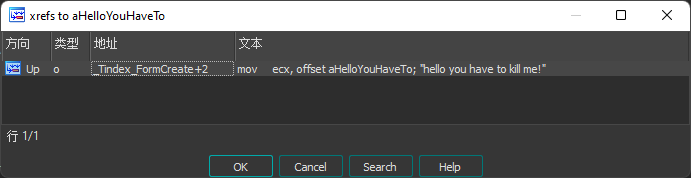

# Acid burn

## 基本信息

名称: Acid burn.  
类型: Nag, Name/Serial, Serial.  
语言: Borland Delphi 3.0.  
壳: 无.

## 准备工作

1. 检索程序基本信息, 如编写语言, 是否加壳.
2. 将程序放入 IDA 中进行分析.
3. 添加 Delphi 库函数标签, 打开签名视图(Shift+F5). 右键选择应用新签名并搜索相关签名.

      

    查看签名视图的 #fun 项, 检查被成功识别函数的数量.  

      

## 阻止启动时弹窗

  

打开字符串视图(Shift+F12)并搜索相关字符串.  

  

双击字符串定位到字符串所在的位置.  

  

通过交叉引用(Ctrl+X)查询引用该字符串的位置.  

  

双击查询记录定位到引用的位置.  

  

该函数的实现非常简单, 在将两个弹窗中出现的字符串作为参数调用了 `TApplication::MessageBox`.  
由于该应用程序使用的是 Win32 API, 因此离 MessageBox 等系统函数的调用不远了.  
在查看 `TApplication::MessageBox` 后可以发现, 这两个字符串参数被原封不动的传入了 `MessageBoxA`.  

至此, 如何阻止启动时弹窗的办法已经十分明显了. 只要让 `MessageBoxA` 不被调用即可, 但为同时确保程序的其他部分能正常运行, 不能应该对 `TApplication::MessageBox` 内部进行修改.  
将不想执行的代码使用空指令 nop 填充, 但需要确保堆栈平衡和寄存器数值的正确, 可参考[调用约定](../调用约定.md).  

通过 *编辑 | 补丁 | 汇编* 来对原汇编代码进行修改, 然后再通过 *编辑 | 补丁 | 应用* 来保存修改, 写入前记得先对源程序进行备份.  

!!! success
    修改完毕后, 启动程序将不再显示启动时的弹窗.  

## Serial

在序列号输入失败后会弹窗提示, 根据内容定位到引用该字符串的代码.  

  

根据上图内容可以看出序列号校验的最后一步操作是利用 LStrCmp 对两个字符串进行比较.  
因为 LStrCmp 会在函数相等时返回 0, 所以字符串相等时序列号正确, 反之错误.  

  

从上图的分析可以看出, 首先创建了两个局域变量 `str1`, `str2` 并为它们赋值.  `_str_Hello`, `_str_Dude_` 类型是 `_strings` 结构体, 包含了 `_top`, `len`, `text` 三部分, 其中 text 部分是以 0 结尾的 C-style 字符串.  
之后调用 `LStrCatN` 将三个字符串连接起来, 形成正确的序列号 "Hello Dude!". 并与通过 `TControl::GetText` 获取的用户输入进行比较.  

由于直接将未经处理的用户输入与序列号进行比较, 因此可以在判断处设置断点, 查看此刻内存中序列号的值.  

!!! success
    序列号为 "Hello Dude!".  

## Name/Serial

定位到验证名称/序列号的代码处:  

  

经过简单分析即可还原算法:  

```cpp
std::string gen_serial_by_name(std::string_view name)
{
    if(name.size() < 4)
        return "";
    return "CW"s + "-"s + std::to_string(41 * 2 * name[0]) + "-"s + "CRACKED"s;
}
```

!!! success
    代码成功通过测试.
