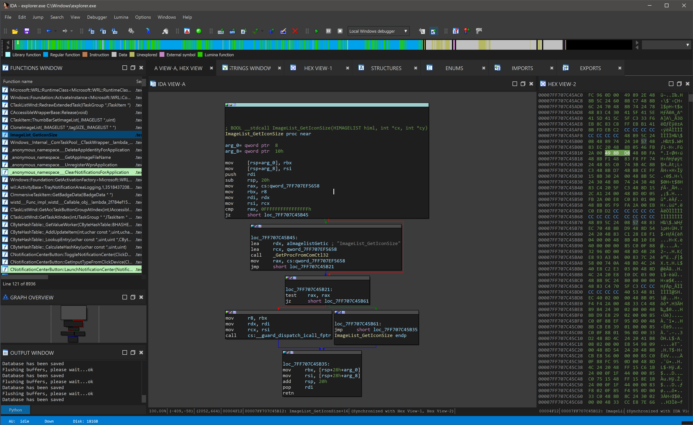
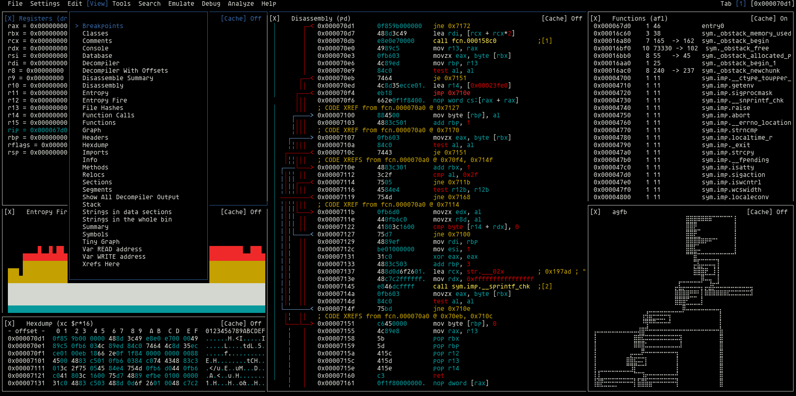
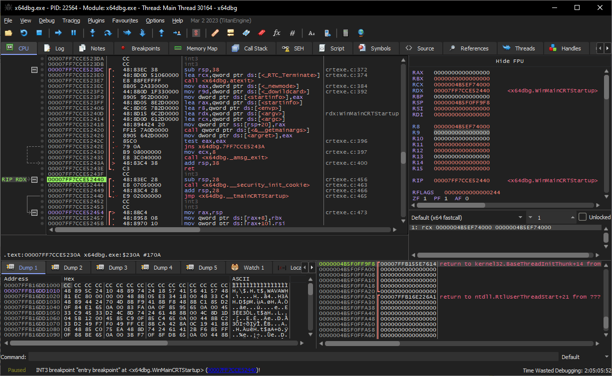

# 反汇编器

**英文**: Disassembler.

!!! info
    由于许多反汇编器已经:

    - 同时具备静态分析和动态调试功能, 因此这里反汇编器同时指代逆向工程框架.  
    - 集成了反编译器 (decompiler), 因此这里统一使用反汇编器指代.

- [Ghidra](#ghidra): 可调试, 反编译, 免费, 开源, 跨平台.
- [IDA Pro](#ida-pro): 可调试, 反编译, 有免费/付费版本, 跨平台.
- [Radare2](#radare2): 可调试, 反编译, 免费, 开源, TUI, 跨平台.

## [Ghidra](https://github.com/NationalSecurityAgency/ghidra)

  

这原本是一个 NSA 内部使用的项目, 因为 Vault 7 泄露事件导致后续开源.  

颜色主题 (包括暗色主题) 可以在 Ghidra 窗口的 `Edit | Theme` 下进行设置.  
早期的 9.0 - 10.3 版本需要另行安装 [Dark Theme](https://github.com/zackelia/ghidra-dark).

!!! warning
    该项目早期版本在未修复的已知的远程可执行漏洞 [CVE-2021-44228](https://cve.mitre.org/cgi-bin/cvename.cgi?name=cve-2021-44228), 详情请参考[安全警告](https://github.com/NationalSecurityAgency/ghidra#security-warning).
    请根据手册来进行补丁.  

插件仅支持 Java 语言.  
使用方法请参考手册 (*Help->Contents*).

- [GhidraMCP](https://github.com/LaurieWired/GhidraMCP) Ghidra 的 MCP 服务器.
- [cwe_checker](https://github.com/fkie-cad/cwe_checker) 用于分析二进制可执行文件中的弱点, 可以集成到 Ghidra 中.

## [IDA Pro](https://hex-rays.com/ida-pro/)

  

由于高昂的售价, 使得 IDA Pro 自身也变成了被逆向的对象.

主要有以下版本:

- IDA Pro: 最知名的商业版本, 支持多种主流指令架构. 还有进一步的版本划分, 主要区别是有更多的或本地的反编译器.
- [IDA Free](https://hex-rays.com/ida-free/): 包含 x86 (32 & 64) 反汇编和云端反编译的免费版本, 仅限个人非商用使用.
- IDA Classroom Free: 相比 IDA Free 增加了 ARM (32 & 64) 反汇编和云端反编译.

- 部分键位和大多数软件并不相同, 具体请参考[快捷键](https://www.hex-rays.com/products/ida/support/freefiles/IDA_Pro_Shortcuts.pdf).

- 重命名: 使用 `n` 来对变量或函数名进行重命名.
- 注释: 使用 `;` 来对反汇编结果进行注释, `/` 来对反编译结果进行注释. 遇到不熟悉的指令集时可以通过 选项->常规->反汇编->自动注释 来启用汇编代码作用的行内注释.

插件支持 Python 和 IDC 语言.  
使用方法请参考手册(*帮助 | 帮助*, F1).

!!! warning "Apple Silicon M1"
    IDA Pro 的 [ARM 版本](https://hex-rays.com/blog/ida-pro-on-apple-silicon/)暂时未泄露, 因此使用 Apple Silicon M1 的计算机需要借助 Wine 来运行 IDA Pro.

## [Radare2](https://github.com/radareorg/radare2)

  

更多内容请参考[常用插件](https://github.com/radareorg/radare2#plugins)和[插件](https://r2wiki.readthedocs.io/en/latest/home/radare-plugins/).  
常用插件:

- [Cutter](https://github.com/rizinorg/cutter) Rizin 的 GUI, Frok 自 iaito.
- [iaito](https://github.com/radareorg/iaito) Radare2 的 GUI.
- [r2ghidra](https://github.com/radareorg/r2ghidra) Ghidra 反编译器的集成.
- [jsdec](https://github.com/rizinorg/jsdec) 为 Rizin 提供的简单反编译器.

普通平台下的安装方法不同, 具体请参考[安装方法](https://github.com/radareorg/radare2#installation).  
使用方法请参考[在线手册](https://book.rada.re/)和[Wiki](https://r2wiki.readthedocs.io/).

### Rizin

Rizin 是由于 radare2 社区分歧产生的新分支. 截止 2025 年 6 月, 相比 Rizin, radare2 显著的更加活跃.

### 快速入门

1. [启动](https://book.rada.re/first_steps/commandline_flags.html)

    ```sh
    r2 [程序名称]
    r2 -d [程序名称] # 对程序进行调试
    ```

    之后便进入 radar2 内部的命令行.  
    除了启动时指定要对程序进行调试, 也可以在静态分析后使用 `ood` 命令重载文件, 启用调试模式.

2. [分析/反编译](https://book.rada.re/analysis/code_analysis.html)

    ```console
    > iI         # 查看程序基本信息 (类似 file + checksec)
    > aaa        # 对全部函数进行分析
    > afl        # 列出全部函数
    > afl~main   # 查看包含特定关键字的函数
    
    > s main     # 定位到指定函数
    > pdf        # 输出反编译结果
    > pdf @ main # 输出 main 函数的反编译结果
    > pdc        # 输出反编译结果

    > iS         # 导入表
    > iE         # 导出表
    > iz         # 数据段字符串
    ```

    其中 `~` 类似 `| grep`, 可在不同命令中使用.

3. [视觉模式](https://r2wiki.readthedocs.io/en/latest/options/capv/visual-mode/)

    ```console
    > V  # 进入视觉模式
    > VV # 进入流程图模式
    > V! # 进入可视面板模式
    > v  # 进入可视面板模式
    > p  # 切换面板类型
    ```

    进入视觉模式后可以按 `p` 进行切换, 按 ` `/`V` 在 V 和 VV 模式之间切换, 按 `Shift+!` 进入视觉面板模式, 即可以同时启用多个窗口显示不同内容.  
    VV 模式下, 可以使用 `+`/`-` 进行缩放.

4. 调试

    | 按键 | 描述     |
    |------|--------|
    | F2   | 设置断点 |
    | F7   | 单步步入 |
    | F8   | 单步步过 |
    | F9   | 执行     |

    ```console
    > iz             # 输出字符串
    > pf @ [变量名]   # 输出变量的值
    > pf z @ [变量名] # 输出 null-terminated 字符串变量的值
    ```

5. 帮助

    语法是 `[cmd]?`, 比如:

    - 查看全部指令: `?`.
    - 查看 pd 开头的指令和用途: `pd?`.
    - 查看 pdc 指令的用途: `pdc?`.
    - 更多帮助命令的用法: `???`.

## 调试器

### [x64dbg](https://github.com/x64dbg/x64dbg)

  

开源, 免费, 只支持 Windows. 详情请参考[官网](https://x64dbg.com/).  
是 [OllyDbg](https://www.ollydbg.de/version2.html) (于 2013 年停止维护) 的良好替代品.

- [配色方案](https://github.com/x64dbg/x64dbg/wiki/Color-Schemes)
- [插件](https://github.com/x64dbg/x64dbg/wiki/Plugins)

### [WinDbg](https://apps.microsoft.com/store/detail/windbg-preview/9PGJGD53TN86)

支持 Time Travel Debugging (TTD)[^1].

### [GDB](https://www.sourceware.org/gdb/)

大部分 Linux 发行版自带 `gdb`, 若要调试其他架构的程序需要安装 `gdb-multiarch`.  
[在线试用](https://www.onlinegdb.com/).

#### 快速入门

```sh
# 执行
r [args]             # run, 执行程序
c                    # cotinue, 继续执行
s                    # step, 源码级单步步入
n                    # next, 源码级单步步过
si                   # step inst, 指令级单步步入
ni                   # next inst, 指令级单步步过
finish               # 步出
until [n]            # 执行到第 n 行

# 断点
b [file:][func|line] # break, 添加断点
delete [id]          # 删除指定 id 的断点
disable [id]         # 禁用指定 id 的断点
enable [id]          # 启用指定 id 的断点
i b                  # info break, 列出断点信息

# 变量
i args               # info args, 列出当前函数参数
i locals             # info locals, 列出局部变量
p [var]              # print, 输出变量 var 的值

# 反汇编
disassemble [func]   # disassemble, 输出函数 func 的反汇编, func 缺省则输出前函数的
set disassembly-flavor intel # 使用 Intel 汇编语法

# 其他
i r                  # info register, 列出寄存器信息
bt                   # backtrace, 输出调用栈
q                    # quit, 退出
```

#### 插件

安装 pwndbg:  

```sh
git clone https://github.com/pwndbg/pwndbg.git
cd pwndbg
./setup.sh
```

```sh
# Arch/Manjaro
sudo pacman -S pwndbg
echo 'source /usr/share/pwndbg/gdbinit.py' >> ~/.gdbinit
```

!!! warning
    安装后需保留本地仓库.

安装 peda:

```sh
git clone https://github.com/longld/peda.git
echo "source ~/peda/peda.py" >> ~/.gdbinit  
```

!!! warning
    安装后需保留本地仓库.

安装 GEF:

```sh
bash -c "$(curl -fsSL https://gef.blah.cat/sh)"
```

### GDB 与 LLDB

- 可以对代码进行反汇编, 但只是简单的输出反汇编代码. 可以搭配 Radare2 使用(LLDB 需要 r2lldb 插件), 同时具备调试和反汇编功能.
- 所使用的指令是不完全相同的, 请参考[具体区别](https://lldb.llvm.org/use/map.html).
- GDB 支持的语言更多.

使用 intel 汇编语法:

```sh
set disassembly-flavor intel                     # GDB
settings set target.x86-disassembly-flavor intel # LLDB
```

### [QIRA](https://github.com/geohot/qira)

QIRA (QEMU Interactive Runtime Analyser) 是一款时间无关[^1]的调试器. 可以集成到 IDA Pro 中.

## 常用命令

以下是在进行动态调试时常用的命令:

- 查看程序基本信息

  ```sh
  file [file]
  ```

- 查看程序依赖库

  ```sh
  ldd [file]
  dumpbin /DEPENDENTS [file] # Windows
  ```

- 查看进程的调用栈

  ```sh
  pstack [pid]
  ```

- 检测系统调用

  ```sh
  strace [option] [file | -p [pid]]
  ```

  常用参数:

  - `-c`: 按系统调用进行汇总, 包括耗时/时间占比/调用次数/失败次数等.
  - `-t`: 在输出的系统调用信息记录前加上时间戳.
  - `-T`: 在输出的系统调用信息记录后加上耗时.

  还可以对记录按系统调用或类型进行过滤.

## 解释型语言

由于解释型语言并不直接生成可执行代码, 因此需要使用不同的工具进行分析. 通常脚本语言的解释器会将源码文件转换为字节码文件, 以提高解释的效率.  
脚本语言的逆向较为简单, 因为字节码可以直接对应到源代码, 而且也保留了变量名称等信息便于输出异常信息.

### Python

Python 的源码文件(.py)可以转换为字节码文件(.pyc), 或通过 [py2exe](https://github.com/py2exe/py2exe)/[pyinstaller](https://github.com/pyinstaller/pyinstaller/) 等工具转换为不同平台的可执行文件.

#### 识别

存在较多包含 `Py` 字眼的字符串.

#### 反编译

1. 利用 [unpy2exe](https://github.com/matiasb/unpy2exe)/[pyinstxtractor](https://github.com/extremecoders-re/pyinstxtractor) 重新转换为字节码文件.  
2. 利用 [uncompyle2](https://github.com/wibiti/uncompyle2) 将字节码文件反编译为源码文件.

### Java

#### 识别

存在较多包含 `java` 字眼的字符串.

#### 反编译

类似许多脚本打包软件, exe4j 的工作原理是先将 jar 文件写入到系统临时目录中, 然后再执行 jar 文件. 因此只需要从临时目录中找到相应的文件即可.  
jar 文件是字节码文件(.class)的合集, 可以直接利用 jad/jd-gui/Fernflower 等工具进行反编译.

### .NET

#### 识别

这类文件具有明显的特征, 可以通过工具分析出来. 比如通过 IDA 加载的时候文件类型会出现 `Microsoft.NET assembly` 选项.

#### 反编译

- .NET Reflector: .NET 反编译.
- de4dot: .NET 反混淆.

[^1]: https://en.wikipedia.org/wiki/Time_travel_debugging
