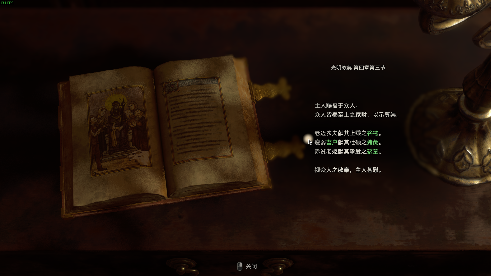
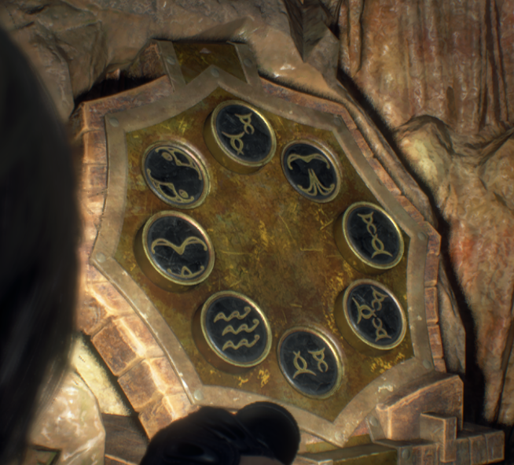
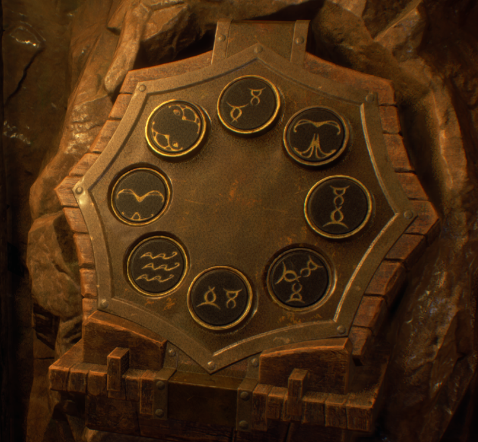

# Resident Evil 4

## 解谜

### 第 1 章

**村长宅邸 1F 衣柜密码**: 谷物, 猪彘, 孩童.

### 第 4 章

**大洞窑祭坛密码**: 1 点钟方向, 11 点钟方向, 6 点钟方向.

**小洞窑祭坛密码**: 9 点钟方向, 7 点钟方向, 5 点钟方向.

https://www.pcgamer.com/resident-evil-4-remake-cave-puzzle/

## 收集

16 个发条城堡位置: <https://www.pcgamer.com/resident-evil-4-remake-clockwork-castellan-locations-salazar/>
