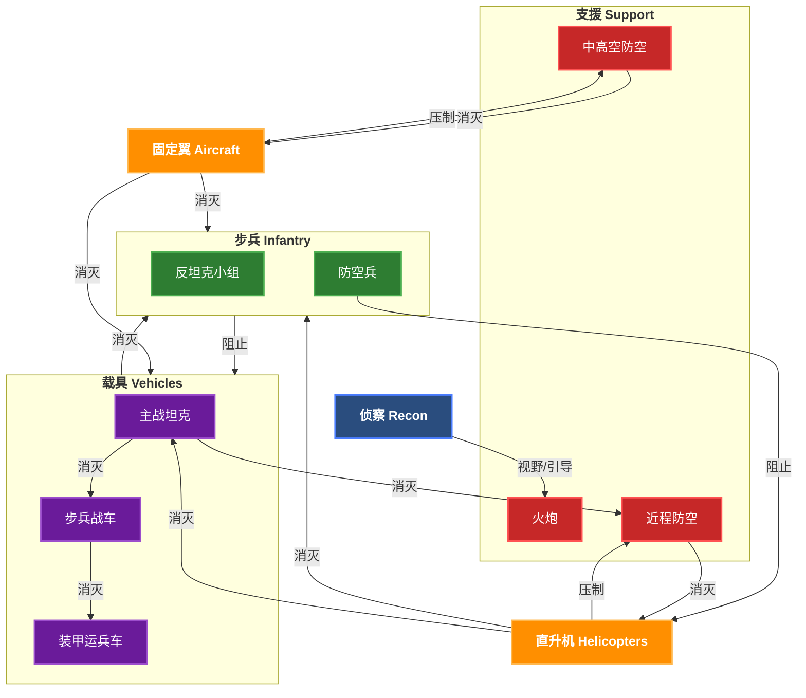
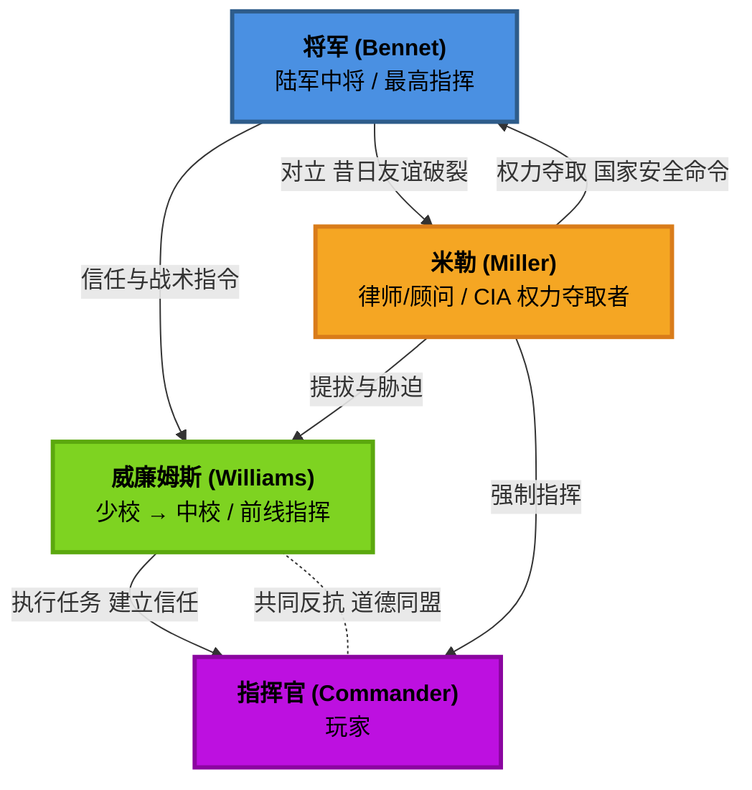
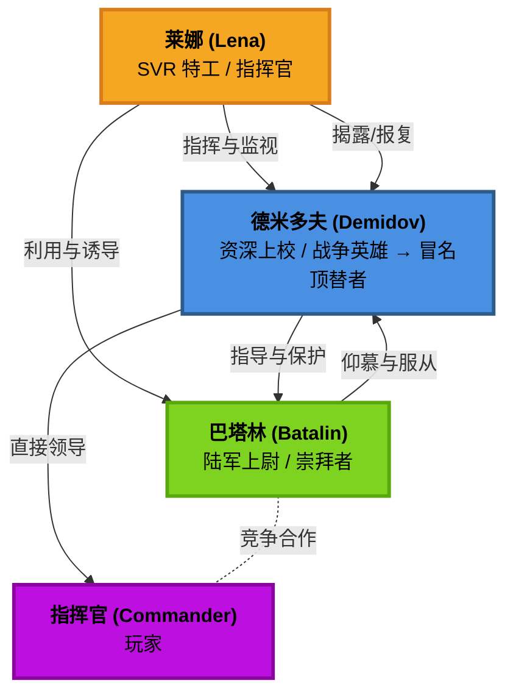

# Broken Arrow

**中文**: 断箭.  

## 卡组

卡组文件位于 `%USERPROFILE%\AppData\LocalLow\SteelBalalaikaStudio\BrokenArrow\Decks`.

## 防空压制

防空压制 (Suppression of Enemy Air Defenses, SEAD) 是指通过使用反辐射导弹 (Anti-Radiation Missile, ARM) 来摧毁或压制敌方防空雷达和导弹系统的战术.

以下是具备 SEAD 能力的战斗机:

- **美国**: Prowler (x4), F-16CJ (x4), F-35A (x2), F-15EX (x2).
- **俄罗斯**: Su-24MP (x3), Su-34 (x2), MiG-35 (x4), Su-57 (x4), Su-25 (x2).

其中 (xN) 表示最多可携带 N 枚 ARM.

以下是具备 SEAD 能力的直升机:

- **美国**: AH-1Z Viper (x2).
- **俄罗斯**: Ka-52 Katran (x2).

以下作战单位应该设置编号, 便于快速选中:

- **远程火力**: 快速为前线提供火力支援.
- **雷达防空**: 便于在发现 SEAD-capable 战机时快速关闭雷达.

## 克制关系

## 波罗的海战役

### 金牌要求

获取金牌的条件**需且仅需满足金牌要求**, 无需同时满足铜牌和银牌要求.

#### 美军任务

| 任务                                           | 金牌要求                                                                      |
| ---------------------------------------------- | ----------------------------------------------------------------------------- |
| 好戏上演 (Show Time)                           | • 在困难难度下完成任务. • 在 30 分钟内完成所有目标.                       |
| 和平捍卫者 (Peacekeeper)                       | • 在困难难度下完成任务. • 不要损失任何单位.                               |
| 空军基地惊天劫案 (Airbase Heist)               | • 在困难难度下完成任务. • 在 30 分钟内完成任务.                           |
| 巨浪 (The Big Wave)                            | • 在困难难度下完成任务. • 在 10 分钟内占领堡垒.                           |
| 钢铁洪流 (Tracked and Furious)                 | • 在困难难度下完成任务. • 不要损失任何一辆车辆 (包括车队).                |
| 夜幕主宰者 (We Own The Night)                  | • 在困难难度下完成任务. • 不要损失任何一架直升机.                         |
| 吸血鬼! (Vampires!)                            | • 在困难难度下完成任务. • 不要损失任何一架飞机 (包括直升机).              |
| 铁雨天降 (Heavy Rain)                          | • 在困难难度下完成任务. • 不要让任何单位被伊斯坎德尔 (Iskander) 导弹击毁. |
| 狩猎季节 (Hunting Season)                      | • 在困难难度下完成任务. • 消灭防空设施且不损失直升机.                     |
| 好友相助 (With a little help from our friends) | • 在困难难度下完成任务. • 不使用豹式坦克 (Leopards) 赢得任务.             |
| 断箭 (Broken Arrow)                            | • 在困难难度下完成任务. • 遵循本内特 (Bennet) 的计划.                     |

#### 俄军任务

| 任务                               | 金牌要求                                                                    |
| ---------------------------------- | --------------------------------------------------------------------------- |
| 请出示证件 (Papers Please)         | • 在困难难度下完成任务. • 使用最少数量的乘员组.                         |
| 停电 (Blackout)                    | • 在困难难度下完成任务. • 撤离全部幸存步兵与车辆.                       |
| 冷港行动 (Operation Cold Harbour)  | • 在困难难度下完成任务. • 不借助巴塔林 (Batalin), 独自占领港口全部目标. |
| 自助服务 (Self Service)            | • 在困难难度下完成任务. • 在 45 分钟内完成任务.                         |
| 禁航水域 (Forbidden Waters)        | • 在困难难度下完成任务. • 用 SSO 或 Spetsnaz VMF 击杀 50 个敌方单位.    |
| 搜索与救援 (Search & Rescue)       | • 在困难难度下完成任务. • 在 40 分钟内占领城市.                         |
| 舍我其谁 (The Ride of the VDV)     | • 在困难难度下完成任务. • 不使用 BMD-4M 或 Sprut-SD.                    |
| 归宿之路 (Road to Fiddler's Green) | • 在困难难度下完成任务. • 不向上校请求任何援助.                         |

### 金牌技巧

善用单人模式下的时间速率调节功能, 在战况较为激烈时进行微操.

**冷港行动**

- 可以在 "夺取港口登陆场" 时提前将部分 PDSS 部署在码头左侧, 便于后续快速占领左侧区域. 进入下一阶段后使用直升机快速清剿左侧区域的敌人, 然后占领.
- 占领左侧区域后, 巴塔林并不会主动占领右侧区域, 因此后续一定能达成 "独自占领港口全部目标" 这一条件.
- 无需立即占领路口, 应先花时间仔细部署伏击圈, 守住该路口是该任务最难的部分.
- 任务是坚守路口 10 分钟, 后期可以打伏击, 并使用烟雾弹拖延敌人的进攻.
- 巴塔林支援路口时, 其所乘坐的 T-90AK Batalin 是无敌的, 可以吸引大量火力, 然后将其余兵力隐藏在树林中.

    

**禁航水域**

- 在 SSO 或 Spetsnaz VMF 完成击杀时, 屏幕左侧会显示喇叭图标和当前击杀数.
- 可以依靠 Spetsnaz VMF 或其他侦察单位提供视野, 然后通过 SSO 的 Kornet-M 从远距离打击敌方人员和载具单位.
- 如需轻松完成 50 击杀的目标, 需要让其他单位在合适的时候启用 "仅还击", 避免直接击杀敌军单位.

**舍我其谁**

- 集中兵力防御单个位置, 所有位置都被敌方占领才会判定为任务失败.

**归宿之路**

- 任务前期德米多夫上校会询问玩家需要何种增援, 选择不需要任何增援即可.

**铁雨天降**

- 可以将开局带步兵的载具直接 RTB (防止移速较慢的步兵被弹道导弹击杀), 然后仅使用坦克进行突击.
- 第二个导弹连防空较为脆弱, 可以直接使用弹道导弹摧毁.

米勒声称一个 "伊斯坎德尔" 导弹连配有 6 辆发射车 (Transporter Erector Launcher, TEL), 实际为 2 辆.

**吸血鬼!**

时刻注意弹药量/油量以及敌占区的地面防空.

- 击落直升机后会有多架 Su-30SM 同时出动, 此时船已快靠港, 可以且战且退.
- 经测试, 直升机损失也会导致条件不满足.

**钢铁洪流**

- 需确保己方任何车辆以及最后的车队不能有任何损失.
- 占领 D 点后, C 点会被攻击.
- 占领 E 点后, C 和 E 点会被攻击.

### 人物关系

#### 美军

#### 俄军

## 教程

- [For those who aren't military geeks](https://steamcommunity.com/sharedfiles/filedetails/?id=3501205842): 介绍了常见的概念和术语, 可以帮助快速入门.

## 术语表

TODO: 完善下面表格

| 术语                                        | 描述                                                                                      |
| ------------------------------------------- | ----------------------------------------------------------------------------------------- |
| 步兵战车 (Infantry Fighting Vehicle, IFV)   | 拥有重型装甲和武器, 用于运输步兵的车辆. 比 APC 装备更好, 但不如坦克. IFV 的载员舱通常较小 |
| 装甲运兵车 (Armored personnel carrier, APC) | 装备轻型装甲和武器, 用于运输步兵的车辆. 比无装甲运输车防护更好, 但火力不如 IFV            |
| 水陆两栖 (Amphibious)                       | 部分步兵和车辆具有 "两栖" 属性, 意味着它们可以直接跨越水域, 但在水上移动速度较慢.         |

| 术语                                         | 描述                                                              |
| -------------------------------------------- | ----------------------------------------------------------------- |
| 主动防护系统 (Active Protection System, APS) | 安装在装甲车辆上的装置, 通过发射拦截弹来拦截射向车辆的反坦克弹药. |
| 爆炸反应装甲 (Explosive reactive armor, ERA) | 能增加装甲车辆对 HE 弹的防御.                                     |

| 术语             | 描述                                                                    |
| ---------------- | ----------------------------------------------------------------------- |
| 火炮 (Artillery) | 小到迫击炮, 大到弹道导弹. 由于其是曲射火力, 非常适合从后方火力支援前线. |

| 术语                                        | 描述                                                                          |
| ------------------------------------------- | ----------------------------------------------------------------------------- |
| 高爆弹 (High Explosive, HE)                 | 伤害一般取决于口径.                                                           |
| 动能弹 (Kinetic Energy, KE)                 | 绝大多数穿甲弹属于 KE, 伤害随距离衰减.                                        |
| 反坦克导弹 (Anti-tank guided missile, ATGM) | 通常比火箭弹射程更远, 威力更大, 但装填时间更长, 且通常要求发射单位保持静止.   |
| 弹道导弹 (Ballistic missile)                | 垂直向上发射, 然后从天而降击中目标.                                           |
| 巡航导弹 (Cruise missile)                   | 水平飞行, 具有较低的飞行高度.                                                 |
| 集束炸弹 (Cluster munition)                 | 爆炸半径大, 对轻装甲车辆极其有效, 对步兵伤害适中, 对坦克等重装甲车辆几乎无效. |
| 反导拦截弹 (Anti-ballistic missile, ABM)    | 用于拦截敌方弹道导弹.                                                         |

| 术语                                                 | 描述                                            |
| ---------------------------------------------------- | ----------------------------------------------- |
| 反坦克 (Anti-tank, AT)                               |                                                 |
| C-RAM (Counter Rocket, Artillery, and Mortar, C-RAM) | 拦截火箭弹, 导弹和迫击炮弹. 断箭中只能拦截导弹. |
| 多管火箭系统 (Multiple launch rocket system, MLRS)   |                                                 |

| 术语                    | 描述 |
| ----------------------- | ---- |
| 激光制导 (Laser-guided) |      |

| 术语                      | 描述                                                                                              |
| ------------------------- | ------------------------------------------------------------------------------------------------- |
| 视线 (Line of Sight, LOS) | 指单位能够直接观察到的区域, 影响其攻击和侦察能力. 即使有共享视野, 直射火力也需要 LoS 才能攻击目标 |

## 侦察

侦察单位是最容易被新手忽视的兵种, 但确实最重要的之一.

- 侦察兵.
- 低空无人机 (Low-altitude UAV).
- 高空无人机 (High-altitude UAV).

- 激光制导.

树林: 隐蔽.
建筑物: 隐蔽+防御加成.

TODO

## 车辆

TODO

### 机动

TODO: 履带和轮式的区别

### 装甲

TODO

### 反坦克小组

发现敌方 ATGM 来袭时, 应立即驶入建筑物后或释放烟幕, 对方失去 LoS 后其半制导弹药将失效.

反坦克小组通常具有较高的隐蔽基础值 (1.75), 且部署在视野开阔的高层建筑内 (3.5), 以便能利用隐蔽和射程优势, 阻止坦克推进.

以 [TOW-2A](https://barmory.net/unit/147?408=1490) 为例, 下表是不同距离下导弹击中目标的时间, 也是被攻击载具的反应时间:

| 距离  | 飞行时间 |
| ----- | -------- |
| 200m  | 0.91     |
| 800m  | 2.83s    |
| 1000m | 3.34s    |
| 1600m | 4.78s    |

以 [M1A2 SEP v3](https://barmory.net/unit/191?153=411) 为例:

- 其 M2 Browning 重机枪射程为 800m, 能在 1-2s 内瞄准并开火压制目标.
- 主炮射程为 1.4km, 对方射程为 1.6km. 如果有敌方单位视野, 瞄准+开火时间长达 3-4 秒.

在通过 LoS 工具确定敌方单位所在建筑物视野后, 利用机动性快速接近建筑物, 使其进入机枪的射程.

若确定对方反坦克小组无补给后 (如已经进行了一轮火炮打击), 也可以在远处诱导对方攻击, 消耗其弹药 (美军 6 次, 俄军 4 次).

根据 ATGM 飞行方向反推对方反坦克单位具体位置, 然后使用火炮打击其最后位置.

## 步兵

TODO

## 直升机

TODO

## 固定翼

TODO

## 资源

- <https://barmory.net>: 查询战绩和单位数据.
- <https://ba-hub.net>: 查询单位数据.

## 参考

- <https://steamcommunity.com/sharedfiles/filedetails/?id=3505492842>
