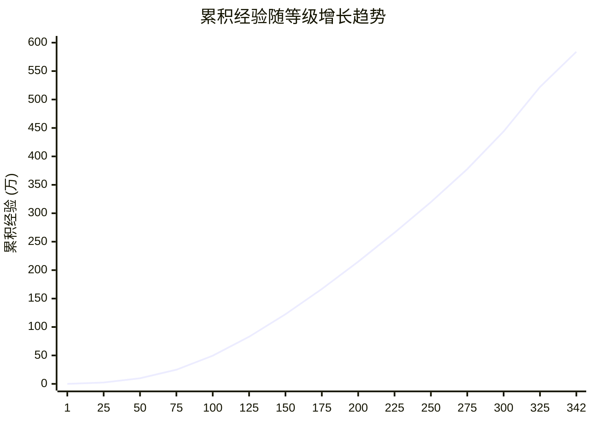

# 黑神话: 悟空

**英文**: Black Myth: Wukong.

## 剧情

关于本作的剧情, 有必要先澄清一点: 虽然游戏科学在宣传片中声称本作改编自*西游记*, 但实际情况远比这一说法更为复杂. 以下为改编关系示意图:

可见, 本作并非简单续写*西游记*, 而是在原著的人物/情节和世界观基础上进行了大量改编.  
例如, 游戏中猪八戒与蜘蛛精/孙悟空与白骨精的恋情, 红孩儿身世等均直接源自*斗战神*的设定.  
因此，过往对*斗战神*和*悟空传*的严肃批评同样适用于本作. 详情可以参考[参见](#参见)部分列出的资料, 此处不再赘述.

需警惕的是对原著的过度解读, 尤其是一些带有阴谋论色彩的解读 (如原著只是对现实官场的讽刺), 不仅偏离原著本意, 而且**极其有害**.

> 譬如勇士，也战斗，也休息，也饮食，自然也性交，如果只取他末一点，画起像来，挂在妓院里，尊为性交大师，那当然也不能说是毫无根据的，然而，岂不冤哉！ - 鲁迅

## Pro Tips

### 探索

- 每一回, 可在土地庙购买需自行探索的地图, 可帮助识别未探索区域.
- 部分支线会在击败关底 Boss 后终止, 因此需先完成.
- *鬼火*可以回复葫芦.
- 容易错过的 BOSS 包括*无量蝠*和*毒敌大王*.

### 战斗

- *身外身法*产生的分身不会让路, 且数量较多容易被堵住. 可以跳跃绕过分身.
- 部分 Boss 会在血条被清空后满血复活进入二阶段 (即实际存在两个血条), 初见时玩家无法知晓, 容易在一阶段过度消耗法术和神力. 如白衣秀士, 靡道人, 晦月魔君, 黑手道人 (第二场), 石猿, 大圣残躯.
- *身外身法*需消耗大量法术, 因此通常配合定身法/精魄 (无量蝠, 百目真人)/变化 (玄渊) 来实现伤害输出最大化.
- 可以先将*禁字法*和法术上限的天赋点满, 释放*禁字法*后再退还*灵光点*重新分配给其他天赋. 期间只要不*调息*即可维持*禁字法*效果.

## 支线

!!! warning
    与人物对话均指与人物不断对话, 直到对话内容重复为止.

### 五蕴

该支线贯穿五个回合.

1. **第一回 黑风山** (色蕴): 传送至**苍狼林 - 前山**土地庙. 面对土地庙往前走, 过桥后沿着右侧山体前进. 在小溪中间找到长满青苔的佛头, 互动即可获得.
1. **第二回 黄风岭** (受蕴): 需要先在**挟魂崖 - 藏风山凹**附近收集 6 颗*佛目珠*. 传送至**挟魂崖 - 枕石坪**土地庙, 进入左侧的左侧门, 与长有佛头的大石头交付珠子激活并击败石敢当.
1. **第三回 小西天** (想蕴): 传送至**极乐谷 - 一念壁**土地庙. 从土地庙出发, 沿路前进到一个平台, 从右侧跳到下一层. 沿着唯一的路前进, 在一个破损的佛头前触发剧情即可获得.
1. **第四回 盘丝岭** (行蕴): 传送至**盘丝洞 - 濯垢泉**土地庙. 面对土地庙往右走, 穿过缝隙. 沿着唯一的路前进到一处有水潭的开阔区域, 在中央的佛头处可获得.
1. **第六回 花果山** (识蕴): 传送至**山脚 - 捕螂汀**土地庙. 必须先集齐前四蕴才能触发. 使用筋斗云朝左侧山体凹陷处飞, 找到并击败巨型 Boss *大石敢当*, 随后跳上它的身体触发剧情即可获得.

### 马天霸

该支线贯穿五个回合.

1. **第一回 黑风山**: 传送至**翠竹林 - 后山**土地庙. 沿下坡路走到水潭处, 左转进入山洞, 在右侧枯木上找到他, 对话至内容重复为止.
1. **第二回 黄风岭**: 传送至**沙门村 - 村口**土地庙. 进村后左转, 在亭子里找到被绑在柱子上的他, 对话至内容重复为止.
1. **第三回 小西天**: 传送至**小雷音寺 - 寺门**土地庙. 进入寺门, 上楼梯后左转, 在左侧偏殿的二楼走廊找到他, 对话至内容重复为止. 可获得*争先红葫芦*.
1. **第四回 盘丝岭**: 传送至**盘丝洞 - 绝想崖**土地庙. 往回走, 在必经之路上找到一个巨大的茧, 击破即可救出他, 对话至内容重复为止.
1. **第五回 火焰山**: 传送至**丹灶谷 - 谷口**土地庙. 沿路前进, 下坡后右转, 在岩浆区域找到一辆报废的战车, 靠近拉动鞭子对话. 击败关底 Boss *火焰山土地*后, 再返回战车处拉动鞭子, 即可获得变身法术*黯雷*.

!!! warning
    如果在指定地点没有发现*马天霸*, 请确保已在上一个地点完成了**完整**的对话, 即重复对话, 直到对话内容重复.

### 瓜田

该支线位于**第三回 小西天**, 主要分为三个阶段:

1. **苦海北岸救人**: 传送至**苦海 - 苦海北岸**土地庙. 背对土地庙, 沿着右边的海岸线走 (辰龙初遇方向), 右侧寺门进入. 对话至内容重复为止.
1. **罪业塔林取暖**: 传送至**极乐谷 - 罪业塔林**土地庙. 装备*安身法*, 触发对话后使用*安身法*即可进入过场动画.
1. **瓜田决战**: 任选一条路径:

    - 传送至**极乐谷 - 无忧涧**土地庙. 背对土地庙, 可见山谷, 谷底有条涧.
    - 传送至**极乐谷 - 快活林**土地庙. 面对土地庙, 沿右侧小道下行, 可以从边缘快速落下, 可见山谷, 谷底有条涧.

    沿下游方向 (西方) 前行. 最终从悬崖边上落下, 即可到达**极乐谷 - 瓜田**土地庙.

{ width=80% style="display: block; margin: 0 auto" }  

完成该支线即可获得*禁字法*奇术, 其次完成该支线为隐藏结局的前置条件.

### 无量蝠

在**第三回 小西天**, 传送至**苦海 - 苦海北岸**土地庙. 面对土地庙, 沿着右边的海岸线走, 在海边会看到一具巨大的蛇骨. 顺着蛇骨走到尽头的蛇头骨处, 调查/触摸它就能触发与*无量蝠*的战斗.

!!! warning
    触发战斗时, *猪八戒*必须在队伍中 (如刚下龟岛). 若八戒已离队, 则无法触发. 但其精魄依然会在击败关底 Boss *黄眉*后获得.

### 双头鼠

TODO: **盘丝洞 - 碎玉池**

### 种子

| 种子名称       | 产出药材        | 采集地点                 |
| -------------- | --------------- | ------------------------ |
| 碧藕种子       | 碧藕            |                          |
| 九叶灵芝草种子 | 紫芝/九叶灵芝草 |                          |
| 猴头菌种子     | 葛蕈/猴头菌     |                          |
| 漱玉花种子     | 漱玉花          |                          |
| 火铃草种子     | 火铃草          |                          |
| 珠树种子       | 树珍珠          |                          |
| 甘草种子       | 甘草            |                          |
| 火枣种子       | 火枣            |                          |
| 千年人参种子   | 老山参/千年人参 |                          |
| 龙胆种子       | 龙胆            |                          |
| 交梨种子       | 交梨            | 小西天 - 极乐谷 - 无忧涧 |
| 地莲种子       | 地莲            | 小西天 - 苦海 - 龟岛     |

### 不老藤 (泡酒物)

传送至**第四回 盘丝岭**的**隐·紫云山 - 千花谷**土地庙. 直接全程花棍打死*青冉冉* (树人).

### 头冠

打至丝血后定身, 绕至背后使用满级*幽魂*磕头.

- **闭眼禅**: 小雷音寺中的*监院僧* (红衣盲僧).
- **长须头面**: 传送至**第四回 盘丝岭**的**花间桥**土地庙, 左侧木板通过后虫卵爆出的*蜢虫精*.

### 金刚护臂

使用满级*地狼*撞击*泥塑金刚*, 然后将其击杀.

## 资源获取

### 碎玉池

**资源**: 道行 (5750/1min), 灵韵 (约 5880/1min), 丝绸, 碎金片.

传送至**盘丝洞 - 碎玉池**土地庙. 面向土地庙, 从右侧山洞进入虫卵巢穴中心, 然后变身并引爆*双头鼠*.

建议进行以下调整:

- **珍玩**: *金花玉萼* (灵韵加成), *仙箓* (道行加成).
- **精魄**: *疯虎* (增加伤害).
- **变化**: 点满*虚相凶猛* (增加伤害).

如因灵光点不足导致伤害不够, 还可以使用定风珠造成 AOE 伤害.

单个卵 115 道行, 因此估计共有 25 个卵.

## 升级

近似升级经验公式:

$$ f(n) \approx 100 n $$

$$
f(x) \approx
\begin{cases}
0.75x^2 + 45x + 300, & 1 \le x < 85 \\
-0.4x^2 + 207x - 5100, & 85 \le x < 230 \\
1.2x^2 - 528x + 79132, & 230 \le x \le 342
\end{cases}$$

近似累积经验公式:

$$ F(n) \approx 50 n^2 $$

$$
F(x) \approx \begin{cases}
0.25x^3 + 22x^2 + 278x - 300, & 1 \le x < 85 \\
15x^2 + 11500x - 750000, & 85 \le x < 230 \\
0.4x^3 - 264x^2 + 79132x - 6340311, & 230 \le x \le 342
\end{cases}$$

原始数据

| 等级 | 升级经验 | 累积经验  |
| ---- | -------- | --------- |
| 1    | 342      | 0         |
| 2    | 389      | 342       |
| 3    | 438      | 731       |
| 4    | 487      | 1,169     |
| 5    | 539      | 1,656     |
| 6    | 591      | 2,195     |
| 7    | 645      | 2,786     |
| 8    | 700      | 3,431     |
| 9    | 756      | 4,131     |
| 10   | 814      | 4,887     |
| 11   | 873      | 5,701     |
| 12   | 933      | 6,574     |
| 13   | 994      | 7,507     |
| 14   | 1,057    | 8,501     |
| 15   | 1,121    | 9,558     |
| 16   | 1,186    | 10,679    |
| 17   | 1,253    | 11,865    |
| 18   | 1,321    | 13,118    |
| 19   | 1,390    | 14,439    |
| 20   | 1,460    | 15,829    |
| 21   | 1,532    | 17,289    |
| 22   | 1,605    | 18,821    |
| 23   | 1,679    | 20,426    |
| 24   | 1,755    | 22,105    |
| 25   | 1,839    | 23,860    |
| 26   | 1,924    | 25,699    |
| 27   | 2,011    | 27,623    |
| 28   | 2,100    | 29,634    |
| 29   | 2,190    | 31,734    |
| 30   | 2,281    | 33,924    |
| 31   | 2,374    | 36,205    |
| 32   | 2,468    | 38,579    |
| 33   | 2,564    | 41,047    |
| 34   | 2,661    | 43,611    |
| 35   | 2,760    | 46,272    |
| 36   | 2,860    | 49,032    |
| 37   | 2,961    | 51,892    |
| 38   | 3,065    | 54,853    |
| 39   | 3,169    | 57,918    |
| 40   | 3,275    | 61,087    |
| 41   | 3,383    | 64,362    |
| 42   | 3,492    | 67,745    |
| 43   | 3,602    | 71,237    |
| 44   | 3,714    | 74,839    |
| 45   | 3,827    | 78,553    |
| 46   | 3,942    | 82,380    |
| 47   | 4,058    | 86,322    |
| 48   | 4,176    | 90,380    |
| 49   | 4,295    | 94,559    |
| 50   | 4,416    | 98,854    |
| 51   | 4,538    | 103,270   |
| 52   | 4,662    | 107,808   |
| 53   | 4,787    | 112,470   |
| 54   | 4,914    | 117,257   |
| 55   | 5,042    | 122,171   |
| 56   | 5,171    | 127,213   |
| 57   | 5,302    | 132,384   |
| 58   | 5,435    | 137,686   |
| 59   | 5,569    | 143,121   |
| 60   | 5,704    | 148,690   |
| 61   | 5,841    | 154,394   |
| 62   | 5,980    | 160,235   |
| 63   | 6,120    | 166,215   |
| 64   | 6,261    | 172,335   |
| 65   | 6,404    | 178,596   |
| 66   | 6,548    | 185,000   |
| 67   | 6,694    | 191,548   |
| 68   | 6,841    | 198,242   |
| 69   | 6,990    | 205,083   |
| 70   | 7,140    | 212,073   |
| 71   | 7,292    | 219,213   |
| 72   | 7,445    | 226,505   |
| 73   | 7,600    | 233,950   |
| 74   | 7,756    | 241,550   |
| 75   | 7,914    | 249,306   |
| 76   | 8,073    | 257,220   |
| 77   | 8,233    | 265,293   |
| 78   | 8,395    | 273,526   |
| 79   | 8,559    | 281,921   |
| 80   | 8,724    | 290,480   |
| 81   | 8,891    | 299,204   |
| 82   | 9,059    | 308,095   |
| 83   | 9,228    | 317,154   |
| 84   | 9,399    | 326,382   |
| 85   | 9,572    | 335,781   |
| 86   | 9,740    | 345,353   |
| 87   | 9,905    | 355,093   |
| 88   | 10,068   | 364,998   |
| 89   | 10,228   | 375,066   |
| 90   | 10,386   | 385,294   |
| 91   | 10,542   | 395,680   |
| 92   | 10,696   | 406,222   |
| 93   | 10,847   | 416,918   |
| 94   | 10,996   | 427,765   |
| 95   | 11,143   | 438,761   |
| 96   | 11,288   | 449,904   |
| 97   | 11,431   | 461,192   |
| 98   | 11,572   | 472,623   |
| 99   | 11,711   | 484,195   |
| 100  | 11,848   | 495,906   |
| 101  | 11,983   | 507,754   |
| 102  | 12,116   | 519,737   |
| 103  | 12,247   | 531,853   |
| 104  | 12,377   | 544,100   |
| 105  | 12,505   | 556,477   |
| 106  | 12,631   | 568,982   |
| 107  | 12,756   | 581,613   |
| 108  | 12,879   | 594,369   |
| 109  | 13,000   | 607,248   |
| 110  | 13,120   | 620,248   |
| 111  | 13,238   | 633,368   |
| 112  | 13,355   | 646,606   |
| 113  | 13,470   | 659,961   |
| 114  | 13,584   | 673,431   |
| 115  | 13,697   | 687,015   |
| 116  | 13,808   | 700,712   |
| 117  | 13,917   | 714,520   |
| 118  | 14,026   | 728,437   |
| 119  | 14,133   | 742,463   |
| 120  | 14,238   | 756,596   |
| 121  | 14,343   | 770,834   |
| 122  | 14,446   | 785,177   |
| 123  | 14,548   | 799,623   |
| 124  | 14,649   | 814,171   |
| 125  | 14,748   | 828,820   |
| 126  | 14,846   | 843,568   |
| 127  | 14,944   | 858,414   |
| 128  | 15,040   | 873,358   |
| 129  | 15,135   | 888,398   |
| 130  | 15,229   | 903,533   |
| 131  | 15,322   | 918,762   |
| 132  | 15,413   | 934,084   |
| 133  | 15,504   | 949,497   |
| 134  | 15,594   | 965,001   |
| 135  | 15,683   | 980,595   |
| 136  | 15,771   | 996,278   |
| 137  | 15,857   | 1,012,049 |
| 138  | 15,943   | 1,027,906 |
| 139  | 16,028   | 1,043,849 |
| 140  | 16,112   | 1,059,877 |
| 141  | 16,195   | 1,075,989 |
| 142  | 16,278   | 1,092,184 |
| 143  | 16,359   | 1,108,462 |
| 144  | 16,439   | 1,124,821 |
| 145  | 16,519   | 1,141,260 |
| 146  | 16,598   | 1,157,779 |
| 147  | 16,676   | 1,174,377 |
| 148  | 16,753   | 1,191,053 |
| 149  | 16,829   | 1,207,806 |
| 150  | 16,905   | 1,224,635 |
| 151  | 16,980   | 1,241,540 |
| 152  | 17,054   | 1,258,520 |
| 153  | 17,127   | 1,275,574 |
| 154  | 17,200   | 1,292,701 |
| 155  | 17,272   | 1,309,901 |
| 156  | 17,343   | 1,327,173 |
| 157  | 17,413   | 1,344,516 |
| 158  | 17,483   | 1,361,929 |
| 159  | 17,552   | 1,379,412 |
| 160  | 17,620   | 1,396,964 |
| 161  | 17,688   | 1,414,584 |
| 162  | 17,755   | 1,432,272 |
| 163  | 17,822   | 1,450,027 |
| 164  | 17,887   | 1,467,849 |
| 165  | 17,953   | 1,485,736 |
| 166  | 18,017   | 1,503,689 |
| 167  | 18,081   | 1,521,706 |
| 168  | 18,144   | 1,539,787 |
| 169  | 18,207   | 1,557,931 |
| 170  | 18,269   | 1,576,138 |
| 171  | 18,331   | 1,594,407 |
| 172  | 18,392   | 1,612,738 |
| 173  | 18,452   | 1,631,130 |
| 174  | 18,512   | 1,649,582 |
| 175  | 18,572   | 1,668,094 |
| 176  | 18,630   | 1,686,666 |
| 177  | 18,689   | 1,705,296 |
| 178  | 18,747   | 1,723,985 |
| 179  | 18,804   | 1,742,732 |
| 180  | 18,861   | 1,761,536 |
| 181  | 18,917   | 1,780,397 |
| 182  | 18,973   | 1,799,314 |
| 183  | 19,028   | 1,818,287 |
| 184  | 19,083   | 1,837,315 |
| 185  | 19,137   | 1,856,398 |
| 186  | 19,191   | 1,875,535 |
| 187  | 19,244   | 1,894,726 |
| 188  | 19,297   | 1,913,970 |
| 189  | 19,349   | 1,933,267 |
| 190  | 19,401   | 1,952,616 |
| 191  | 19,453   | 1,972,017 |
| 192  | 19,504   | 1,991,470 |
| 193  | 19,555   | 2,010,974 |
| 194  | 19,605   | 2,030,529 |
| 195  | 19,655   | 2,050,134 |
| 196  | 19,704   | 2,069,789 |
| 197  | 19,753   | 2,089,493 |
| 198  | 19,802   | 2,109,246 |
| 199  | 19,850   | 2,129,048 |
| 200  | 19,898   | 2,148,898 |
| 201  | 19,946   | 2,168,796 |
| 202  | 19,993   | 2,188,742 |
| 203  | 20,039   | 2,208,735 |
| 204  | 20,086   | 2,228,774 |
| 205  | 20,132   | 2,248,860 |
| 206  | 20,177   | 2,268,992 |
| 207  | 20,222   | 2,289,169 |
| 208  | 20,267   | 2,309,391 |
| 209  | 20,312   | 2,329,658 |
| 210  | 20,356   | 2,349,970 |
| 211  | 20,400   | 2,370,326 |
| 212  | 20,443   | 2,390,726 |
| 213  | 20,486   | 2,411,169 |
| 214  | 20,529   | 2,431,655 |
| 215  | 20,572   | 2,452,184 |
| 216  | 20,614   | 2,472,756 |
| 217  | 20,656   | 2,493,370 |
| 218  | 20,697   | 2,514,026 |
| 219  | 20,738   | 2,534,723 |
| 220  | 20,779   | 2,555,461 |
| 221  | 20,820   | 2,576,240 |
| 222  | 20,860   | 2,597,060 |
| 223  | 20,900   | 2,617,920 |
| 224  | 20,940   | 2,638,820 |
| 225  | 20,979   | 2,659,760 |
| 226  | 21,018   | 2,680,739 |
| 227  | 21,057   | 2,701,757 |
| 228  | 21,095   | 2,722,814 |
| 229  | 21,134   | 2,743,909 |
| 230  | 21,172   | 2,765,043 |
| 231  | 21,197   | 2,786,215 |
| 232  | 21,224   | 2,807,412 |
| 233  | 21,254   | 2,828,636 |
| 234  | 21,287   | 2,849,890 |
| 235  | 21,322   | 2,871,177 |
| 236  | 21,359   | 2,892,499 |
| 237  | 21,398   | 2,913,858 |
| 238  | 21,440   | 2,935,256 |
| 239  | 21,485   | 2,956,696 |
| 240  | 21,532   | 2,978,181 |
| 241  | 21,581   | 2,999,713 |
| 242  | 21,632   | 3,021,294 |
| 243  | 21,686   | 3,042,926 |
| 244  | 21,743   | 3,064,612 |
| 245  | 21,802   | 3,086,355 |
| 246  | 21,863   | 3,108,157 |
| 247  | 21,926   | 3,130,020 |
| 248  | 21,992   | 3,151,946 |
| 249  | 22,061   | 3,173,938 |
| 250  | 22,132   | 3,195,999 |
| 251  | 22,205   | 3,218,131 |
| 252  | 22,280   | 3,240,336 |
| 253  | 22,358   | 3,262,616 |
| 254  | 22,439   | 3,284,974 |
| 255  | 22,522   | 3,307,413 |
| 256  | 22,607   | 3,329,935 |
| 257  | 22,694   | 3,352,542 |
| 258  | 22,784   | 3,375,236 |
| 259  | 22,877   | 3,398,020 |
| 260  | 22,972   | 3,420,897 |
| 261  | 23,069   | 3,443,869 |
| 262  | 23,168   | 3,466,938 |
| 263  | 23,270   | 3,490,106 |
| 264  | 23,375   | 3,513,376 |
| 265  | 23,482   | 3,536,751 |
| 266  | 23,591   | 3,560,233 |
| 267  | 23,702   | 3,583,824 |
| 268  | 23,816   | 3,607,526 |
| 269  | 23,933   | 3,631,342 |
| 270  | 24,052   | 3,655,275 |
| 271  | 24,173   | 3,679,327 |
| 272  | 24,296   | 3,703,500 |
| 273  | 24,422   | 3,727,796 |
| 274  | 24,551   | 3,752,218 |
| 275  | 24,682   | 3,776,769 |
| 276  | 24,815   | 3,801,451 |
| 277  | 24,950   | 3,826,266 |
| 278  | 25,088   | 3,851,216 |
| 279  | 25,229   | 3,876,304 |
| 280  | 25,372   | 3,901,533 |
| 281  | 25,517   | 3,926,905 |
| 282  | 25,664   | 3,952,422 |
| 283  | 25,814   | 3,978,086 |
| 284  | 25,967   | 4,003,900 |
| 285  | 26,122   | 4,029,867 |
| 286  | 26,279   | 4,055,989 |
| 287  | 26,438   | 4,082,268 |
| 288  | 26,600   | 4,108,706 |
| 289  | 26,765   | 4,135,306 |
| 290  | 26,932   | 4,162,071 |
| 291  | 27,101   | 4,189,003 |
| 292  | 27,272   | 4,216,104 |
| 293  | 27,446   | 4,243,376 |
| 294  | 27,623   | 4,270,822 |
| 295  | 27,802   | 4,298,445 |
| 296  | 27,983   | 4,326,247 |
| 297  | 28,166   | 4,354,230 |
| 298  | 28,352   | 4,382,396 |
| 299  | 28,541   | 4,410,748 |
| 300  | 28,732   | 4,439,289 |
| 301  | 28,925   | 4,468,021 |
| 302  | 29,120   | 4,496,946 |
| 303  | 29,318   | 4,526,066 |
| 304  | 29,519   | 4,555,384 |
| 305  | 29,722   | 4,584,903 |
| 306  | 29,927   | 4,614,625 |
| 307  | 30,134   | 4,644,552 |
| 308  | 30,344   | 4,674,686 |
| 309  | 30,557   | 4,705,030 |
| 310  | 30,772   | 4,735,587 |
| 311  | 30,989   | 4,766,359 |
| 312  | 31,208   | 4,797,348 |
| 313  | 31,430   | 4,828,556 |
| 314  | 31,655   | 4,859,986 |
| 315  | 31,882   | 4,891,641 |
| 316  | 32,111   | 4,923,523 |
| 317  | 32,342   | 4,955,634 |
| 318  | 32,576   | 4,987,976 |
| 319  | 32,813   | 5,020,552 |
| 320  | 33,052   | 5,053,365 |
| 321  | 33,293   | 5,086,417 |
| 322  | 33,536   | 5,119,710 |
| 323  | 33,782   | 5,153,246 |
| 324  | 34,031   | 5,187,028 |
| 325  | 34,282   | 5,221,059 |
| 326  | 34,535   | 5,255,341 |
| 327  | 34,790   | 5,289,876 |
| 328  | 35,048   | 5,324,666 |
| 329  | 35,309   | 5,359,714 |
| 330  | 35,572   | 5,395,023 |
| 331  | 35,837   | 5,430,595 |
| 332  | 36,104   | 5,466,432 |
| 333  | 36,374   | 5,502,536 |
| 334  | 36,647   | 5,538,910 |
| 335  | 36,922   | 5,575,557 |
| 336  | 37,199   | 5,612,479 |
| 337  | 37,478   | 5,649,678 |
| 338  | 37,760   | 5,687,156 |
| 339  | 38,045   | 5,724,916 |
| 340  | 38,332   | 5,762,961 |
| 341  | 38,621   | 5,801,293 |
| 342  |          | 5,839,914 |

## 升级顺序

1. 柳木棍.
1. 鳞棍·双蛇.
1. 鳞棍·亢金.

## Boss

### 黄风大圣

*定风珠*可用于打断二阶段的三味神风或三阶段的追踪龙卷风.

### 魔将·莲眼

- 释放*定身术*, 然后近身舞棍花, 积攒到四段棍势后打击.
- 大范围激光可在左后方的岩石后躲避.

### 大圣残躯

- 喝酒后立即翻滚即可防止被定身.
- 保持距离, 降低对方攻击欲望, 反复蓄力劈棍. 此方法同时适用于石猿和大圣残躯共计 4 个阶段.

## 参见

- [地图 - MAPGENIE](https://mapgenie.io/black-myth-wukong).
- [西游记 - 维基文库](https://zh.wikisource.org/zh-hans/%E8%A5%BF%E9%81%8A%E8%A8%98).

## 参考

- <https://wiki.biligame.com/wukong/%E5%8D%87%E7%BA%A7%E7%BB%8F%E9%AA%8C%E8%A1%A8>.
- [想做斗战神又想蹭西游记，拧巴剧情的好游戏 - Bilibili](https://www.bilibili.com/video/BV1iLsGemEte).
- [别吐槽《黑神话》，看不懂剧情的有福了 - Bilibili](https://www.bilibili.com/video/BV1PusTe7Ej3).
