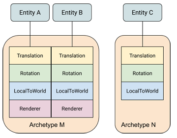

# ECS

**中文**: 实体-组件-系统.\
**英文**: Entity-Component-System(ECS).

## 概述

相對於使用面向對象的繼承, ECS 有一下幾個優點:

* 模块化: ECS 可以增加代码重用, 避免代码体积迅速膨胀.
* 避免继承带来的缺陷: 相比传统的继承, ECS 不用担心"菱形继承", 继承关系复杂等问题.
* 高性能: 数据以组件的形式添加, 内存管理自由, 可以有效利用数据局部性原理(Cache 友好).

ECS 由實體(entity), 組件(components)和系統(system)三部分組成, 分別對應標識, 數據和行为. 它們之間的具體關係如下圖所示:


## 实体(Entity)

实体只作为标识, 可向其添加和移除组件. 但实体本身并不包含组件的数据, 类似一个指向了组件数据的指针.\
下面是一个实体的简单实现:

```cpp
struct Entity
{
  uint64_t id;      // ID
  uint32_t version; // 版本
}
```

*   ID

    是实体作为标识的具体实现方法, 存放了一个唯一的 ID. 实体销毁后 ID 会被回收, 并将在后续创建的新实体中继续使用. 这意味着分发实体的类需要维护一个以回收的 ID 表.
*   版本(Version)

    实体只是一个标识, 因此在内存中可能存在多个副本. 且实体销毁后所使用的 `id` 会被重新利用, 无法通过判断 `id` 使用已使用来检查实体是否有效.\
    因此引入了第二个属性 `version`. 实体每次销毁 `version` 都增加 1, 以确保已销毁的实体的副本无效化.

## 组件(Component)

组件用于存储数据, 无需包含成员函数. ， 下面是一个具体组件的简单实现:

```cpp
struct TransformComponent
{
  Vector3    translation;
  Quaternion rotation;
  Vector3    scale;
};
```

上面的组件用于表示实体的变换, 可用于图形渲染或物理模拟等系统. 如有必要, 还可以将该组件进一步拆分为三个单独的组件.

## 系统(System)

系统负责处理实体组件的数据. 不同的系统根据自身功能, 只关注具备某些组件的实体.\
例如, 移动系统负责更新实体位置, 它需要读取并修改每个实体的位置和速度两个组件数据. 因此, 移动系统只需要遍历并操作同时包含位置和速度组件的实体.

## Archetypes

一种独特的组件类型组合被称为一个 Archetype. 如下图, 可以通过组件类型的组合分为 M, N 两种 Archetype. 对组件类型的改动也会造成实体 Archetype 的改变. 例如, 移除实体 B 的 Renderer 组件会使其的 Archetype 从 M 变为 N.



Archetype 可以看作是组件种类的合集, 因此可以用 `std::bitset` 来存储这些数据来方便的实现快速的交并集运算.\
除了对 `std::bitset` 进行简单的封装, 还负责管理组件对应的位, 将具体实现方式完全隐藏起来.\
每个组件对应一个位, 位的状态表示是否包含该组件. 通常会使用下列几种运算:

* any: a 是否包含 b 的任意一个组件, 即 a 与 b 之间是否存在交集. 只需要判断 `a & b` 是否为 true.
* all: a 是否包含 b 的全部组件, 即是 a 是否是 b 的子集. 只需要判断 `a & b` 是否与 b 相等.
* none: a 是否没有包含 b 的任何组件, a 与 b 之间没有交集. 只需要判断 `a & b` 是否为 false.

可用于实体和系统之间的解耦, 具有相同组件的实体拥有相同的 Archetype, 对相同组件感兴趣的系统具有相同的 Archetype.\
实体通过 Archetype 进行分组, 系统用过 Archetype 查询实体.

类似面向对象中类的实例化, 可以通过 Archetype 来创建实体. 并可以对 Archetype 做加法来实现类似继承的效果.

下面是一个 Archetype 的简单实现:

```cpp
class Archetype
{
public:
  // 通过组件类型创建 Archetype
  template <typename T, typename... Ts>
  static Archetype create() {...}

  Archetype(...) {...}

  bool any_of(const Archetype&) const {...}
  bool all_of(const Archetype&) const {...}
  bool none_of(const Archetype&) const {...}

private:
  std::bitset<32> signature_; // 每一个位表示一个组件, 若 Archetype 包含某个组件, 则将对应的位设为 1, 否则为 0
	inline static std::unordered_map<std::type_index, std::size_t> index_; // 组件类型 -> 在 `signature_` 中对应的位
};
```

## 无缝数组

这是一个存储组件数据的方法. 该数组能确保元素总是在内存中连续存放的, 以提高遍历数组元素的效率.\
被移除的元素将被最后一个元素替代, 因此在移除操作后该数组中元素的索引可能发生变化. 需要维护一张记录虚拟索引到实际索引的映射表.\
下面是一个简单的不完整实现:

```cpp
template <typename T>
class Array
{
public:
  // 添加或访问元素
  T& operator[](std::size_t index) {
    auto [iter, inserted] = index_map_.try_emplace(index, index_map_.size());
    if(inserted)
      return data_.emplace_back();
    return data_[iter->second];
  }

  // 移除元素
  void remove(std::size_t index) {
    data_[index_map_[index]] = data_.back();
    index_map_.erase(index);
    
    // data_.pop_back();
  }

  // 获取元素数
  std::size_t size() const noexcept { return index_map_.size(); }

private:
  std::vector<T> data_; // 实际数据
  std::unordered_map<std::size_t, std::size_t> index_map_; // 映射表
}
```

访问元素只需要一个可以是任意值的虚拟索引, 正好可以使用实体的 ID.

## 性能剖析

```sh
valgrind --tool=cachegrind <program>
```


## Unity ECS

### 内存块(Memory Chunks)

实体组件的存储位置取决于其 Archetype. 申请的内存块被简称为 chunk. 每个 chunk 只会存储具有相同 Archetype 的实体.


## 参见

* [https://austinmorlan.com/posts/entity\_component\_system/](https://austinmorlan.com/posts/entity\_component\_system/)
* [https://wickedengine.net/2019/09/29/entity-component-system/](https://wickedengine.net/2019/09/29/entity-component-system/)

## 参考

* [A Simple Entity Component System (ECS) \[C++\] - Austin Morlan](https://austinmorlan.com/posts/entity\_component\_system/)
* [Unity ECS](https://docs.unity3d.com/Packages/com.unity.entities@0.10/manual/ecs\_core.html)
