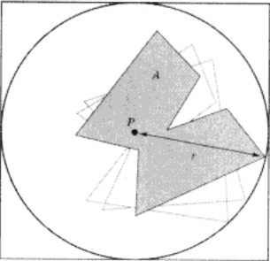

# 轴对齐包围盒(axis-aligned bounding boxes, AABB)

由于所有的边都与坐标轴平行, 因此无需考虑旋转角度等复杂因素, 可以简单快速地进行 AABB 之间的相交检测.  
利用分离轴定理, 可以通过判断 AABB 在二/三个主轴方向上的投影是否存在重叠区域来判定是否相交.

!!! info
    为了降低理解难度, 以下以 2D 的 AABB 为例.

AABB 相交时必然存在平行于主轴的分离线, 因此只需要投影到数量较少的主轴上即可判断是否相交.

## 表达方式

```cpp
// 中心+半径. Godot 使用的
struct AABB0
{
  Vector2 center;
  float   radius[2];
};

// 最小值+最大值
struct AABB1
{
  Vector2 min;
  Vector2 max;
};

// 最小值+直径
struct AABB2
{
  Vector2 min;
  float   diameter[2];
};
```

## 相交测试

```cpp
bool intersects(const AABB0& a, const AABB0& b)
{
  return std::abs(a.center.x - b.center.x) <= a.radius[0] + b.radius[0] &&
         std::abs(a.center.y - b.center.y) <= a.radius[1] + b.radius[1];
}

bool intersects_0(const AABB1& a, const AABB1& b)
{
  // 判断 X 和 Y 轴上的投影是否有交集
  return ((a.min.x <= b.min.x && b.min.x <= a.max.x) || (a.min.x <= b.max.x && b.max.x <= a.max.x)) &&
         ((a.min.y <= b.min.y && b.min.y <= a.max.y) || (a.min.y <= b.min.y && b.min.y <= a.max.y));
}

// 对 intersects_0 进行改进. 只有相交和不相交两种状态, 判断不相交的条件比较少
bool intersects_1(const AABB1& a, const AABB1& b)
{
  // 判断判断 X 和 Y 轴上的投影是否没有交集
  return !((a.max.x < b.min.x || b.max.x < a.min.x) ||
           (a.max.y < b.min.y || b.max.y < a.min.y));
}
```

## 计算与更新

## 基于包围球的 AABB

{ style="display: block; margin: 0 auto" }  

首先得到锚点与最远顶点之间的距离, 以该距离为半径, 锚点为圆心画圆. 然后做该圆的外切正方形, 该正方形即为物体基于包围球的 AABB.  
无论物体如何绕锚点旋转都能保证所有顶点被 AABB 所包含.  
在更新这类 AABB 的过程中只需要在意平移变换, 可以忽略的旋转变换, 不需要在基于锚点的旋转后进行更新, 但可能与物体的拟合度较差.

## 紧凑型 AABB

外切 AABB.
