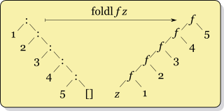
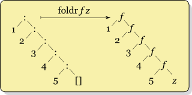

# 折叠

**英文**: Folding.

```hs
foldl :: Foldable t => (b -> a -> b) -> b -> t a -> b
foldr :: Foldable t => (a -> b -> b) -> b -> t a -> b

foldl1 :: Foldable t => (a -> a -> a) -> t a -> a
foldr1 :: Foldable t => (a -> a -> a) -> t a -> a
```

类似 C++ 的 `std::ranges::fold_left` 和 `std::ranges::fold_right`.

```hs
sum' = foldl (+) 0
and' = foldl1 (&&) True
or' = foldl1 (||) False
```




## 参考

- <https://wiki.haskell.org/Fold>.
