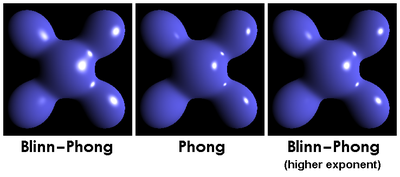
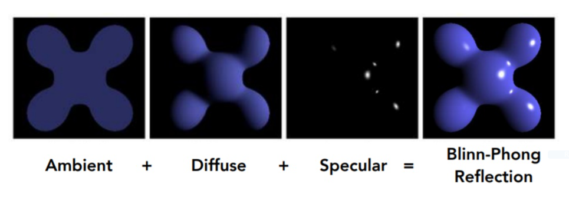

# 光照模型

为表达自然光照效果, 需要根据光学物理的有关定律建立一个数学模型, 计算物体表面任意一点投向观察者(viewer)的光线亮度. 该数学模型被称为光照模型(illumination model).

## 局部光照模型

  

左侧两张图片分别使用了 Blinn-Phong 和 Phong 反射模型计算高亮, 右侧图是 Blinn-Phong 但具有更大的镜面反射系数, 高亮会相对集中.  

### Blinn-Phong 反射模型(Blinn-Phong Reflectance Model)

  

上图展示了光照计算三个步骤分别得到的结果, 最后再进行求和得到最终结果.  

```
物体表面反光 = 环境光(ambient lighting) + 漫反射光(diffuse reflection) + 镜面反射高亮(specular highlights)
```

1. 环境光: 是指光源间接对物体的影响, 是在物体和环境之间多次反射, 最终达到平衡时一种光.
2. 漫反射: 入射光线射到粗糙的表面时, 粗糙的表面将光线向着各个方向反射的现象.
3. 镜面反射: 也被称之为高光.

分别计算三种光照的效果最后求和得到结果. 使用点积计算向量之间的夹角. 使用 [Lambert's cosine law](https://en.wikipedia.org/wiki/Lambert%27s_cosine_law) 计算光线辐射强度.  

```c++
// 平行光
struct DirLight
{
  vec3 direction;
  vec3 color;
};

/**
  * @brief 计算平行光光照.
  *
  * @param light 光属性.
  * @param V     相机观察方向.
  * @param N     表面法向量.
  */
vec3 CalcDirLight(DirLight light, vec3 V, vec3 N)
{
  const vec3 L = light.direction;

  const float ka        = 0.2; // 环境光系数
  const float kd        = 0.5; // 漫反射系数
  const float ks        = 0.7; // 镜面反射系数
  const float shininess = 32.0;

  // 环境光照
  vec3 ambient = ka * light.color;

  // 漫反射光照
  float diffuse_amount = max(dot(V, N), 0.0); // 计算参与漫反射的光线总量
  vec3  diffuse        = kd * diffuse_amount * light.color;

  // 镜面反射光照(Phong)
  vec3  R               = reflect(-L, N);                               // 计算反射光线方向
  float specular_amount = pow(max(dot(R, dir_to_cam), 0.0), shininess); // 计算参与镜面反射的光线总量
  vec3  specular        = ks * specular_amount * light.color;

  return ambient + diffuse + specular;
}
```

## 整体光照模型

## 参见

- <https://en.wikipedia.org/wiki/List_of_common_shading_algorithms#Illumination_models>
