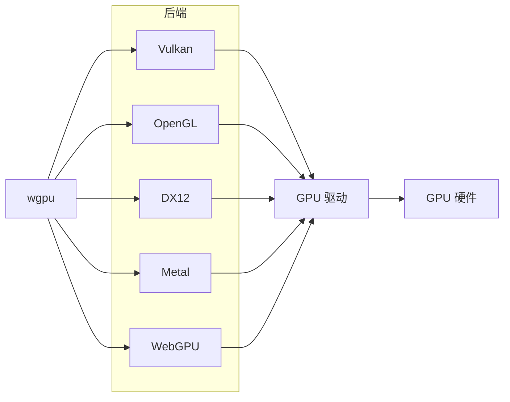
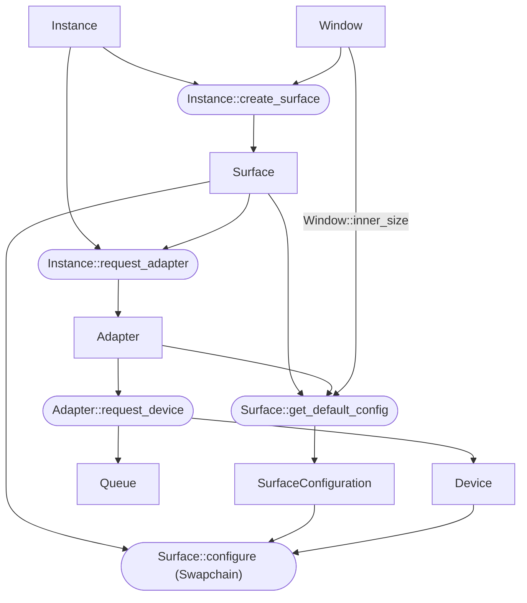

# Wgpu

!!! warning
    目前, WebGPU 标准已进入提议推荐标准阶段. 预计 2025 年下半年正式成为 W3C 推荐标准.

## 简介

[wgpu] 是一个基于 Rust 语言开发的跨平台图形 API. 它提供了基于 WebGPU 标准的 API (`wgpu`), 通过其核心实现 (`wgpu-core`) 通过抽象层 (`wgpu-hal`) 调用主流图形 API (即后端).  
在此基础上, wgpu 博采众长, 实现了以下三个目标:

- 合理的抽象层级​.
- 高性能.
- 完美的跨平台能力.

目前, 没有任何一个主流图形 API 能同时满足上面三个方面的要求. 例如:

- **Vulkan** 有优异的性能和跨平台能力, 但是其 API 过于底层, 抽象程度较低, 使用起来十分复杂.
- **OpenGL** 有较高级别的抽象和良好的跨平台能力, 但其设计难以充分发挥现代 CPU 和 GPU 的性能.

主流图形 API 在这三个方面各有优劣, 但 wgpu 通过合理的设计, 在这三者间取得了良好的平衡.



WebGPU 标准的[介绍](https://gpuweb.github.io/gpuweb/#intro)包含了一段简洁的说明, 可以帮助用户快速了解相关基本概念.

!!! info
    一个有趣的事情是, Firefox 的 WebGPU 实现是基于 wgpu 的, 这意味着基于 wgpu 编写的 WASM 在 Firefox 上运行时会调用 Firefox 的 wgpu. 🤯

[wgpu]: https://github.com/gfx-rs/wgpu

## 初始化

wgpu 的初始化 (从创建 `Instance` 开始, 到创建交换链), 一共只需要 **19** 行代码. 下面是该过程的流程图:



函数 `Instance::create_surface` 接收一个 `SurfaceTarget` 类型的参数, 可能为以下两种类型:

- 桌面环境下的一个窗口 (Window).
- 浏览器页面的一个画布 (Canvas).

本文将通过由 winit 库[^winit]创建的窗口 (`winit::Window`) 来创建 `Surface`.  
自从 winit 0.30 版本后, 创建窗口的方法较为复杂, 具体流程请参考 [winit 的示例](https://github.com/rust-windowing/winit/blob/master/examples/window.rs).  

wgpu 的初始化流程与 Vulkan 十分相似, 早期版本也包含 [`wgpu::Swapchain`] 类型, 后来为了遵循 WebGPU 标准, 该类型在 0.10 版本中被合并到了 `Surface` 类型里.[^swapchain]

初始化流程最后一步调用的 `Surface::configure` 函数便是用于创建 Swapchain.

[`wgpu::Swapchain`]: https://docs.rs/wgpu/0.9.0/wgpu/struct.SwapChain.html

```rs
// 创建 Instance, 默认启用所有后端.
let instance = wgpu::Instance::new(&wgpu::InstanceDescriptor::default());

// 创建 Surface, 为所有已启用的后端创建对应的 Surface.
let surface = instance.create_surface(window.clone()).unwrap();

// 获取符合条件的 Adapter.
let adapter = instance
    .request_adapter(&wgpu::RequestAdapterOptions {
        power_preference: wgpu::PowerPreference::HighPerformance,
        force_fallback_adapter: false,
        compatible_surface: Some(&surface),
    })
    .await
    .expect("Failed to find an appropriate adapter");

// 获取该 Adapter 的 Device 和 Queue.
let (device, queue) = adapter
    .request_device(&wgpu::DeviceDescriptor::default())
    .await
    .expect("Failed to create device");
```

创建 `Instance` 后, 即可通过 `Instance::request_adapter` 函数获取符合条件的 `Adapter`, 也就是图形/计算设备 (通常为物理 GPU, 但也可能是基于 CPU 的软渲染器). 筛选条件可以通过 `RequestAdapterOptions` 结构体指定, 分为硬性约束和软性约束, 如果硬性约束不被满足, 则会返回未找到错误.

以上面代码为例, 存在下面约束:

- `power_preference`: 游戏笔记本电脑通常有集成显卡和独立显卡两个 GPU, 集成显卡性能较差, 但是比较节能, 独立显卡性能较好, 但是功耗较大. 可以根据当前应用的使用常见选择, 如果是游戏, 则应该优先选择高性能的 GPU 设备.
- `force_fallback_adapter`: 表示是否**强制使用回退适配器**. 如果设置为 `true`, 会返回一个通常由操作系统实现的软渲染器, 例如 Windows 上的 "Microsoft Basic Render Driver". 正常情况下, 应该总是设置为 `false`, 以避免使用性能较差的软渲染器.
- `compatible_surface`: 确保选择的 GPU 兼容当前的 `Surface`, 即所选 GPU 渲染的结果可以通过该 `Surface` 进行展示.

其中 `power_preference` 是**软性约束**, 因为高性能与低能耗只是相对而言的. 如果只有一个 GPU 设备, 那它既是性能最高的也是能耗最低的.  
而 `compatible_surface` 则属于**硬性约束**, 因为如果 GPU 设备不兼容该 `Surface`, 就无法完成后续的初始化步骤.

除了上述方法, 还可以手动通过 `Instance::enumerate_adapters` 遍历指定后端的全部 `Adapter`:

```rs
for adapter in instance.enumerate_adapters(wgpu::Backends::all()) {
    println!("{:?}", adapter.get_info());
}
```

即使初始化 `Instance` 时选择了特定后端, 此处也可以使用 `wgpu::Backends::all()` 来获取所有的 `Adapter`.

`Adapter::get_info` 函数返回的内容由对应的后端 API 提供, 因此不同后端, 同一个物理 GPU 的信息可能有所不同.

通过 `Adapter` 可以获取该 GPU 设备的基本信息, 支持的特性和限制.

选择了合适的 `Adapter` 后, 可以通过 `DeviceDescriptor` 结构体指定需要的特性和最大限制, 然后通过 `Adapter::request_device` 连接到该 GPU 设备, 并获得 `Device` 句柄和 `Queue`.

!!! info
    以文件系统作为类比:

    - `Adapter` 就像是一个 "文件详情", 包含文件名, 元数据等信息.
    - `DeviceDescriptor` 结构体则用于指定 "打开方式", 限制了后续对该句柄的使用方式.
    - `Device` 则是打开该文件后获得的句柄.

```rs
let size = window.inner_size();
// Safety: 仅当 Surface 与 Adapter 不兼容时返回 None.
let config = surface
    .get_default_config(&adapter, size.width, size.height)
    .unwrap();
surface.configure(&device, &config);
```

`Surface` 配置完毕后就完成了基本的初始化工作, 后续可以用来将渲染得到的结构展示在窗口中.  
后续的渲染任务主要通过调用 `Device` 和 `Queue` 来完成.

下面是完整的初始化代码:

```rs
let instance = wgpu::Instance::new(&wgpu::InstanceDescriptor::default());
let surface = instance.create_surface(window.clone()).unwrap();
let adapter = instance
    .request_adapter(&wgpu::RequestAdapterOptions {
        power_preference: wgpu::PowerPreference::LowPower,
        compatible_surface: Some(&surface),
        ..Default::default()
    })
    .await
    .expect("Failed to find an appropriate adapter");
let (device, queue) = adapter
    .request_device(&wgpu::DeviceDescriptor::default())
    .await
    .expect("Failed to create device");
let size = window.inner_size();
let config = surface
    .get_default_config(&adapter, size.width, size.height)
    .unwrap();
surface.configure(&device, &config);
```

## 着色器

WGSL (WebGPU Shading Language) 是 WebGPU 的**着色器语言**, 其语法与 Rust 语言十分相似.  
虽然 wgpu 也支持 GLSL 和 SPIR-V, 但**只有 WGSL 支持是默认启用的**. 后端 WebGPU 仅支持 WGSL, wgpu 会负责自动将其他类型的着色器转换为 WGSL.  

这些着色器转换工作由 [naga] 库实现, 此外还提供一个 `naga-cli`.

可以通过该互动式教程快速入门 WGSL: <https://google.github.io/tour-of-wgsl/>.

[naga]: https://github.com/gfx-rs/wgpu/tree/trunk/naga
[^winit]: 跨平台窗口库, 类似 C++ 的 GLFW 库.
[^swapchain]: <https://github.com/gfx-rs/wgpu/blob/HEAD/CHANGELOG.md#v010-2021-08-18>

下面是一个简单的 WGSL 着色器, 用于渲染一个红色三角形:

```wgsl
@vertex
fn vs_main(@builtin(vertex_index) vertex_index: u32) -> @builtin(position) vec4f {
  const pos = array(
    vec2( 0.0,  0.5),
    vec2(-0.5, -0.5),
    vec2( 0.5, -0.5)
  );
  return vec4f(pos[vertex_index], 0, 1);
}

@fragment
fn fs_main() -> @location(0) vec4f {
    return vec4f(1.0, 0.0, 0.0, 1.0);
}
```

与 GLSL 不同, WGSL 可以将不同阶段的着色器代码写到同一个文件中.

## 参考

- <https://eliemichel.github.io/LearnWebGPU/>.
