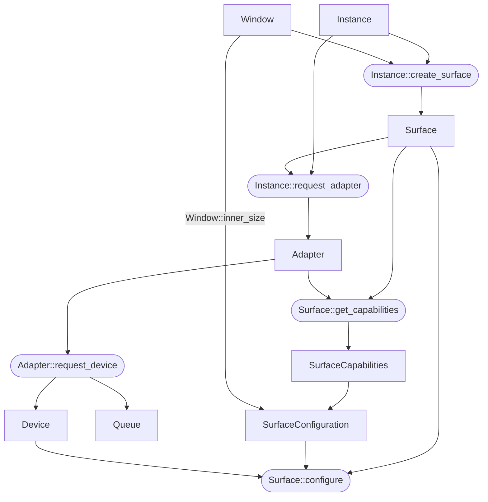

# Wgpu

[wgpu] 是一个由 Rust 实现的跨平台的图形 API. 其提供基于 WebGPU 标准的 API (`wgpu`), 通过其核心实现 (`wgpu-core`) 调用主流图形 API (即后端) 的抽象层 (`wgpu-hal`).  
在这个基础之上, wgpu 实现了 "集百家之长, 成一家之言".

- 合理的抽象程度.
- 高性能.
- 跨平台.

目前, 没有任何一个主流图形 API 能同时满足上面三个方面的要求. 例如:

- **Vulkan** 有良好的性能和跨平台能力, 但是其 API 过于底层, 抽象程度较低, 使用起来十分复杂.
- **OpenGL** 有较高的抽象程度和良好的跨平台能力, 但其设计难以充分发挥现代 CPU 和 GPU 的性能.

主流图形 API 在这三个方面各有优劣, 但 wgpu 通过合理的设计, 在这三个方面之间取得了良好的平衡.

[wgpu]: https://github.com/gfx-rs/wgpu

下面是 wgpu 初始化的流程图.

```mermaid
flowchart TD
    I[Instance]
    W[Window]
    S[Surface]
    A[Adapter]
    D[Device]
    Q[Queue]
    SCap[SurfaceCapabilities]
    SConf[SurfaceConfiguration]

    create_surface([Instance::create_surface])
    request_adapter([Instance::request_adapter])
    request_device([Adapter::request_device])
    get_capabilities([Surface::get_capabilities])
    surface_configure([Surface::configure])

    I --> create_surface
    W --> create_surface
    create_surface --> S

    I --> request_adapter
    S --> request_adapter
    request_adapter --> A

    A --> request_device
    request_device --> D
    request_device --> Q

    S --> get_capabilities
    A --> get_capabilities
    get_capabilities --> SCap

    SCap --> SConf
    W -->|Window::inner_size| SConf

    S --> surface_configure
    SConf --> surface_configure
    D --> surface_configure
```

函数 `Instance::create_surface` 接收一个 SurfaceTarget 参数, 可能为以下两种类型:

- 桌面环境下的一个窗口 (Window).
- 浏览器页面的一个画布 (Canvas).

本文将使用 `winit` 库[^winit]创建一个窗口, 具体流程请参考 [winit 的示例](https://github.com/rust-windowing/winit/blob/master/examples/window.rs).  
然后利用该 `winit::Window` 创建一个 Surface.

`Surface::configure` 用于创建 Swapchain.

Surface 配置完毕后, 就可以使用 Device 和 Queue 执行后续的渲染操作了.

- <https://gpuweb.github.io/gpuweb/#intro>.
- <https://google.github.io/tour-of-wgsl/>.

[^winit]: 跨平台窗口库, 类似 C++ 的 GLFW 库.

## 参考

- <https://eliemichel.github.io/LearnWebGPU/>.
