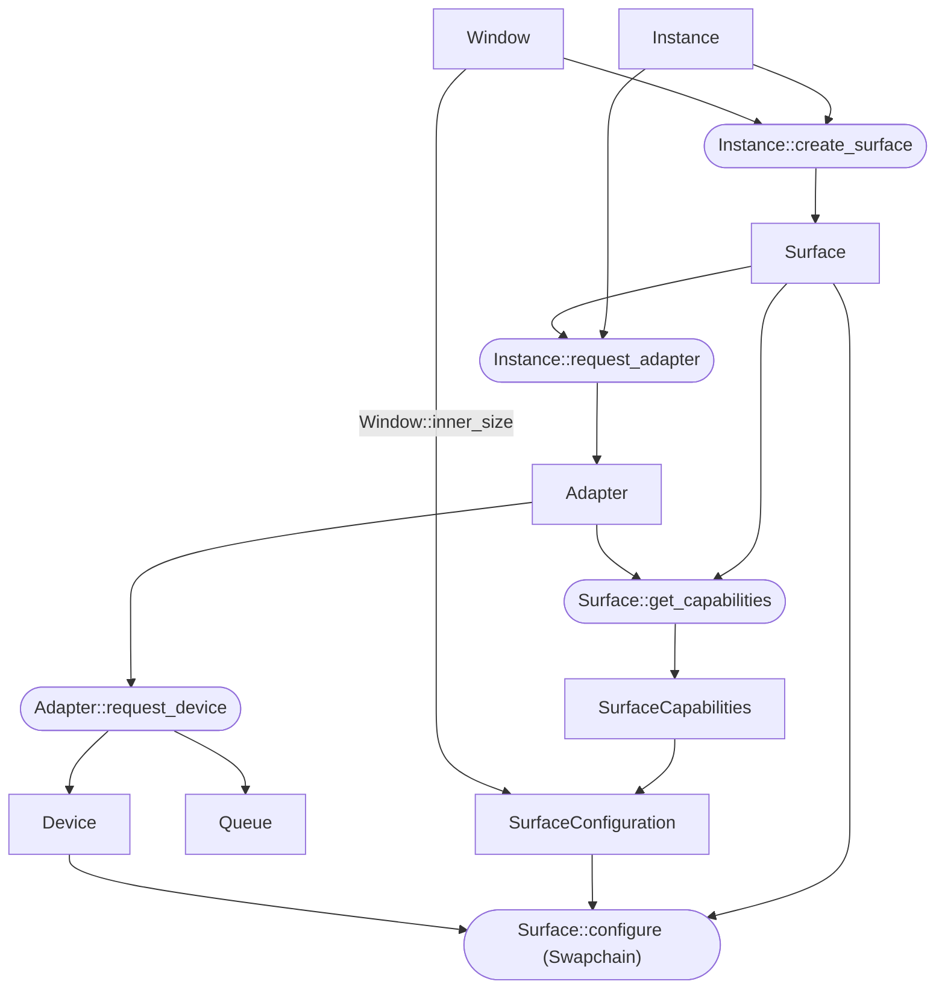

# wgpu

## 简介

[wgpu] 是一个由 Rust 实现的跨平台的图形 API. 其提供基于 WebGPU 标准的 API (`wgpu`), 通过其核心实现 (`wgpu-core`) 调用主流图形 API (即后端) 的抽象层 (`wgpu-hal`).  
在这个基础之上, wgpu 实现了 "集百家之长, 成一家之言".

- 合理的抽象程度.
- 高性能.
- 跨平台.

目前, 没有任何一个主流图形 API 能同时满足上面三个方面的要求. 例如:

- **Vulkan** 有良好的性能和跨平台能力, 但是其 API 过于底层, 抽象程度较低, 使用起来十分复杂.
- **OpenGL** 有较高的抽象程度和良好的跨平台能力, 但其设计难以充分发挥现代 CPU 和 GPU 的性能.

主流图形 API 在这三个方面各有优劣, 但 wgpu 通过合理的设计, 在这三个方面之间取得了良好的平衡.

[wgpu]: https://github.com/gfx-rs/wgpu

## 初始化

下面是 wgpu 初始化的流程图.



函数 `Instance::create_surface` 接收一个 `SurfaceTarget` 类型的参数, 可能为以下两种类型:

- 桌面环境下的一个窗口 (Window).
- 浏览器页面的一个画布 (Canvas).

本文将通过由 winit 库[^winit]创建的窗口 (`winit::Window`) 来创建 `Surface`.  
自从 winit 0.30 版本后, 创建窗口的方法较为复杂, 具体流程请参考 [winit 的示例](https://github.com/rust-windowing/winit/blob/master/examples/window.rs).  

wgpu 的初始化流程与 Vulkan 十分相似, 早期版本也包含 [`wgpu::Swapchain`] 类型, 后来为了遵循 WebGPU 标准, 该类型在 0.10 版本中被合并到了 `Surface` 类型里.[^swapchain]

初始化流程最后一步调用的 `Surface::configure` 函数便是用于创建 Swapchain.

[`wgpu::Swapchain`]: https://docs.rs/wgpu/0.9.0/wgpu/struct.SwapChain.html

```rs
let instance = wgpu::Instance::new(&wgpu::InstanceDescriptor::default());

let surface = instance.create_surface(window.clone()).unwrap();

// 获取符合条件的 Adapter.
let adapter = instance
    .request_adapter(&wgpu::RequestAdapterOptions {
        compatible_surface: Some(&surface),
        ..Default::default()
    })
    .await
    .expect("Failed to find an appropriate adapter");

let (device, queue) = adapter
    .request_device(&wgpu::DeviceDescriptor::default())
    .await
    .expect("Failed to create device");
```

`Surface` 配置完毕后就完成的基本的初始化工作, 后续可以用来将渲染得到的结构展示在窗口中.  
后续的渲染任务主要通过调用 `Device` 和 `Queue` 来完成.

- <https://gpuweb.github.io/gpuweb/#intro>.

## 着色器

WGSL (WebGPU Shading Language) 是 WebGPU 的**着色器语言**, 其语法与 Rust 语言十分相似.  
虽然 wgpu 也支持 GLSL 和 SPIR-V, 但只有 WGSL 支持是默认启用的.

可以通过该互动式教程快速入门 WGSL: <https://google.github.io/tour-of-wgsl/>.

[^winit]: 跨平台窗口库, 类似 C++ 的 GLFW 库.
[^swapchain]: <https://github.com/gfx-rs/wgpu/blob/HEAD/CHANGELOG.md#v010-2021-08-18>

## 参考

- <https://eliemichel.github.io/LearnWebGPU/>.
