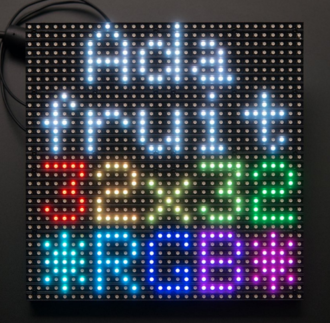
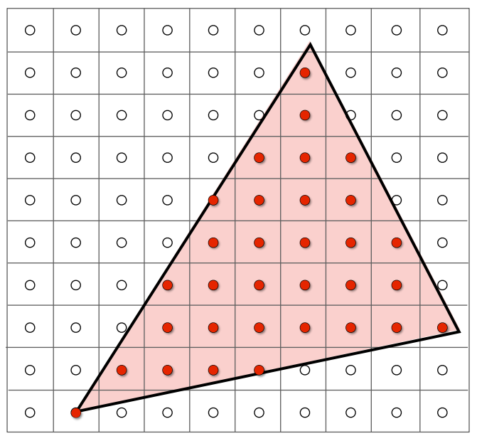

# 光栅化

  

## 光栅化管线

将所有的图元都转换为三角形, 包括点(正方形)和直线(矩形).  

为什么使用三角形:  

- 最基础的图元: 可以近似的表示其他任何形状.
- 三个顶点总在一个平面上.

## 三角形的光栅化

  

```cpp
struct Triangle
{
  Vector2f v[3];
};

/**
 * @brief 判断点是否在三角形内.
 *
 * @param triangle 三角形.
 * @param position 点的坐标.
 */
bool inside(const Triangle& triangle, const Vector2f& position)
{
}

/**
 * @brief 将三角形绘制在图像上.
 *
 * 背景为白色, 三角形为黑色.
 *
 * @param image      图像.
 * @param triangle   三角形.
 * @param pixel_size 像素大小.
 */
void draw(Image& image, const Triangle& triangle, const float pixel_size)
{
  for(size_t x = 0; x < image.size().x(); x++)
  {
    for(size_t y = 0; y < image.size().y(); y++)
      image[x][y] = inside(triangle, {pixel_size / 2.f + x * pixel_size, pixel_size / 2.f + y * pixel_size}) ? black : white;
  }
}
```

其中 `draw` 要对整个图像的每个像素进行采样, 可以通过包围盒来缩小采样面积.  
